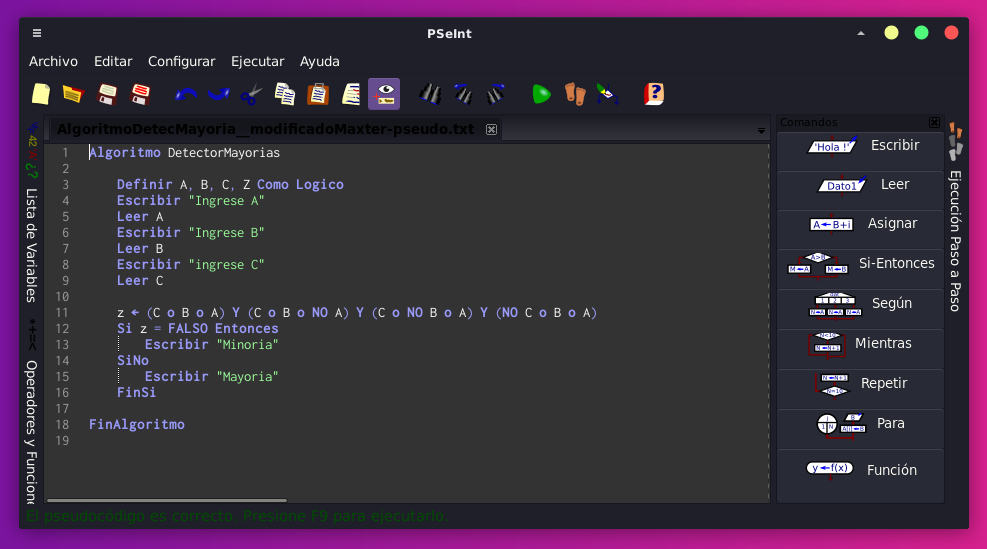

### Detector mayorías
TP3 individual:

1) Escriban las respuestas de este algoritmo en función de sus entradas “C”, “B” y “A”. Son dos posibles: Mayoría o Minoría. La mayoría se refiere a mayor cantidad de 1s.

Solución:

| A | B | C | Rta |
|---|---|---|-----|
| 0 | 0 | 0 | Min |
| 0 | 0 | 1 | Min |
| 0 | 1 | 0 | Min |
| 0 | 1 | 1 | May |
| 1 | 0 | 0 | Min |
| 1 | 0 | 1 | May |
| 1 | 1 | 0 | May |
| 1 | 1 | 1 | May |

2) Qué modificarían para que funcione con Maxitérminos. Fíjense que el algoritmo está hecho con minitérminos.

Solución:
Para que funcione con Maxitérminos modificaría lo siguiente: Cambiar la función para que encuentre los negados **(línea 12)** y luego cambiar la condición de Z a Verdadero en vez de Falso **(línea 13).**

- Algoritmo detector mayoría (pseudo):

3) Hacer un diagrama de flujo que muestre de manera gráfica el algoritmo.

Solución:

*Nota: Diagrama diseñado teniendo en cuenta el algoritmo original de la consigna original) 

