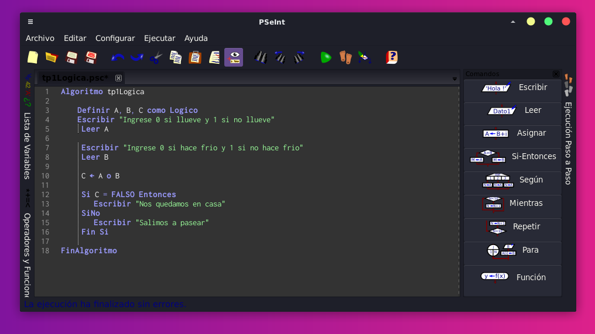
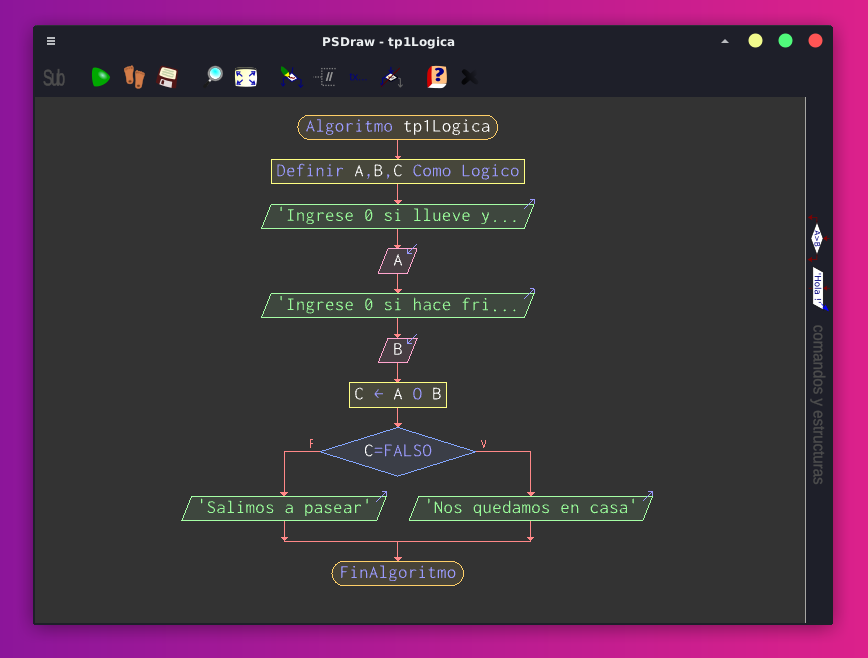

### Consigna
1) Escriban las respuestas de este algoritmo en función de sus entradas “A” y “B”. Son dos posibles: “Nos quedamos en casa” o “Salimos a pasear”.  
2) Qué modificarían para que los deje salir en el caso de que se den las dos condiciones: no llueve y no hace frío.  
3) Hacer un diagrama de flujo que muestre de manera gráfica el algoritmo del punto 1.

### Resolución

1) Resultados:

Al ingresar A = 0 B = 0 → Nos quedamos en casa

Al ingresar A = 0 B = 1 → Salimos a pasear

Al ingresar A = 1 B = 0 → Salimos a pasear

Al ingresar A = 1 B = 1 → Salimos a pasear

2) Para que el algoritmo indique “salimos a pasear” solo si se cumplen positivamente (1) ambas condiciones podríamos cambiar lo siguiente: OR por AND. Cuando ambos resultados sean 1 (no llueve y no hace frío) el resultado sería “Salimos a pasear” en los demás casos sería falso:

Al ingresar A = 0 B = 0 → Nos quedamos en casa

Al ingresar A = 0 B = 1 → Nos quedamos en casa

Al ingresar A = 1 B = 0 → Nos quedamos en casa

Al ingresar A = 1 B = 1 → Salimos a pasear

3) Realizar diagrama de flujo

