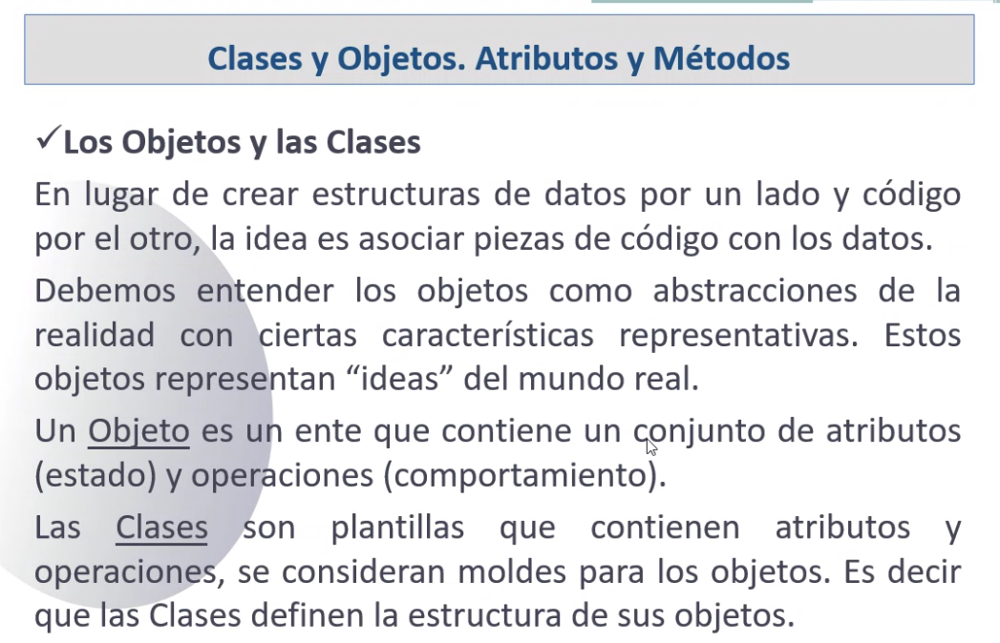

## Clase 01
Presentación profe: Eduardo Iberti

Introducción a la materia

Cronograma de clases virtuales y presenciales:

Luego de intro a la materia, empezamos con la clase:

Fases de un desarrollo de software

- Análisis
- Diseño
- Implementación

Análisis: qué hacer?
Diseño: cómo hacerlo?
Implementación: traducir el diseño a código

Algunas diferencias entre analista funcional, desarrollador de software, 'programador'.

Paradigma POO

El foco está en los objetos y sus relaciones

Ventajas de la POO

- Reutilización y extensión del código

Si utilizamos correctamente la modularidad y dividimos el problema en porciones menores, podemos reutilizar ese mismo código. También se va a poder extender y mejorar de forma más simple.

- Permite crear sistemas más complejos

Al poder extenderse, nos permite generar sistemas más complejos.

- Relacionar el sistema al mundo real

Utilizamos objetos del mundo real (objetos tangibles) al utilizar clases y objetos. Hacemos una abstracción de los conceptos del mundo real.

- Facilita la creación de programas visuales

Los componentes visuales también se comportan como objetos (ventanas, cajas de texto, botones).

- Construcción de prototipos

A partir de un correcto diseño, se utilizan prototipos previos al software final.

- Agiliza el desarrollo de software

Al reutilizar código nos facilita mucho el trabajo.

- Facilita el trabajo en equipo

En el momento de desarrollo se fomanta el trabajo en equipo y se realizan componentes más pequeños.

- Facilita el mantenimiento

Al estar compartimentado, es fácil identificar en dónde hay que corregir o extender cierta funcionalidad.

### Caracteristicas POO

- Abstracción
- Modularidad

- Encapsulamiento

Los objetos tienen atributos y métodos

Un objeto externo no puede modificar los atributos sin antes pasar por sus métodos (de ahí el concepto de encapsulamiento, protege los atributos)

- Herencia

Las clases pueden heredar características de su superclase.

- Polimorfismo

Distintos objetos de una misma clase responden de distinta forma a un mismo mensaje. 

### Clases y objetos. Atributos y Métodos

- Atributos

Atributos declarados en la clase Empleado: 

- Métodos

Son las acciones que pueden realizar los objetos.

Ejemplo de cargos en una empresa donde hay cargos, empleados y departamentos

