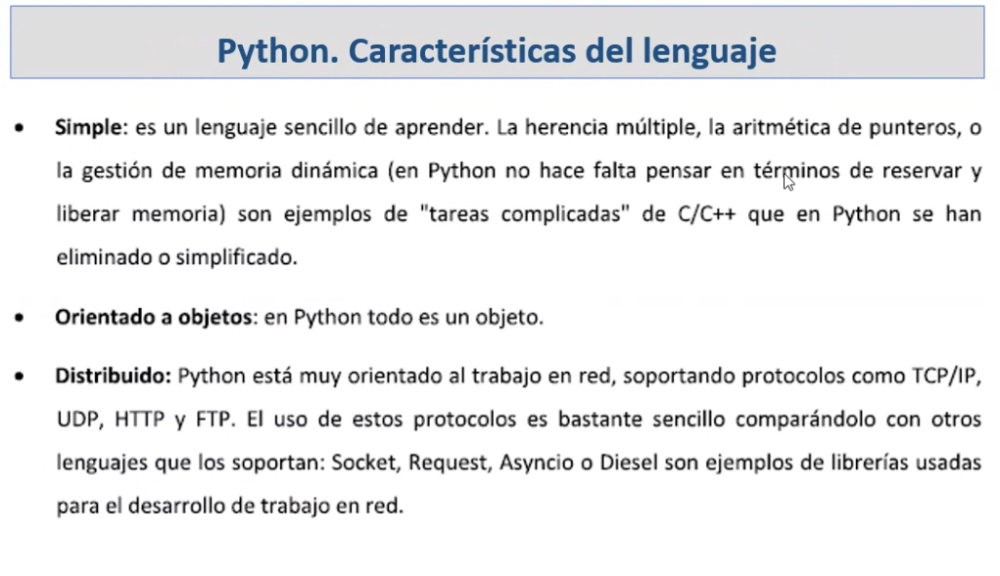
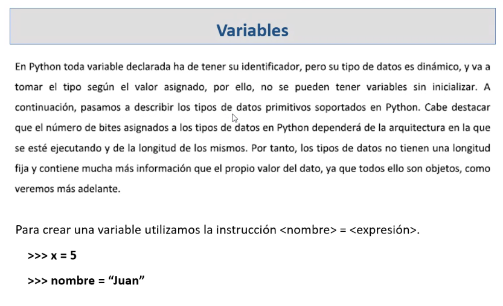
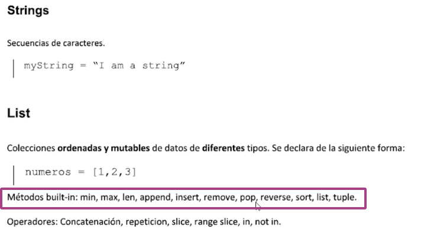
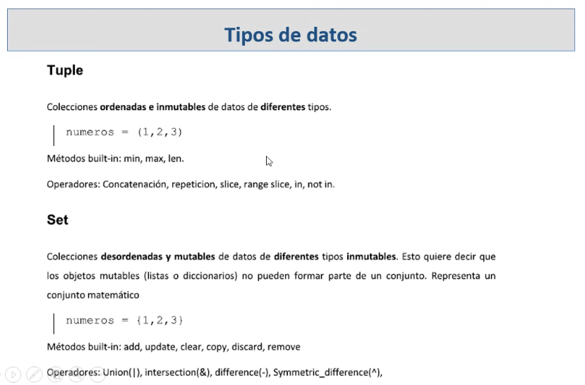
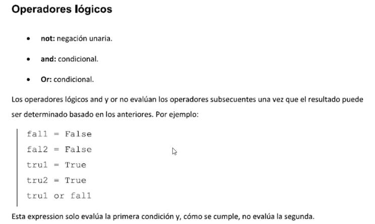
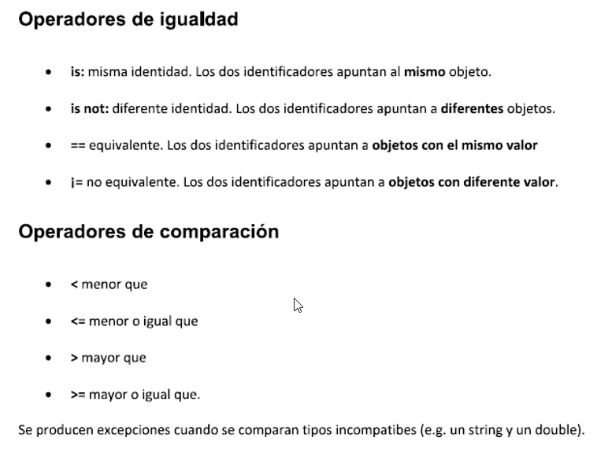
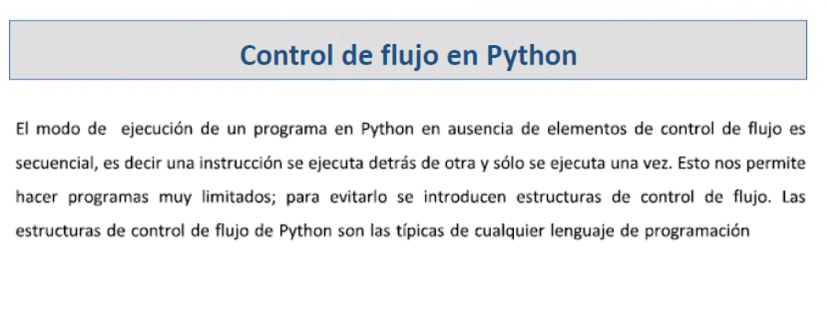
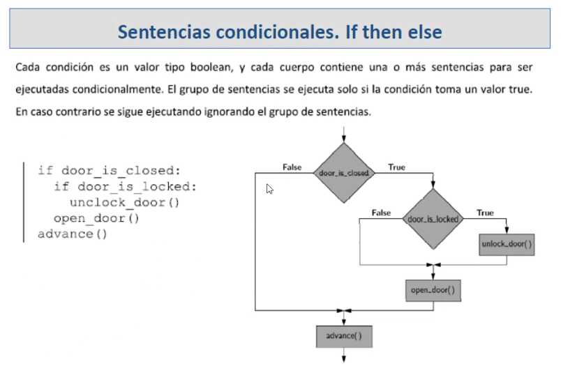
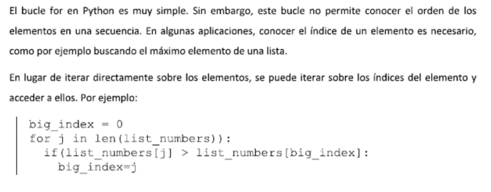
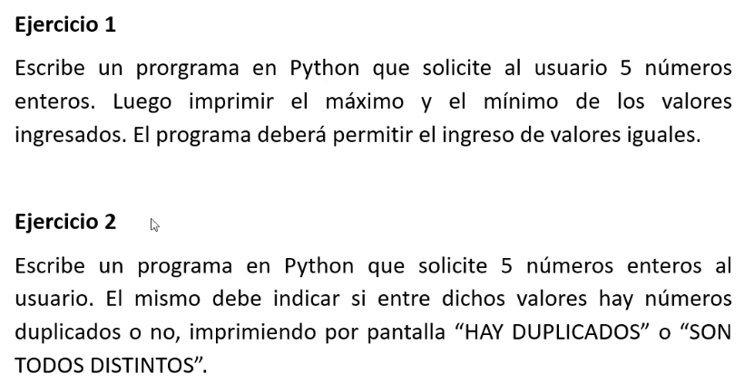

## Clase 02
Intro a la clase: temario del día.

Empezamos con repaso de Python



- Fácil de aprender.
- Similar al inglés

Llevar a código el concepto de OOP es sencillo en Python (ej Herencia múltiple).

En python todo es un objeto.

Es distribuido porque está orientado al trabajo en red (cliente/servidor), soporte múltiples protocolos.

Hablamos de uso y aplicaciones, IDE, intérprete de Python, etc.

### Repaso general:

Variables y su uso.



- Tipos de datos



Como todo es un objeto, el objeto List tiene entre sus métodos funciones como sort(), pop(), len(), etc.



Repaso de operadores lógicos





Operadores aritméticos (los básicos)

Hacemos un ejercicio de práctica para compartir en clase:

```py
"""

calcular el perimetro y área de un rectángulo

ingresando su base y altura

(A + B) * 2

"""  

base = int(input("ingrese la base del rectángulo: "))

altura = int(input("ingrese la altura del rectángulo: "))

perimetro = (base * 2 + altura * 2)
area = (base * altura)  

print("el perimetro de su rectángulo es: {} ".format(perimetro))

print("el área de su rectángulo es: {} ".format(area))

print()

print('Fin del programa')

```

Estructuras de control



### if else



### for loop



Break & continue

break: si se cumple una condición mientras recorro una serie de elementos, puedo salir del bucle con 'break'.

continue: también detiene la ejecución del cuerpo del bucle, pero no sale del bucle, sino que pasa a su próxima iteración.



```py

"""
Solicitar al usuario 5 números,
imprimir el min y max
"""

numeros = []
i = 0

while(i < 5):
    inputNum = int(input('Ingrese un número: '))
    numeros.append(inputNum)
    i = i + 1

print(numeros)

menor = numeros[0]
mayor = numeros[0]

for item in numeros:
    if(item > mayor):
        mayor = item
    if(item < menor):
        menor = item

print('El mayor de los números es {}'.format(mayor))
print('El menor de los números es {}'.format(menor))
```

```py
"""
Solicitar al usuario 5 números,
imprimir si hay num duplicados
o son todos distintos
""" 

numeros = []
i = 0

while(i < 5):
	inputNum = int(input('Ingrese un número: '))
	numeros.append(inputNum)
	i = i + 1
print('Los numeros ingresados son: ', numeros)

if len(numeros) == len(set(numeros)):
	print('No hay números repetidos')
else:
	print('Hay números repetidos')
```
