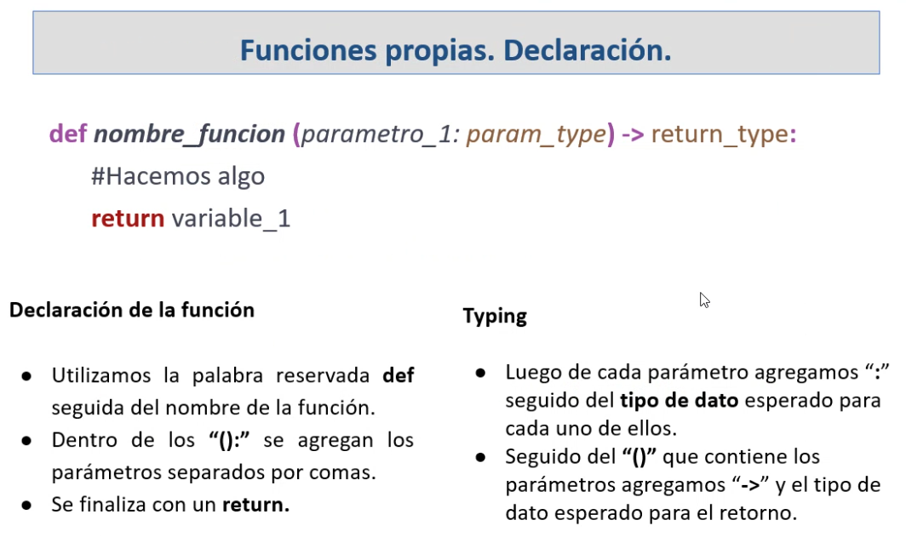
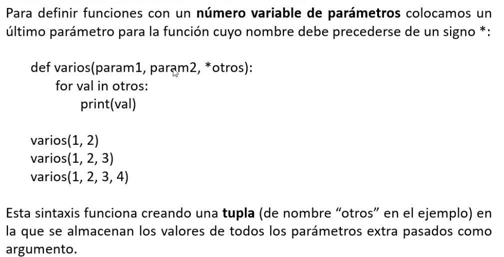
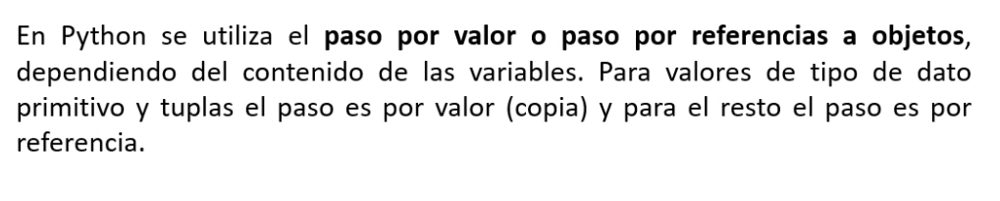
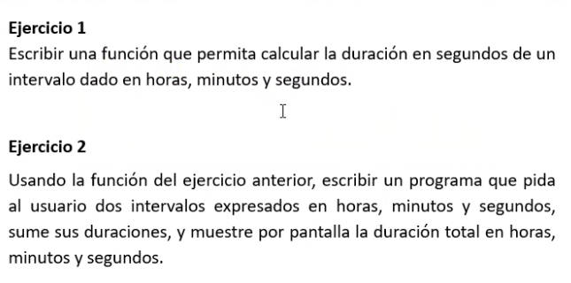

## Clase 03
Repaso de funciones:

Qué es? Una función es un bloque de código reutilizable que se utiliza para realizar una funcionalidad.

Nos brindan modularidad.

Hay funciones propias creadas por nosotros o ya definidas por el lenguaje.


Declarando nuestras funciones:



Numero de parámetros variable:



Pasar valores de tipo de datos primitivos

Paso por valor: se crea una copia
Paso por referencia: se crea una nueva posición de memoria que referencia el objeto que ya estaba creado



### Ejercicios


```py

# ejercicio 1

def getSeconds(hours,minutes,seconds):
	hoursToSec = hours * 3600
	minToSec = minutes * 60
	count = hoursToSec + minToSec + seconds
	return count

print(getSeconds(1,6,24))

```

```py

# ejercicio 2

from getSeconds.time import getSeconds  

def askTime():
	hours = int(input('Ingrese horas: '))
	minutes = int(input('Ingrese minutos: '))
	seconds = int(input('Ingrese segundos: '))
	print('~~~~~~')
	answer = getSeconds(hours,minutes,seconds)
	return(answer)

def makeHour(totalSeconds):
	seconds = totalSeconds % (24 * 3600)
	hour = seconds // 3600
	seconds %= 3600
	minutes = seconds // 60
	seconds %= 60
	print('El total es {} horas, {} minutos y {} segundos'.format(hour,minutes,seconds))  

i = 0
total = 0

while(i < 2):
	total = total + askTime()
	i = i + 1

print('El total en segundos es: ',total)
makeHour(total)

```

> **Note** 
> Los archivos de este código están en:
> 
> 121-oop/python-files-oop/ejercicio-6.py
> 121-oop/python-files-oop/getSeconds/time.py

Tarea para próxima clase:


