## Clase 04

Primero vimos el ejercicio de tarea. Después repasamos el ejercicio de la clase anterior (horas minutos y segundos)

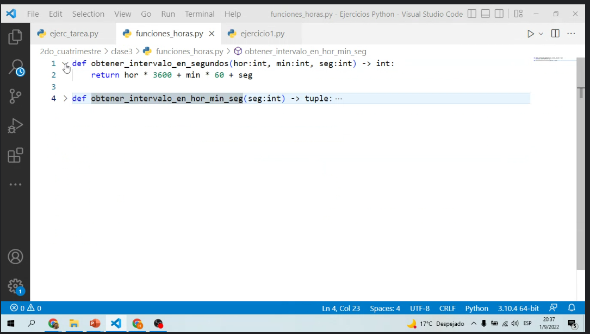

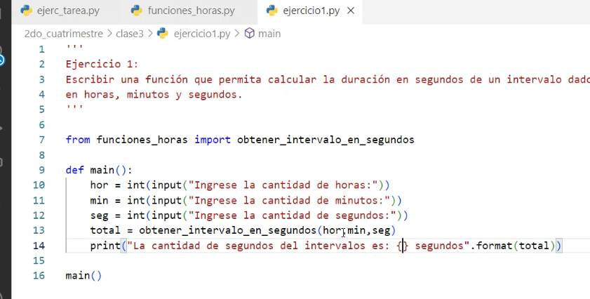

### Incio clase:

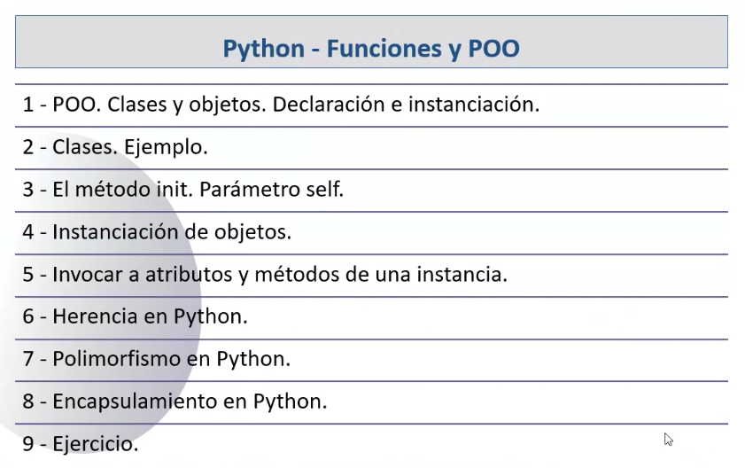

Empezamos a hablar de clases en la sintaxis de python.

Repaso:

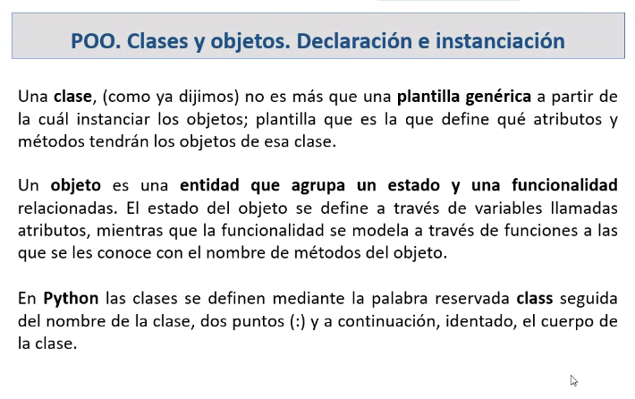

El estado del objeto está dado por los valores de sus atributos en un momento dado. Esto también es una variable.

Las funcionalidades están dadas por los métodos

la palabra reservada `class:` similar a `def()`

#### POO Clases Ejemplo

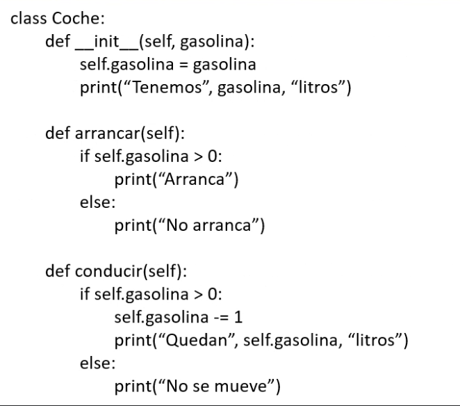

Buenas prácticas:
- Primera letra en mayúscula

Método `__init__()`

método especial dentro del lenguaje que se utiliza como constructor de las instancias de esa clase. 

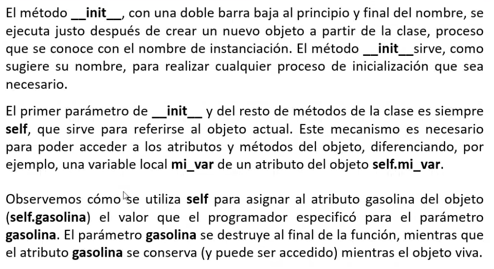

`self.my_var` no es una palabra reservada pero por convención funciona como tal. Para el referirse a este objeto (similar a `this.my_var` en otros lenguajes)

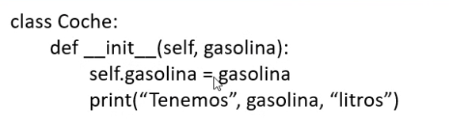

`self.gasolina` es la variable atributo gasolina, de la clase coche. Y esta va a poder ser accedida desde cualquier otra parte del código

Hasta ahora declaramos la clase, sus métodos y atributos. Pero hasta ahora no tenemos ninguna instancia de esta clase.

Cómo se instancia un objeto?

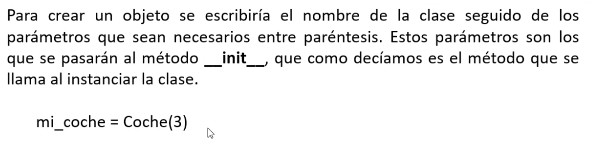

Esta es la instanciación de un objeto:

`mi_coche = Coche(3)`

Coche coincide con la declaración de la clase choche. Se está llamando implícitamente al método `__init__` 

A partir de la variable `mi_coche` puedo empezar a usar todos los métodos de la instancia

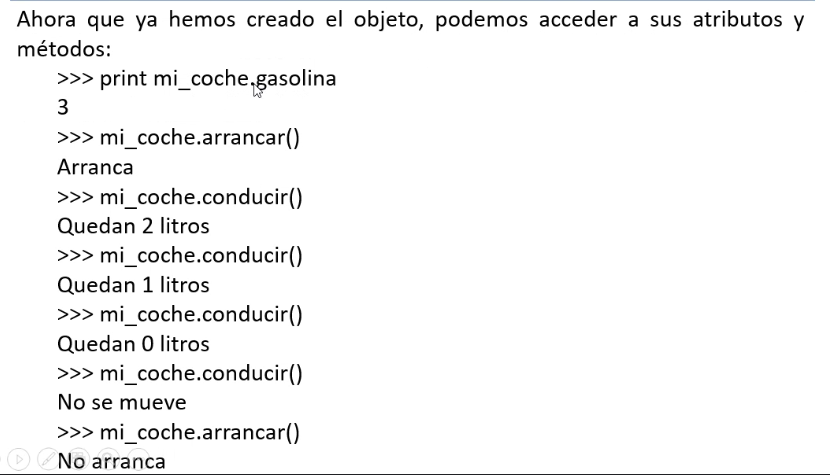

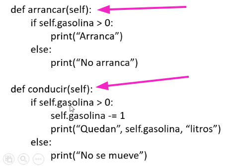

Al tener un solo parámetro (self) no espera ningún valor.

#### Herencia

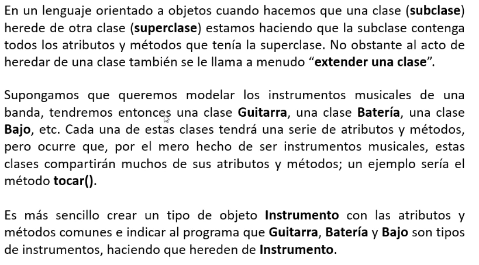

Característica propia de cualquier lenguaje que haga uso del paradigma POO.

Definimos algo particular a partir de otra clase que ya tenía una definición.

Se suele decir que 'extendemos una clase'

Ejemplo banda (Guitarra, Batería, Bajo). Mejor crear un tipo de objeto *Instrumento*. Todo lo que es común entre ellos va a parar a la superclase.

Cómo lo llevamos a sintaxis Python:

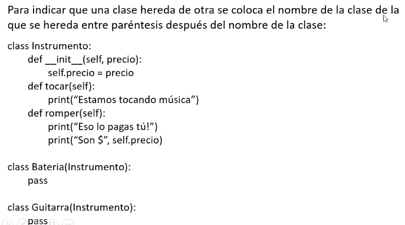

La clase *Bateria* que hereda de *Instrumento*. *Instrumento* es la superclase de *Batería* y *Guitarra*.

Todo lo común va a la superclase. Todo lo específico en la subclase.

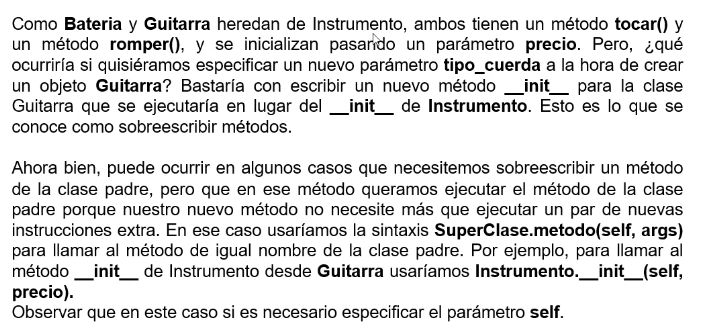

Mencionamos **sobreescribir métodos**. Declarar con un `__init__` los objetos del tipo *Batería* y sobreescribo el método init de *Instrumento*.

con la sintaxis `SuperClase.metodo(self, args)`

#### Polimorfismo en Python

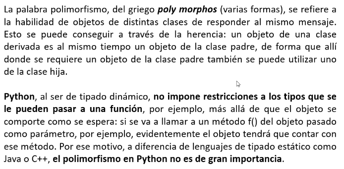

La aplicación del concpeto de polimorfismo en python no es tan relevante (ya que el tipo de dato no son fuertemente tipados)

Puede tomar diferentes formas. Porque depende del tipo de dato que lo invoca (ej Objeto del tipo Bateria, del tipo Guitarra. Se van a ejecutar de la forma en que está declarado en cada subclase).

#### Encapsulamiento en Python

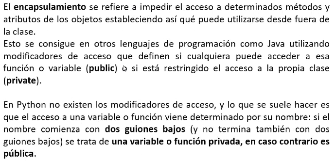

No hay modificadores de acceso. Se suele hacer que venga determinado por su nombre. Si comienza con dos guiones bajos y no termina en otros dos guiones bajos, es una variable privada, en caso contrario es pública.

`def publico(self)`

`def __privado(self)`

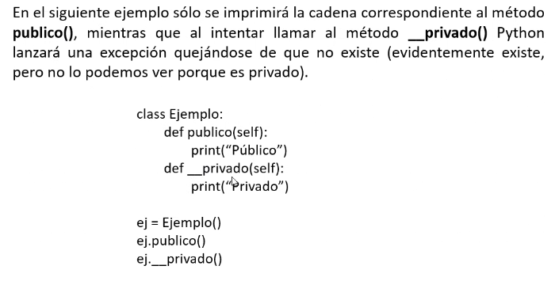

Si creamos un objeto de esta clase ( `ej = Ejemplo()` ) no tengo que pasar ningun valor porque no hay un método `__init__`

Luego puedo llegar a todos los métodos públicos

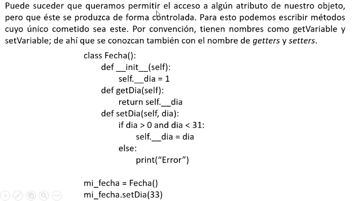

`getters` y `setters`

`getDia(self)`

`setDia(self)`

Desde código externo no voy a poder asignar un valor a la variable `dia` porque es una variable privada y su valor va a ser modificado únicamente desde ese método

#### Ejercicio

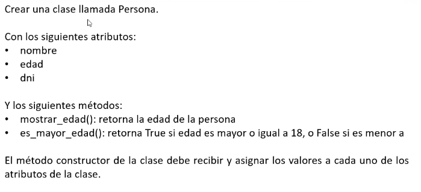

```py

# resolución tarea clase Persona

class Persona:
    def __init__(self, nombre:str, edad:int, dni:str):
        self.nombre = nombre
        self.edad = edad
        self.dni = dni

    def mostrar_edad(self) -> int:
        return self.edad
    
    def es_mayor_edad(self) -> bool:
        if self.edad >= 18:
            return True
        else:
            return False

# creamos objetos del tipo Persona

magno = Persona('Alejandro', 26, '29245680')
cesar = Persona('Julio', 15, '20245680')
polo = Persona('Marco', 41, '34556780')

# guardamos las personas en una List y la recorremos

users = [magno, cesar, polo]

for u in users:
    if u.es_mayor_edad():
        res = 'sí'
    else:
        res = 'no'
    print('{} de {} años, DNI n° {}: {} es mayor de edad'.format(u.nombre, u.mostrar_edad(), u.dni, res))

```