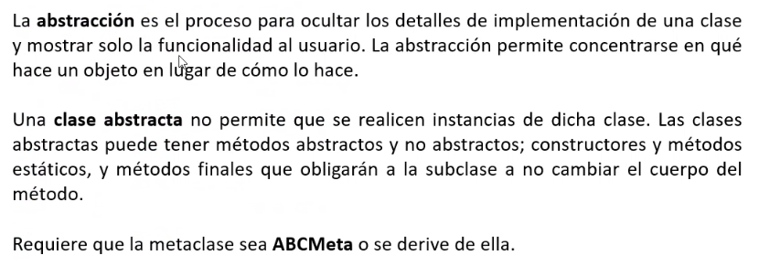

## Clase 06
> Fecha parcial: 29-09

Seguimos con temas nuevos.

### Relaciones de herencia

**Temas:**

- Interfaces
- Interfaces formales e infromales. Módulo abc y clase ABC de Python
- Clases abstractias. Metaclase ABCMeta
- Métodos abstractos. El decorador `@abstractmethod`

#### Interfaces


Un conjunto de métodos que debe tener un objeto para cumplir una función. Define la funcionalidad pero no su implementación. Podemos crear una clase donde vamos a definir las funcionalidades que contiene, pero no cómo se realiza.

Ejemplo control remoto.

Una clase va a implementar esas interfaces. La implementación va a estar definida en estas clases.


> Se centra en el qué y no en el cómo


En python se simula el concepto de interfaz con dos tipos:

- Interfaces informales
- Interfaces formales

#### Interfaz informal


(se definen los métodos pero no la implementación)

Las clases que implementen esta interfaz informal tendrán que dar sentido a esos métodos.


Lo podemos usar mediante herencia. En la superclase solo están definidos los métodos. Por eso en la clase que hereda tiene que dar funcionalidad a esos métodos.


No se obliga a implementar todos los métodos. Esto puede causar problemas.

#### Interfaces formales. Uso de Abstract Base Classes (ABC)


Se definen una forma de crear interfaces y se fuerza a las clases que usan esa intefaz a implementar los métodos.

Mando, la heredar de ABC, se convierte en una clase abstracta.

```py
from abc import ABC
class Mando(ABC):
	pass
```

o 

```py
from abc import ABCMeta
class Mando(metaclass=ABCMeta):
	pass
```

Esto nos indica que de esta clase no se van a tener instancias


Un método es abstracto es su definición sin su implementación.

#### Abstracción



Ocultamos la implementación, mostramos la funcionalidad.

Generalmente definimos todos los métodos abstractos si la clase va a ser abstracta (y eso va a representar una interfaz).

#### Métodos abstractos


No lleva código. Por eso usamos `pass`. Obliga a las clases a modificar su implementación. Con esto restringimos en nuestro modelo que se creen instancias con métodos definidos.


esta es la implementación de 'Mando' (una intefaz formal). A partir de `MandoSamsung()` puedo utilizar `bajar_volumen()` (lineas 31 y 32).

Hasta ahora veníamos usando métodos concretos (porque el método tiene una implementación particular).


línea 31 da error, porque la clase abstracta no nos permite que se creen objetos de su tipo.

