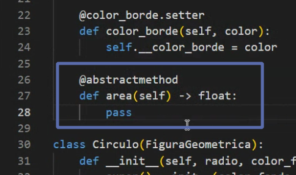

## Clase 07
Repasando info del parcial de Modelado, también info de la promoción

Repaso temas de la clase anterior:

El objetivo de las interfaces es definir las funcionalidades, pero no darle una implementación completa. Uno de sus usos es negar la posibilidad de crear instancias de ese tipo, sino que los objetos se crean a partir de las subclases que heredan de ella. Es común que la superclase sea una clase abstracta. Queremos que los objetos sean de las subclases.

La clase abstracta también tiene métodos abstractos.

Tenemos dos formas de hablar de interfaces en python:

- Formal
- Informal

Formal: uso de decoradores, heredando del módulo abc (metaclase abc meta, que sirve para declarar clases abstractas e interfaces).

> no existe la palabra clave 'interface' como en otros lenguajes, pero lo "simulamos"

Informal: no se recomienda

Al declarar el método como abstracto obligamos a las subclases a darle funcionalidad a los objetos.

---
Usamos de ejemplo el ejercicio de figuras geométricas.

En UML, poniendo el nombre de la clase en cursiva, indicamos que es una clase abstracta

El init se puede dejar como está. Los métodos hay que marcarlos como abstractos (con cursiva).

Diagrama final:

Realizamos ejercicio en clase, resolvimos con el curso:

> subido en /121-oop/python_files_oop/tarea-cuenta-bancaria/main-cuenta.py
