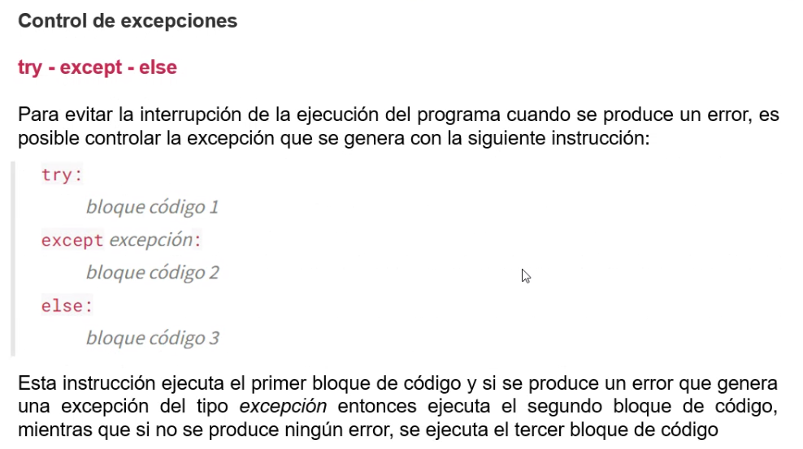

## Clase 09

Manejo de excepciones:


Error de sintaxis, algo está mal escrito en nuestro código. La única solución es corregirlo


Errores lógicas: por más que esté bien la redacción hay un problema en la lógica (en este ejemplo un archivo que no existe es `FileNotFoundError`, `ZeroDivisionError` o `ImportError`).


En estos casos sí debemos atrapar la excepción y gestionar el error (continuar con la ejecución del programa sin que este se interrumpa). Si no lo atrapamos la ejecución del programa se detiene.

Al hacer esto python crea un `objeto del tipo excepción.`

Ejemplos de excepción en el intérprete de python:


Principales tipos de excepción:

- TypeError
- ZeroDivisionError
- OverflowError
- IndexError
- KeyError
- FileNotFoundError
- ImportError

### Control de excepciones



Ejemplo `FileNotFoundError`:


> (!) Siempre deberíamos usar un try si nos estamos por conectar a otros ficheros, apis, base de datos, etc.

### Múltiples excepciones
Se pueden guardar las excepciones en una variable para acceder a sus argumentos:


### Finally
Se pueden ejecutar las sentencias ya sea que se produzca la excepción o no.


Generalmente usamos Finally para cerrar una conexión, ya sea que dio error o no.

### Parte práctica


Haciendo pruebas con manejo de errores:


Tipo de error personalizado:


Generamos nuestro propio tipo de excepción creando una clase que hereda de `Exception`


En línea 18 con raise lanzo la excepción con mi propio error que recibe un string.

### Ejercicio práctico en clase


Resolución:

```py

def agregar_una_vez(lista, elemento):

	if elemento not in lista:
		lista.append(elemento)
		print('se agregó un elemento a la lista!')
	else:
		raise ValueError('Error: Imposible añadir elementos duplicados', elemento)

def main():
	elementos = [1, 5, -2]
	add = [10, -2, 4, 'hola']  

	for i in add:
		try:
			agregar_una_vez(elementos, i)
			print(elementos)
		except Exception as e:
		print('error: ', e)

main()
```

> Archivo completo en /121-oop/python_files_oop/tarea-error/error_v1.py

