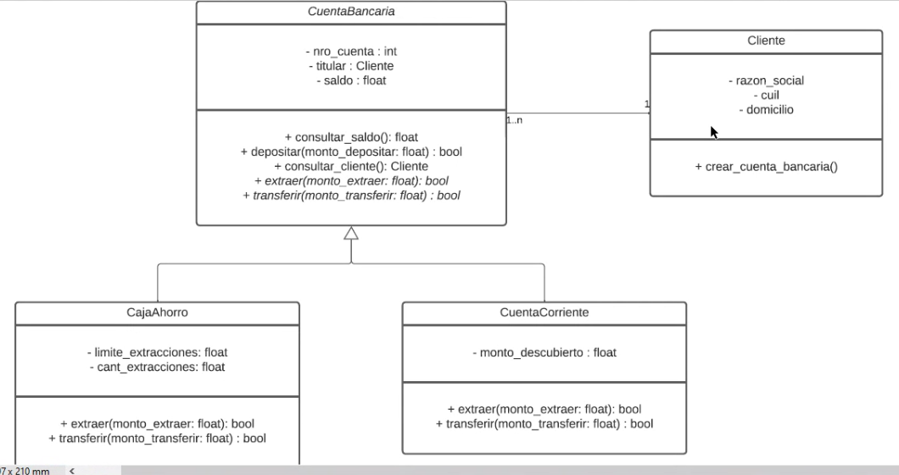

## Clase 10

Práctica en base a ejercicio previamente resuelto que respondía al siguiente diagrama de clases:

Ejercicio de cuentas bancarias (caja de ahorro y cuenta corriente)

Modificaciones:

- Lanzar una nueva excepción propia
- Modificar los métodos extraer() para contemplar el manejo de excepción

> Resolución subida como update al ejercicio 121-oop/python_files_oop/tarea-cuenta-bancaria/main-cuenta.py
