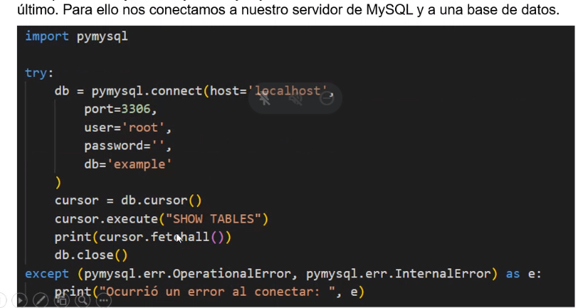

## Clase 11

(...) primera parte de la clase estuve off en nerdearla, vieron cómo conectarse a una BD mysql. [Revisar PPT de clase en Drive](https://drive.google.com/drive/u/1/folders/1LJJlN5TJKJ1e2Iu2fkG0MYyeQWCjbWHW).



(captura de Emi)

**Después del break:**

Consigna para ejercicio en clase:

```
Desarrollar una app python que se conecte a una BD sqlite que vamos a llamar 'Empleados'. Va a contener una tabla también llamada 'Empleados', la estructura de la tabla 'empleados' es:

Nombre de la tabla: Empleados

Campos: 

id = Integer (primary key, AI, not NULL)
numero_legajo = Integer (AI, not NULL, Unique)
dni_empleado = Integer (not NULL, Unique)
nombre_empleado = Text (not NULL)
apellido_empleado = Text (not NULL)
area = Text (not NULL)

La aplicación debe permitir crear la tabla. Todas las sentencias que van a permitir crear la tabla deben estar en una función o un método (puede ser una clase o una función) la función debe llamarse crear_tabla()

Luego el programa debe solicitar al usuario que ingrese por teclado una de las siguientes opciones:

Opción 1: Insertar un registro de empleado
Opción 2: Seleccionar un registro de empleado a partir de su número de DNI
Opción 3: Seleccionar todos los empleados o los registros de la tabla
Opción 4: Modificar el área de un empleado en función de su número de legajo
Opción 5: Eliminar un empleado a partir de su número de legajo
Opción 6: Finalizar

Cada una de estas opciones las deben ingresar por teclado (solo el número de opción). Cada una de estas sentencias deben estar en una función por separado, es decir, la opción 'Insertar un nuevo empleado' debe estar dentro de la función insertar_empleado(), así con todas las opciones.

La conexión a la BD también debe estar en una función por separado, al igual que la creación de la tabla.

Luego de realizar acciones de modificación de datos (insert, update, delete) se debe cerrar la conexión a la BD.
```

Resuelto en parte en clase: [ver en Github de Emi](https://github.com/manganielloEmiliano/pythonsqllite/blob/main/ejerciciocreartabla.py)

Dejo mi solución WIP para completar en `/121-oop/python_files_oop/tarea-BD-empleados/main.py`
