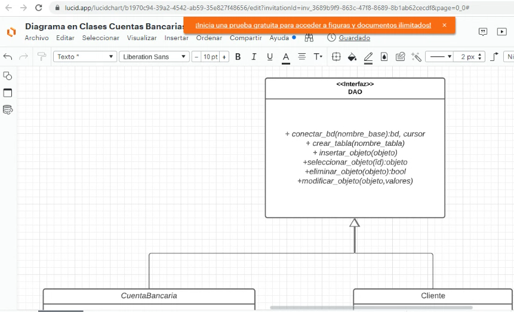
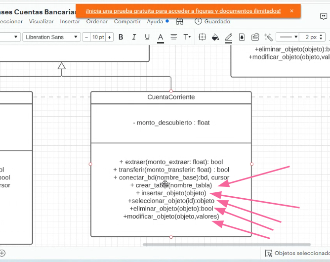
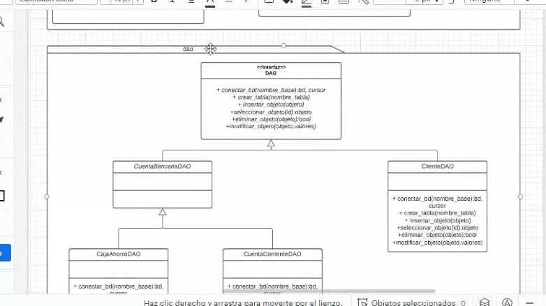
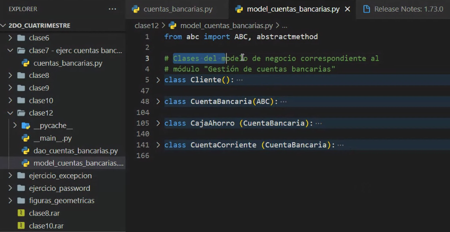
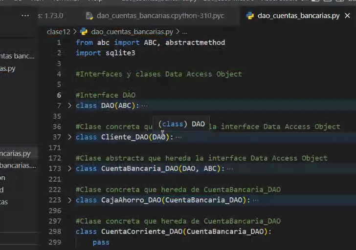
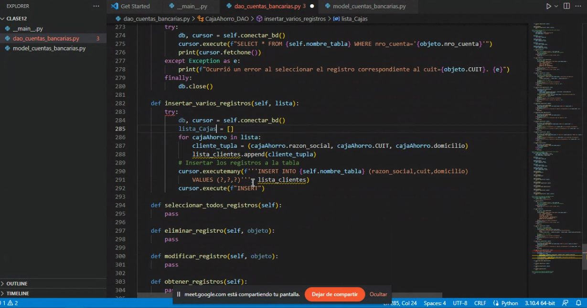

## Clase 13

Repasamos diagrama

Vamos a hacer el DAO como Interfaz (en python es una clase abstracta cuyos métodos son abstractos, que se definirán en otras clases)

El error conceptual de la imagen de arriba es que la CuentaCorriente debería realizar las acciones de extraer y transferir, pero conectarse a BD o crear tablas no están relacionadas con esa instancia, son cuestiones anexas al sistema, a nivel diseño hay que separarlo.

En código llevamos a módulos distintos.

Interfaz DAO:

Reformulamos el ejercicio utilizando dos módulos distintos para DAO y para el modelo de negocios.

Luego pasamos a parte práctica resolviendo el ejercicio en grupo:

