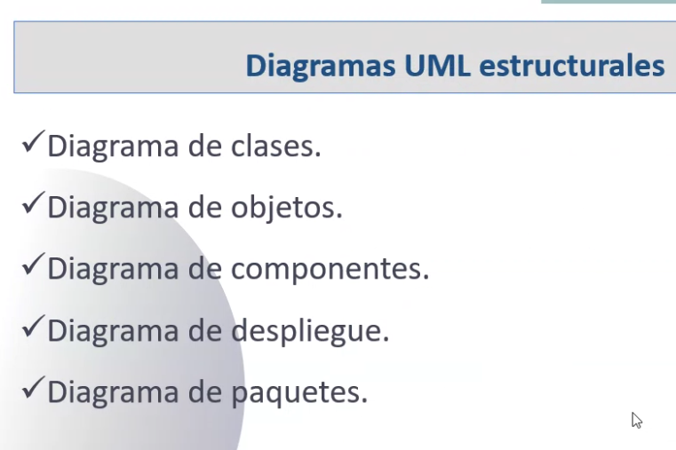

## Clase 01
También con el Profesor Eduardo Iberti

- Presentación de la materia (muy similar a la anterior)

[Descargar programa de la materia:](https://drive.google.com/file/d/1Z6_sU70RdRD3QAqIsec7Y-G4sonMG-PQ/view)

El modelado es esencial en la construcción de software para:

- Comunicar la estructura de un sistema complejo

Componentes, atributos y sus relaciones.

- Especificar el comportamiento deseado

Funcionalidades, lo que se traduce en código a métodos, que resuelven pequeños problemas (derivados de un problema más complejo). Permiten comunicarse con otros objetos en el sistema.

- Comprender mejor lo que estamos construyendo

Este correcto modelado nos va a ayudar a comprender mejor de un pantallazo. El diagrama nos hace comprender la totalidad de un componente, de forma gráfica.

- Descubrir oportunidades de simplificación y reutilización

Cuando tenemos un panorama completo en forma gráfica tenemos una mayor comprensión y detección de errores, mejoras. Antes de pasar a la implementación. 

UML como lenguaje de modelado nos permite visualizar nuestro sistema gráficamente.

Ventajas:

Al ser un estándar nos permite que quien sea que use el sistema comprenda el diagrama, porque comprendemos el mismo estándar.

Un diagrama de estructura interviene el arquitecto de software para lograr volcar en una representación gráfica. 

Cuando bajamos hacia el comportamiento los diagramas más en detalle nos indican las funcionalidades más finas (más cercano al código). Definición de los métodos y clases.

Un diagrama de diagramas :S

Diagramas estructurales: lo que vamos a estar viendo en esta materia

