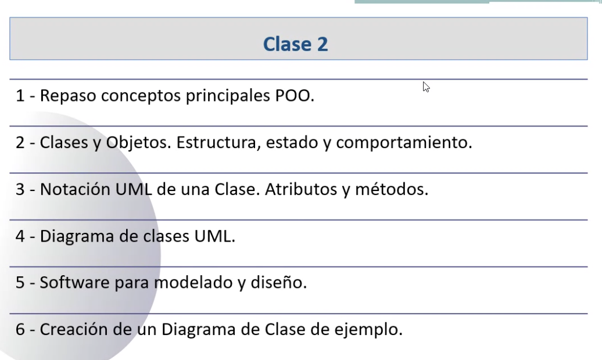

## Clase 02

Diagrama de clases (básico)

:: Repaso general de conceptos ::

### Clases y objetos

Lo que diferencia un objeto de otro es el valor de sus atributos. Lo que se conoce como 'estado'.

Podemos pensar los objetos como una variable de tipo estructurado. 

Las clases son nuevos tipos de datos que estoy incorporando a mi software.

### Diagrama de Clases

Quiero conocer las clases y cuál es la relación entre ellas. No necesito ver sus atributos y métodos en este diagrama.

El triángulo vacío indica relación de herencia entre las clases.

Relación de asociación simple

Relación de composición (hay también de agregación)

