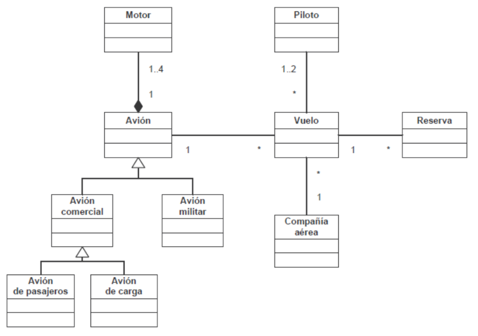
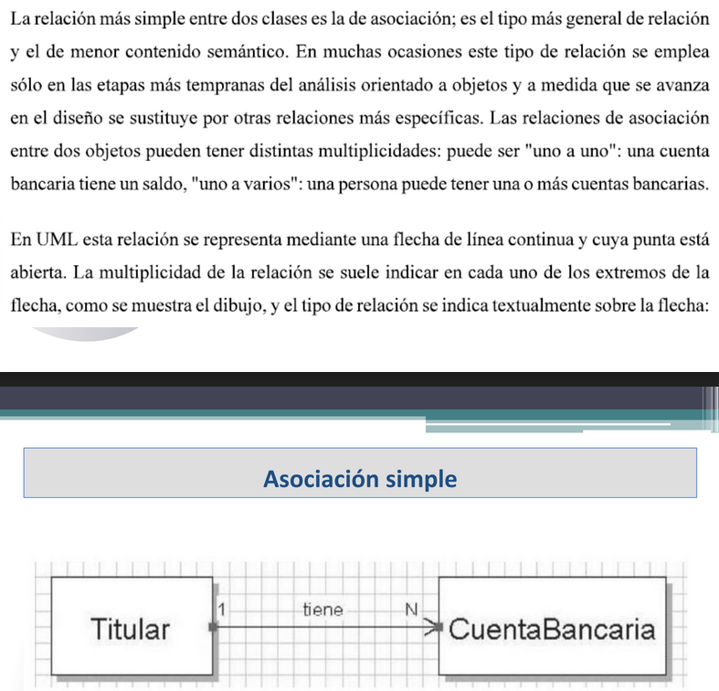
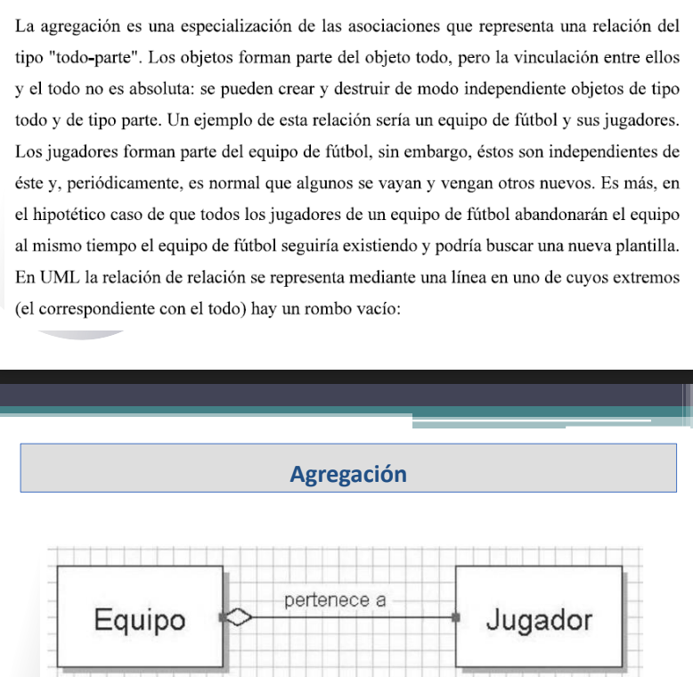
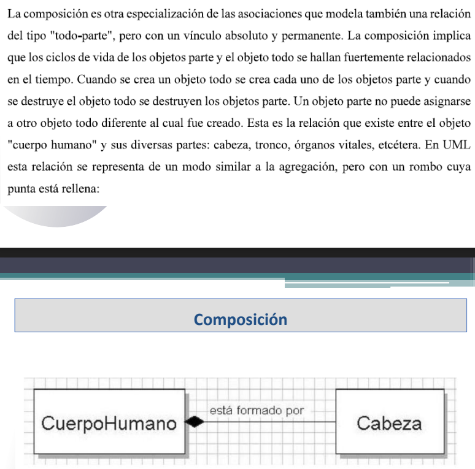
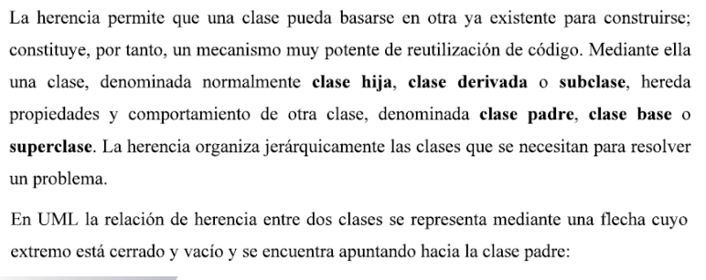
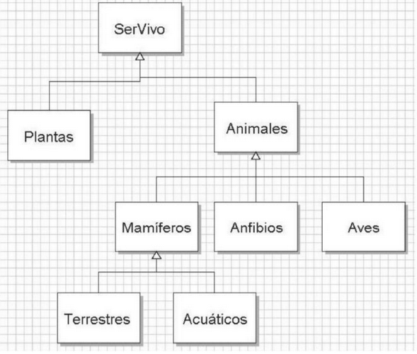

## Clase 03

Repaso diagrama de clases UML

Analizamos la fuerza que tiene cada asociación entre los objetos.

La respuesta a si un objeto es de una clase es: "es un (..)?" ("un avión militar, es un avión? si")

### Asociación simple

Es la relación más simple entre dos clases. Aparece con más frecuencia. Puede ser uno a uno, uno a varios (ej cuentas bancarias). Se indica en los extremos de la flecha.

Ej "un titular tiene muchas CuentasBancarias"

Titular 1 --> N CuentaBancaria

El titular tiene cuenta bancaria, la cuenta bancaria le pertenece a un titular. No es una relación de mucha fuerza: si desaparece una puede permanecer la otra.

### Agregación (es una asociación con particularidades)

La vinculación no es absoluta, se pueden crear y destruir objetos de tipo todo y de parte.

Ejemplo equipo de fútbol. Se conecta con el rombo vacío:

un Jugador pertenece a un equipo, pero si el equipo se disuelve el jugador sigue existiendo.

### Composición

Es otra especialización, del tipo todo parte, pero con un vínculo absoluto y permanente. Sus ciclos de vida se hallan fuertemente relacionados en el tiempo.

Ejemplo Cuerpo humano (y sus diversas partes). Se representa similar a la agregación, pero el rombo se rellena.

CuerpoHumano <-- Cabeza 
(está formado por)

### Herencia

Permite que una clase pueda basarse en otra ya existente. Nos sirve para reutilizar código. Una clase hija, derivada o subclase, hereda propiedades y comportamientos de una clase padre, clase base o superclase.

La relación se representa con una flecha con extremo vacío y se encuentra apuntando hacia la clase padre.

Diagrama: Plantas animales, son seres vivos

