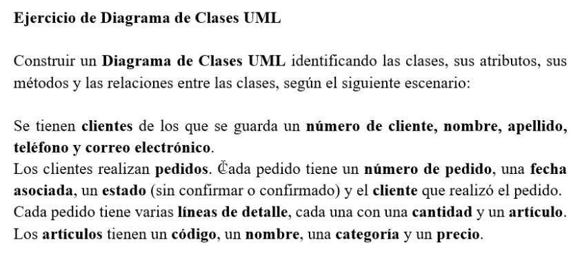
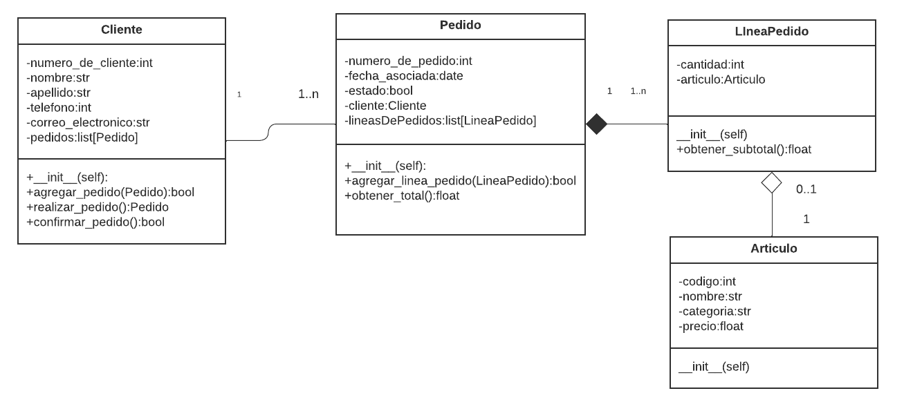

## Clase 04
Repaso conceptos clase anterior:

- Asociaciones
	- simple
	- agregación
	- composición
- Herencia
- Repaso diagrama UML

Realizamos diagrama en clase.

Enunciado:

Resolución en clase con screenshare de Emi:

