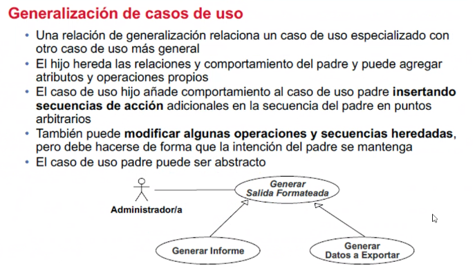
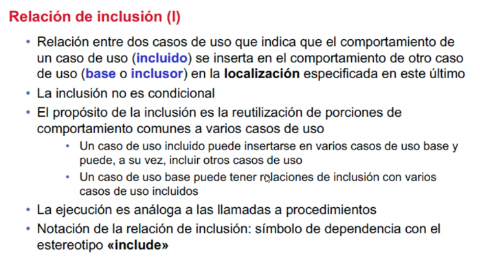

## Clase 05
Nuevo tema:
Casos de uso en UML

Cuáles son los elementos que intervienen en los esquemas, para qué sirven. Vemos ejemplo.

Listado de diagramas (algunos de ellos) del lenguaje de modelado UML

Varios de estos diagramas nos dan información sobre la estructura del diseño de los sistemas de software. Otros nos dan una idea de su comportamiento.

Dentro de estos vimos los diagramas de clases. Sus componentes y sus relaciones.
En este tipo de diagrama no se puede observar el comportamiento. Eso se va a poder observar en otro tipo de diagramas.

### Casos de uso

No siempre es suficiente con un diagrama de casos de uso, muchas veces usamos muchos.

De ahí sale una 'vista' que está compuesta por más de un diagrama de casos de uso.

Lo que hace es capturar la funcionalidad de un sistema. Cuanto más complejo se necesita comunicar el comportamiento, vamos a necesitar más de un diagrama.

Hay que dividir en diferentes diagramas.

Los usuarios se denominan 'actores' y las funcionalidades se conocen como casos de uso.

Representando una funcionalidad puntual, que puede estar relacionada a otro caso de uso. Y pueden estar vinculados a otros actores.

El conjunto de unos casos de uso que tienen alguna relación van a estar formando el 'sujeto'. Los 'actores' van a ser quienes hagan cumplir las interacciones de los casos de uso.

Ejemplo de diagrama de casos de uso. Notamos que es muy distinto a un diagrama de clases.

Los nombres deben ser con verbo (+ un sustantivo en algunos casos) que da una forma rápida de entender qué hace esa funcionalidad.

Ejemplos `Hacer Recomendaciones`, `Reservar`, `Gestionar Inventario`

Los Casos de uso podrían estar relacionados a más de un actor.

Generalmente es un usuario, puede cumplir varios roles de acuerdo a las acciones que esté realizando (por eso podría tener otros roles).

El actor se representa con un stick man o monigote. El nombre empieza con mayúscula.

### Tipos de actores

En la mayoría de los casos se observan actores principales (opcionalmente pueden aparecer otros tipos de actores: de apoyo y pasivos).

#### Relaciones entre actores

Van a haber asociaciones entre el actor y los casos de uso (uno o muchos de ellos). Pero también pueden existir relación entre los distintos actores.

Podemos tener diferentes tipos de instancias de actores.

Los actores que quedan definidos como actores 'padre' se los conoce como actores abstractos. Similar a lo que veíamos en clases abstractas.

Izquierda: un actor puede relacionarse a un caso de uso.

Derecha: actores que se relacionan entre sí. Son relaciones generalizadas. Tienen un comportamiento similar a la herencia.

### Casos de uso
La notación de los casos de uso es con una elipse.  

Especifican un comportamiento que el actor puede llegar a realizar.

Por lo general en un conjunto de acciones aparecen más de un actor / usuario.

Generalmente este comportamiento deriva en un cambio de estado. Una serie de acciones que modifican el estado. Van a estar agrupados en alguna funcionalidad que se traduce en métodos.

Los diagramas de casos de uso complementan a los diagramas de clase

### Notación de un caso de uso en UML

La más común es la de la izquierda.

### Relaciones entre casos de uso

### Generalización de casos de uso

Similar a la herencia. El hijo hereda los comportamientos del padre. El caso de uso hijo añade comportamientos.

### Relación de extensión

El caso de uso base, puede ser extendido como comportamiento adicional. 

El extendido define un comportamiento independiente del caso de uso extensor.

La extensión tiene lugar en determinados puntos de extensión. Son determinadas condiciones que si se cumplen o no, van a tomar un camino u otro.

### Relación de inclusión

El comportamiento incluido se inserta en otro caso de uso (en la localización demarcada en este último).

El propósito de la inclusión es la reutilización de comportamientos comunes a varios casos de uso.

