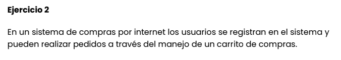

## Clase 6

Repaso de clase anterior:

Diagramas de caso de uso. 

Componentes de los casos de uso: sujeto, casos de uso, actores..

Realizamos diagrama de casos de uso UML en conjunto:

---
Ejercicio 2 y 3 (a resolver)

[wip]

