## Intro a la materia
6 sept clase presencial

[Link al classroom](https://classroom.google.com/u/1/c/NDg4ODQxNTM0MTY1)

### Estadística

Descriptiva:

Mediante gráficos y cálculos. Parámetros que calculamos, calculamos la probabilidad de ocurrencia.

Inferencial:

A partir de una muestra de datos organizados, hacer una inferencia de cómo se va a comportar toda la población.

Se basa en la probabilidad

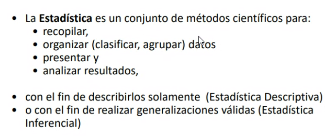

*Población*: conjunto completo de los datos

*Muestra*: un subconjunto representativo de la población. 

Debe ser representativo para que el análisis de la muestra lo pueda transferir a la población completa. Debe ser aleatoria o seleccionada al azar.

Lo que se conoce y se calcula es el parámetro poblacional.

Si salgo de una muestra saco un estadístico y, si era representativo de una población, el parámetro promedio (ej ingresos promedio)

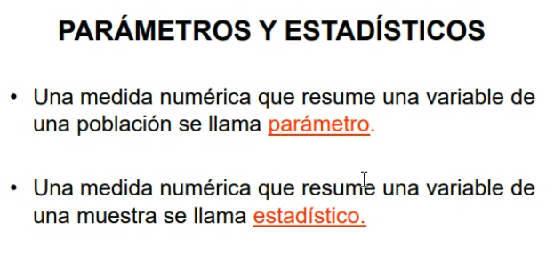

Dentro del conjunto de datos quiero estudiar una característica.

Esa característica es la VARIABLE.

Y el valor, es el DATO que le vamos a asignar a las variables.

### Clasificaciones de las Variables

- Cualitativas o Categóricas:

- Cuantitativas

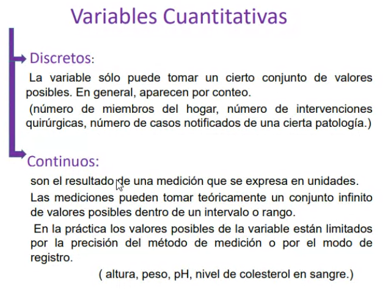

Ejemplos variables cuantitativas discretas:
Cantidad de materias aprobadas, cantidad de integrantes de un hogar. (números enteros)

Ejemplos variables cuantitativas continuas:
Tiempo de espera en caja, resultados de análisis, peso, altura, etc.

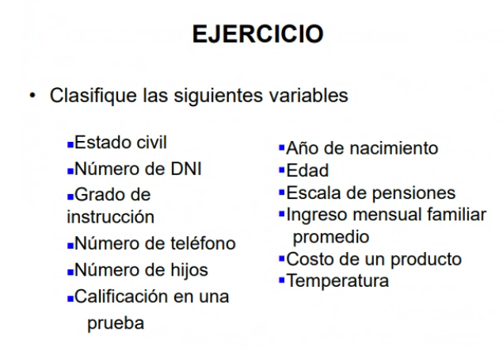

### Problema 1

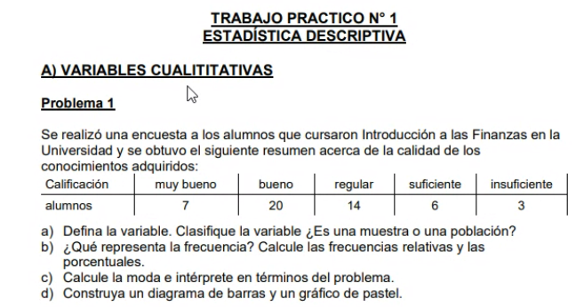

N = 50 alumnos

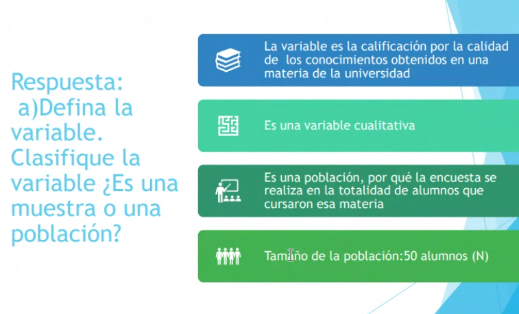

*Frecuencia*: La cantidad de veces que aparece un valor de una variable.

En el ejemplo, alumnos me da la frecuencia.

Frecuencia absoluta (f), frecuencia relativa (fr), frecuencia porcentual (f%)

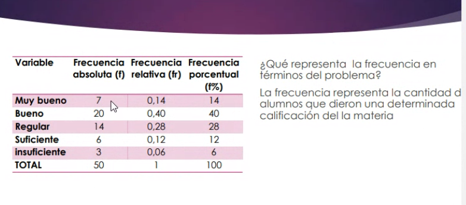

El valor de variable que más veces se repite: moda (Mo)

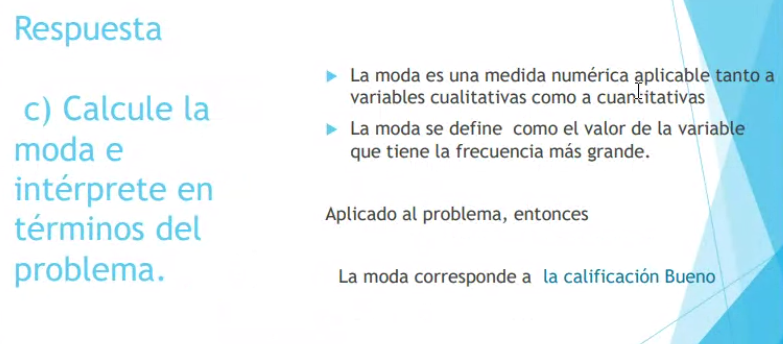

La mayoría de los alumnos se inclinó por la calidad del conocimiento adquirido como bueno.

La barras van separadas cuando los datos cualitativos y cuantitativos discretos. Esto es porque cada barra representa a una categoria diferente.

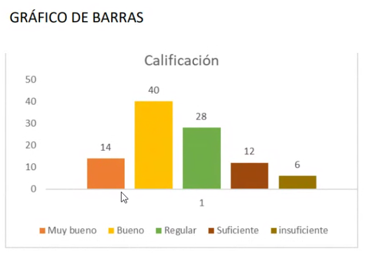

### Problema 2

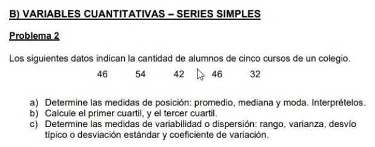

Medidas de posición:

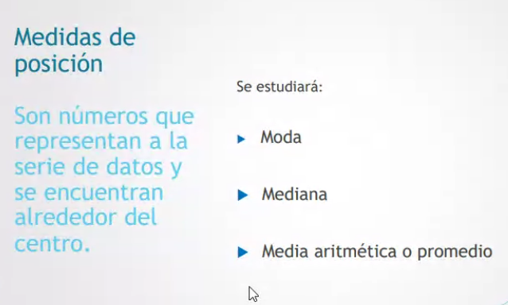

De tendencia central
	Media aritmética o promedio
	Mediana
	Moda

De tendencia no central
	Percentiles
	Cuartiles

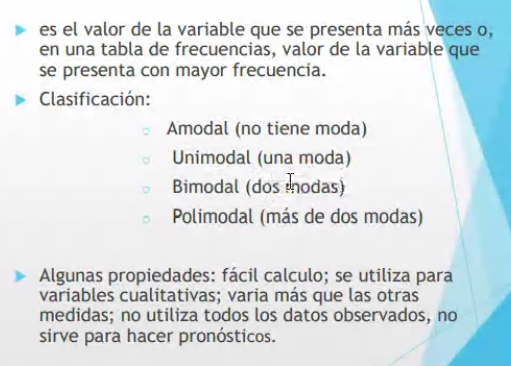

La Moda no utiliza todos los datos observados, no sirve para hacer pronósticos.

Total de la muestra: 220
Cantidad de categorías: 5

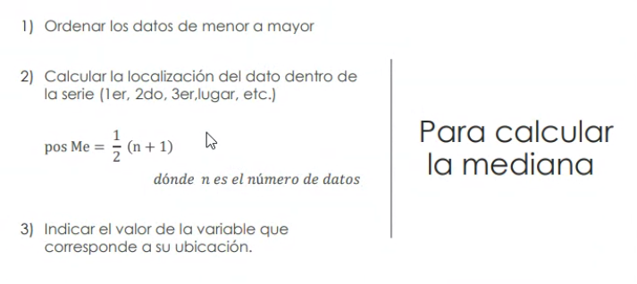

La mediana es 46

[32 42 46 46 54]

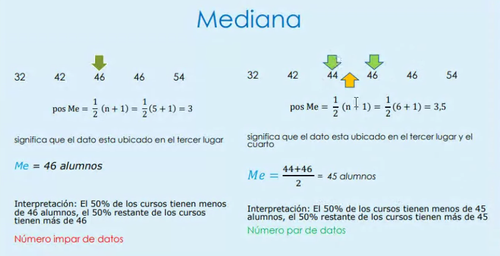

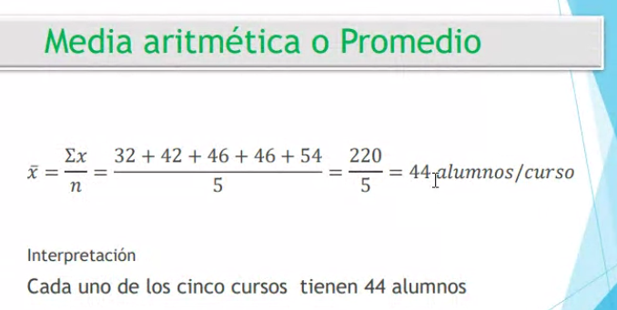

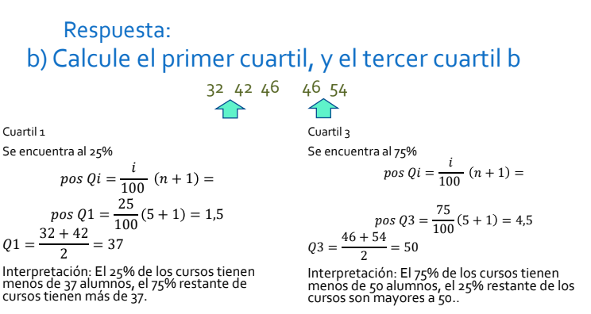

### Medidas de Dispersión o Variabilidad

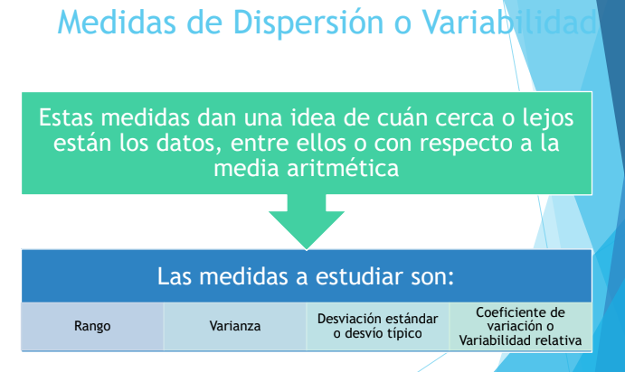

En este caso tenemos 4 medidas.

Desvío de la muestra: s

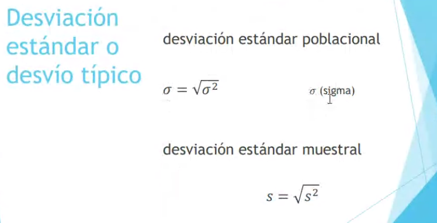

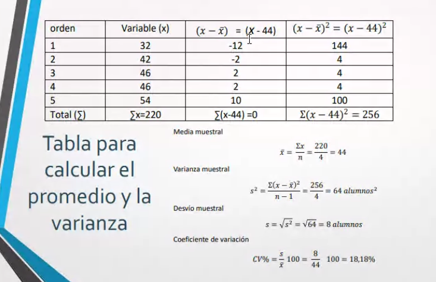

Este conjunto de datos en confiable. 

### Regla empírica

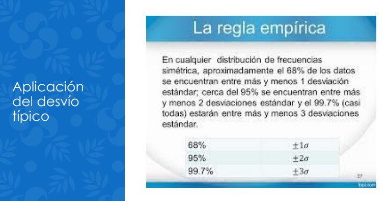

[Documento pdf fuente](https://drive.google.com/file/d/1vRNicWfvNxxV94Qnl028AT7anBmX4owD/view)
