## Clase 04
Clase virtual 13-09

Repaso pre clase:

### asimetría:

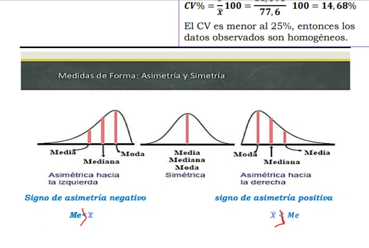

---
### Probabilidad

Conceptos básicos:

Se realiza sobre fenómenos al azar. Uno no puede saber la probabilidad de ocurrecia del suceso, hasta que uno realiza el experimento.

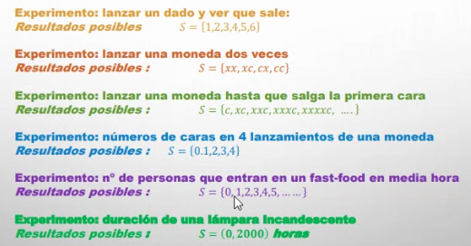

s = suceso

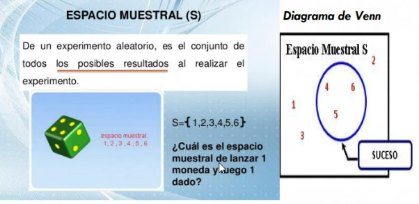

Espacio muestral es el conjunto completo de los posibles resultados

` S = {1,2,3,4,5,6} `

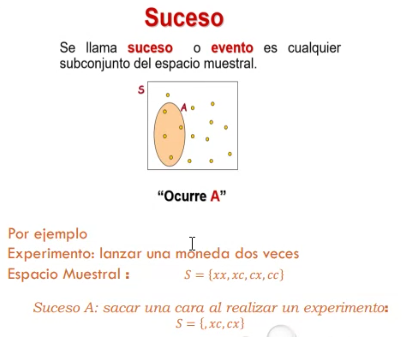

Dentro del espacio muestral, obtenemos el suceso

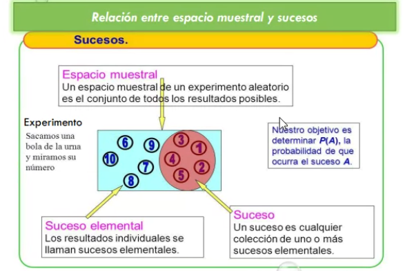

Suceso elemental: cuando tiene un único resultado.

Un suceso puede ser uno o más sucesos elementales

Resultado favorable sobre el total de resultados posibles

Probablidad de que ocurra un suceso: está entre 0 y 1. Porque en 0 es imposible (suceso imposible). Suceso seguro: siempre va a ser verdadero (ej sacar bolilla menor a 11)

Son equiprobables si tienen la misma posibilidad de salir (ej 1/6 posibilidades de obtener un número en un dado). No hace falta que tire el dado. Sé que la probabilidad es la misma (enfoque clásica o de Laplace o a priori).

Probabilidad subjetiva: qué tanto quiero que algo ocurra. No las podemos medir.

Experimento con dado:

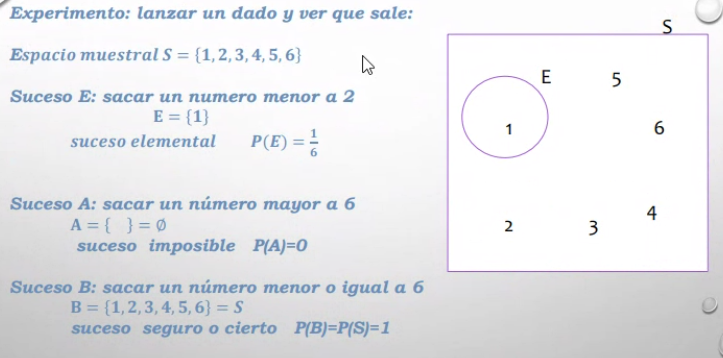

Elementos disjuntos: no tienen elementos en común.

Sucesos complementarios: 

La probabilidad de dos sucesos es la suma de la probabilidades de ambos sucesos.

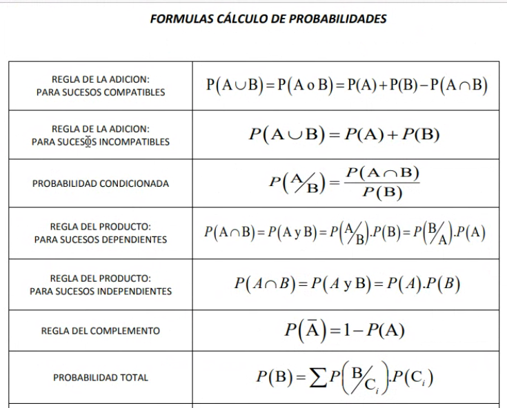

Probabilidades marginales o de sucesos simples.

Dentro de la tabla: sucesos compuestos:

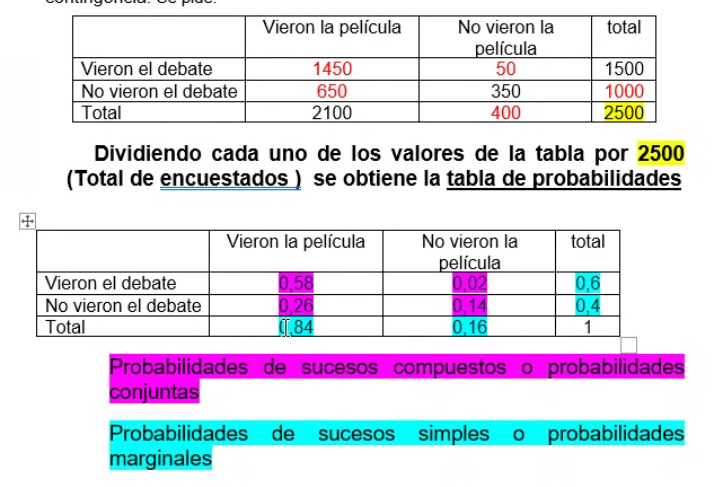

### Operaciones con sucesos

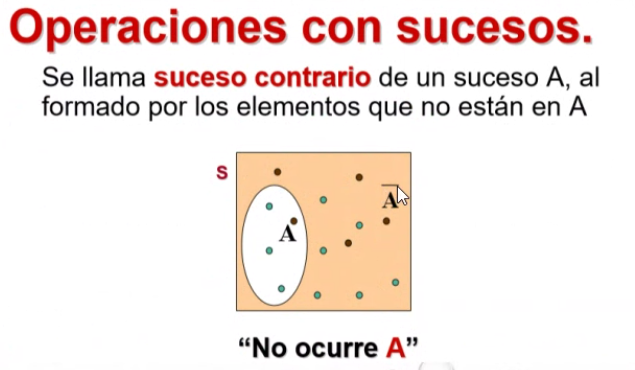

### Intersección de sucesos

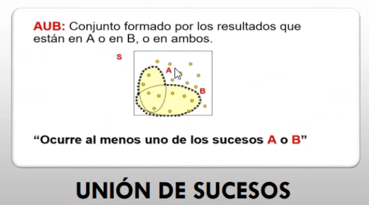

Ocurren en forma simultanea dos sucesos.

Unión es el conjunto de todos los elementos que están en A, en B o en ambos

(buscamos que ocurra al menos uno de los sucesos)

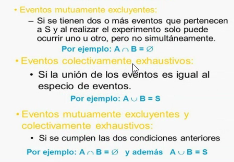

- Eventos mutuamente excluyentes
- Eventos colectivamente exhautivos
- Las dos cosas juntas

### Regal de adición

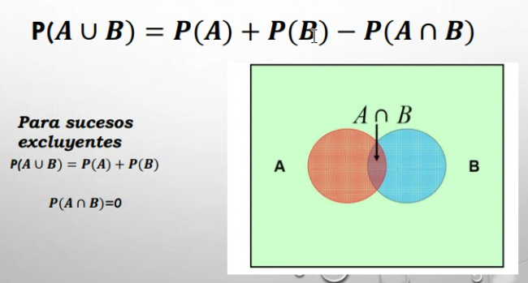

Resolvemos ejercicio en clase:

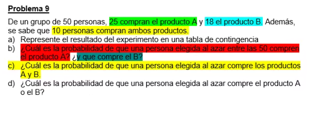
 
 (completar tabla de contingencia o de doble entrada)

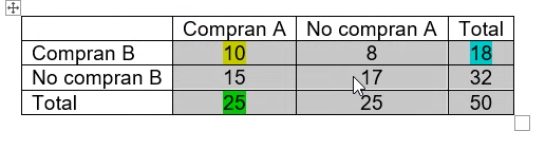

Para la tabla de probabilidades, divido cada uno de los números por el total.

Resultado:

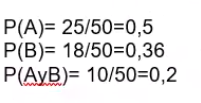

