## Clase 05

Repaso con problema 10

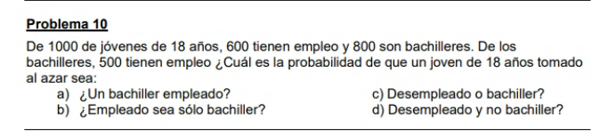

Resolución

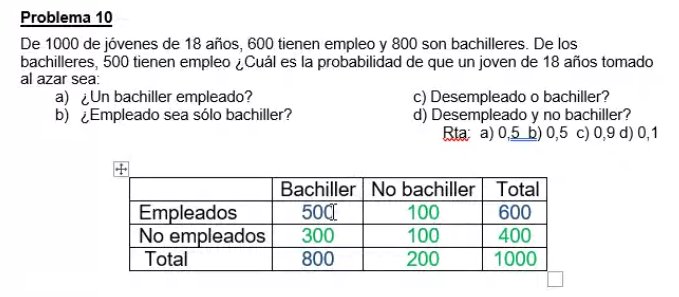

En azul los datos
En verde lo que sacamos por diferencia

Sucesos simples: ser empleado, no ser empleado. Ser bachiller, no ser bachiller.

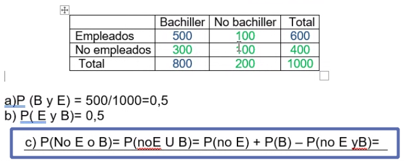

usamos la unión de los dos sucesos.

Sumo ambos sucesos y le resto la intersección

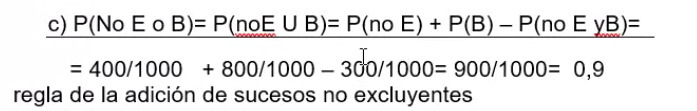

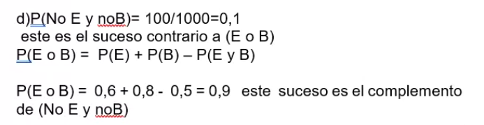

### Problema 11 del TP
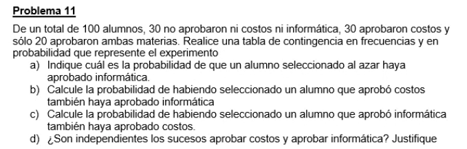

Para el punto b, usamos la probabilidad condicionada:

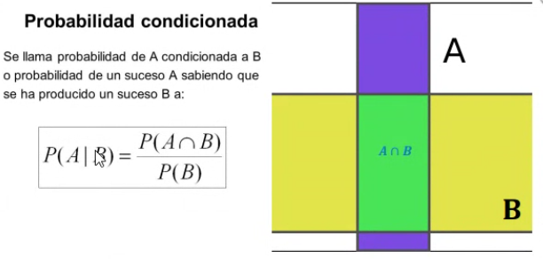

El hecho de aprobar informática, sabiendo previamente que aprobó costos, el suceso aprobar info se vio modificado por el hecho de haber aprobado costos.

Los sucesos no son independientes, porque la probabilidad se ve modificada. Si son independientes, un suceso no modifica la probabilidad de ocurrencia. 

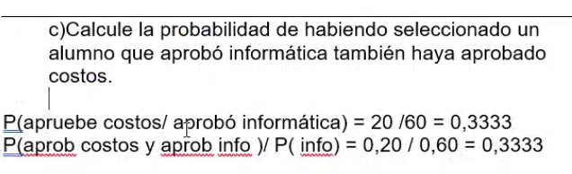

### Problema 12

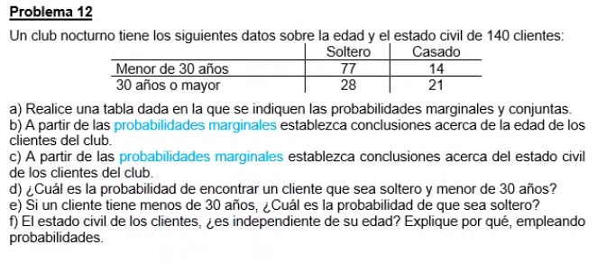

### Problema 14 (a resolver)

### Problema 15

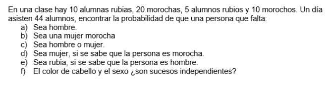

### Problema 20

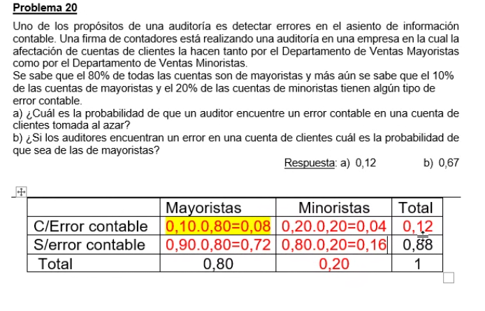

Refejado en diagrama de árbol:

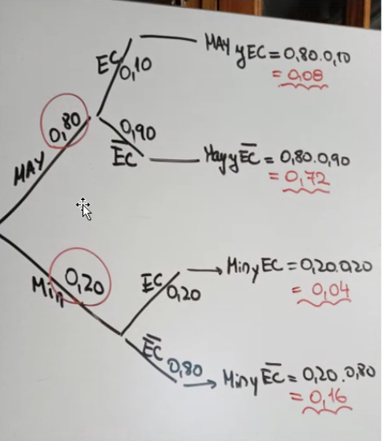

