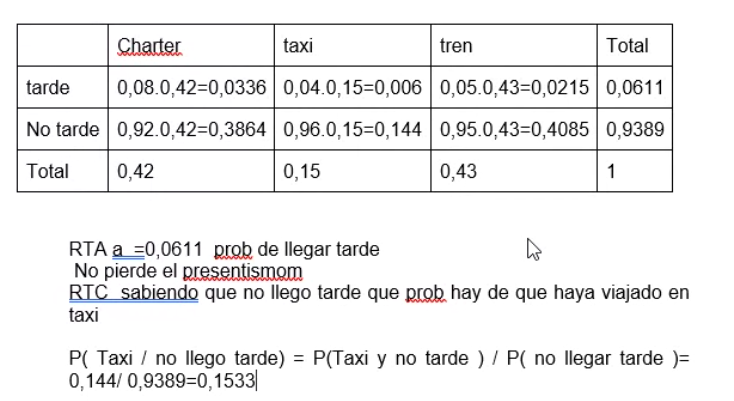

## Clase 06
**Repaso pre-parcial**

Hacemos ejercicios en clase:

### Unidad 1

> puede no incluir datos como que se trata de una 'muestra'

a) La frecuencia reperesenta la cantidad de días en los que hubo determinada producción

Para la mediana buscamos el percentil 50

El coeficiente de variación tiene que ser menor al 25% para que sea homogenea. Está concentrado todo al rededor del promedio.

En nuestro caso ambas muestras son homogeneas.

La primera tiene menor variabilidad relativa

### Unidad 2: Probabilidad

En formato árbol:

