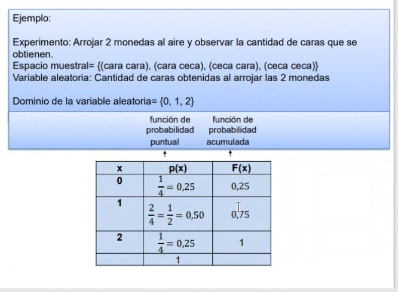
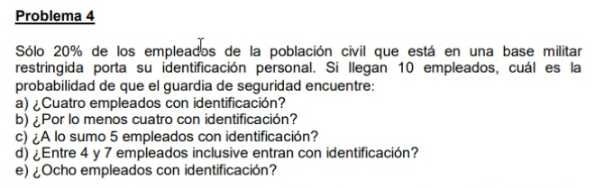

## Clase 07

Nuevo tema: Variables aleatorias discretas

Primer ejemplo:

Resolución:

En vez de frecuencia acumulada hacemos la función de frecuencia acumulada

[app que tenemos que usar](https://play.google.com/store/apps/details?id=com.mbognar.probdist)

---

con ID, sin ID

X (variable aleatoria) = Empleados con documento
N = 10 (10 empleados que tomamos como muestra)
Variable aleatoria: 
Probabilidad: 0,2 (20%)

**punto a:**

Pbi (x = 4; 3 = 10; p = 0,2)

**punto d:**

Pbi (x <= 7) = 0,99992 - Pbi (x<=3) = 0,87913 
0,99992 - 0,87913 = **0,12079**

---

**punto b:** 
Pbi(x = 2, n = 20, p = 0,10)

