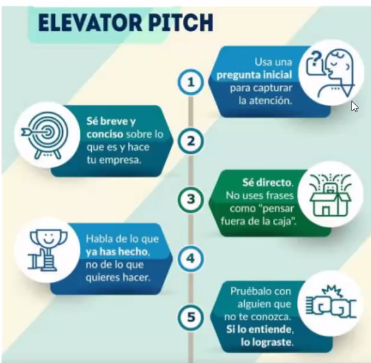
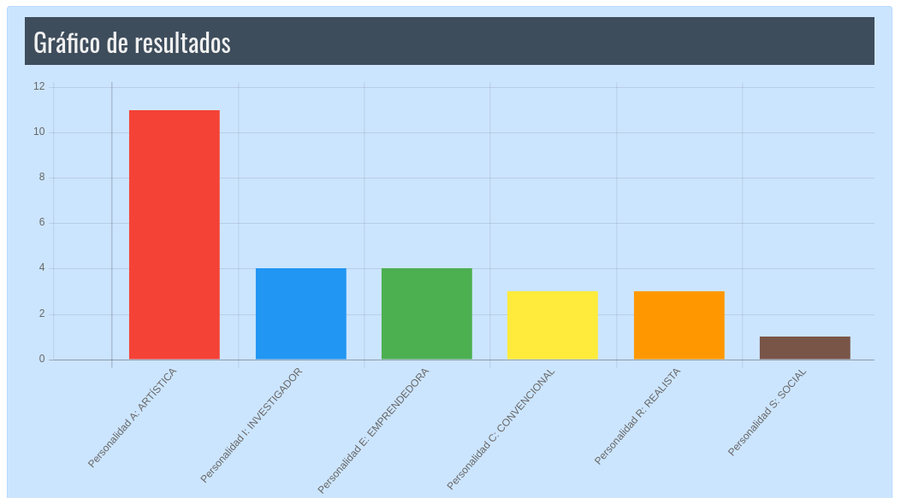

## Clase 01
Aproximación al ámbito laboral

- Presentación de la materia

Clases previstas:

- Primer tramo
- Pitch
- Conversatorio 1
- Clase presencial
- Pre-parcial
- Primer Parcial 28-9

Primera idea de Elevator Pitch:

Elevator pitch steps:

1) afirmación o pregunta
2) presentacion: quien eres
3) problemas cubres
4) que aportas (soluciones)
5) Beneficios que aportas
6) porque eres adecuado
7) CTA

Completamos un Test de Holland:
https://cuvintedu.files.wordpress.com/2018/11/test-de-holland.pdf

Nos dividimos en grupos y empezamos a armar un pitch personal