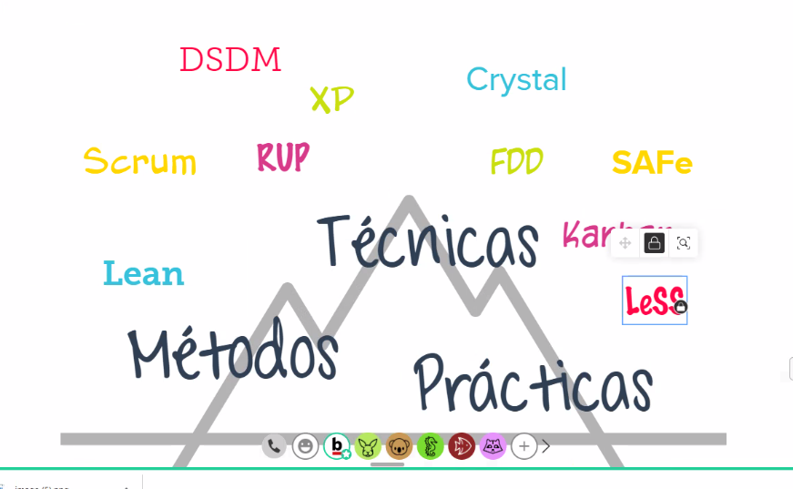
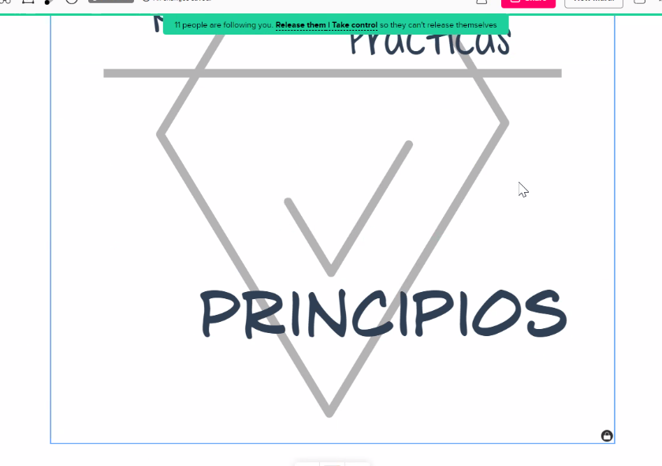
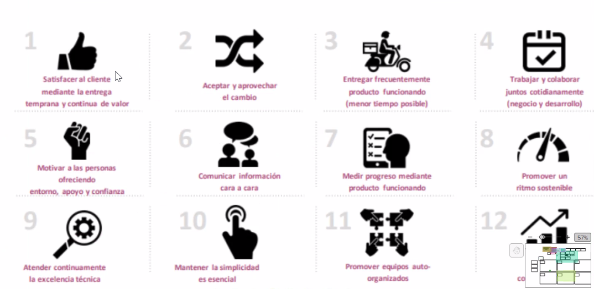
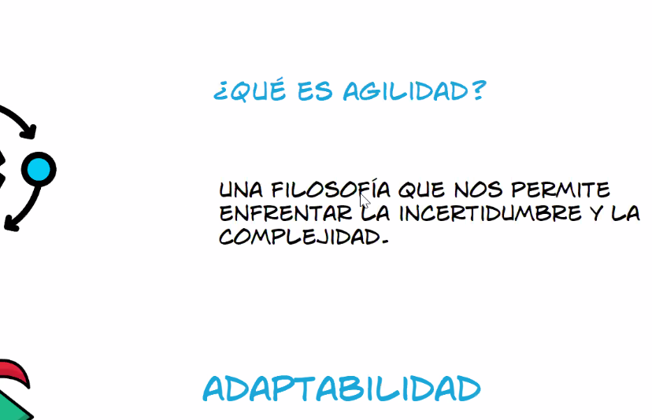
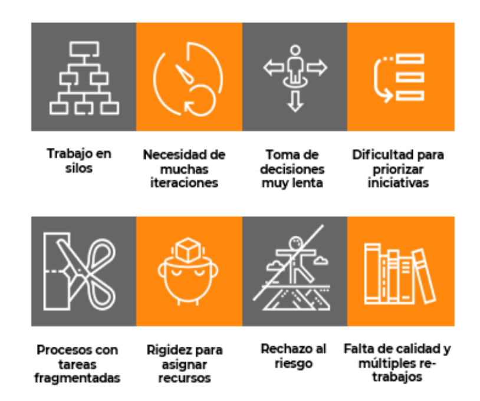
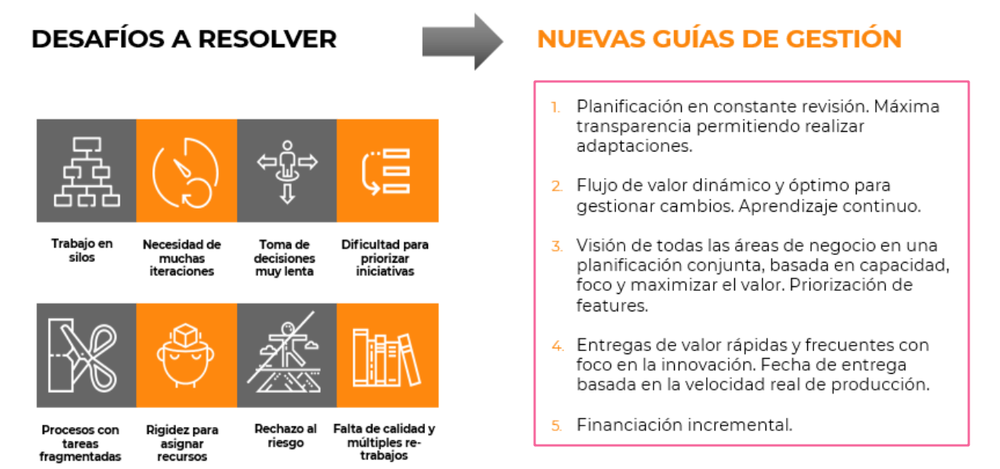
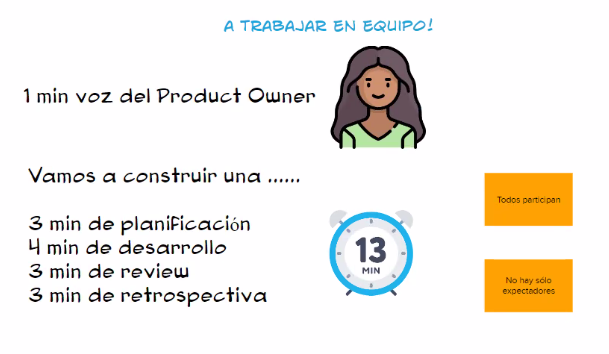
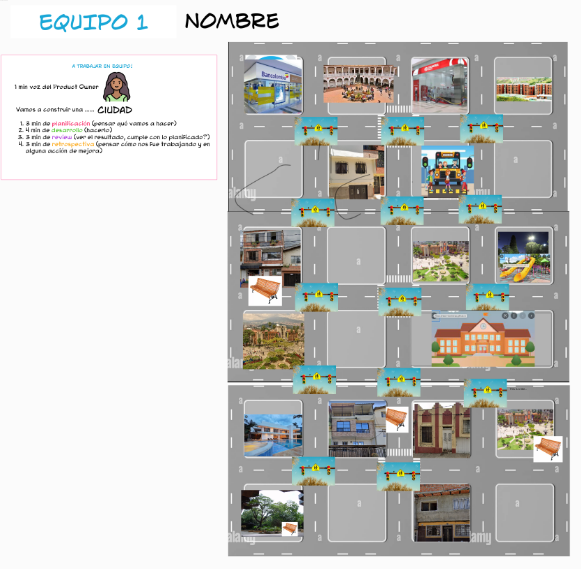
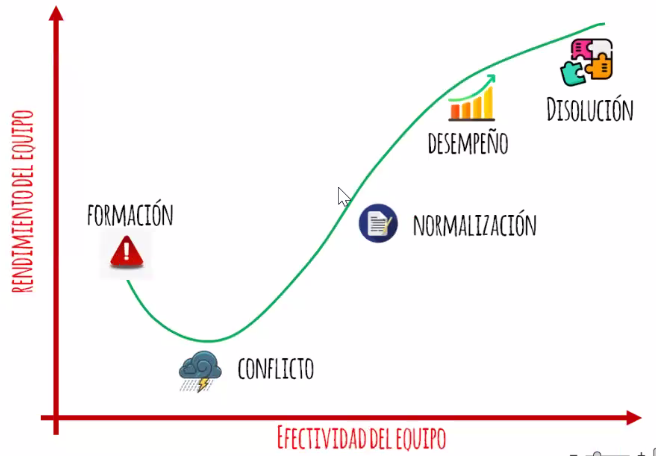

## Clase 05
Conversatorio Agile

Realizamos actividades en grupo (presentación)

Luego Vanina presenta conceptos agile:

Principios y valores Agile

Sobre principios ágiles

- Ciclos cortos
- Dar valor siempre al cliente

Problemas a resolver:

Consigna trabajo en equipo:

Product Owner nos dice qué..
Nosotrxs concentrarnos en el cómo..

Hicimos ejercicio en grupo:

:: sprint 1 :: 

Retrospectiva:

- Logramos cumplir los tiempos pautados
- Llevamos cronograma y temporización
- Logramos detectar una forma de optimización consultando al product owner si los bancos podían ser para sentarse y duplicarlos (copy paste)
- Pudimos optimizar usando una plantilla de calles para darle orden al proyecto

Bloqueo: nos vimos saboteados por otro grupo 😓

:: sprint 2 :: 

Retrospectiva: 

- Logramos cumplir el objetivo 
- Mejoramos la comunicación previa preguntando a tiempo antes de planificar o ejecutar 
- Fuimos más rápidos en la ejecución que el sprint anterior (teníamos más claro cómo avanzar) 
- Mejor reparto de tareas, más autogestionado (en base a la planificación anterior) 
- Estuvimos más atentos a la tarea del otro (más colaborativo) 
- Se volvió a dar un sabotaje un poco más intenso que el anterior (nos borraron toda la ciudad 😬)

Cierre de actividad grupal. Puesta en común. Conclusiones de aprendizaje.

Repasa algunos conceptos:

Modelo Tuckman

Finaliza la actividad dando feedback de lo trabajado en el conversatorio.
