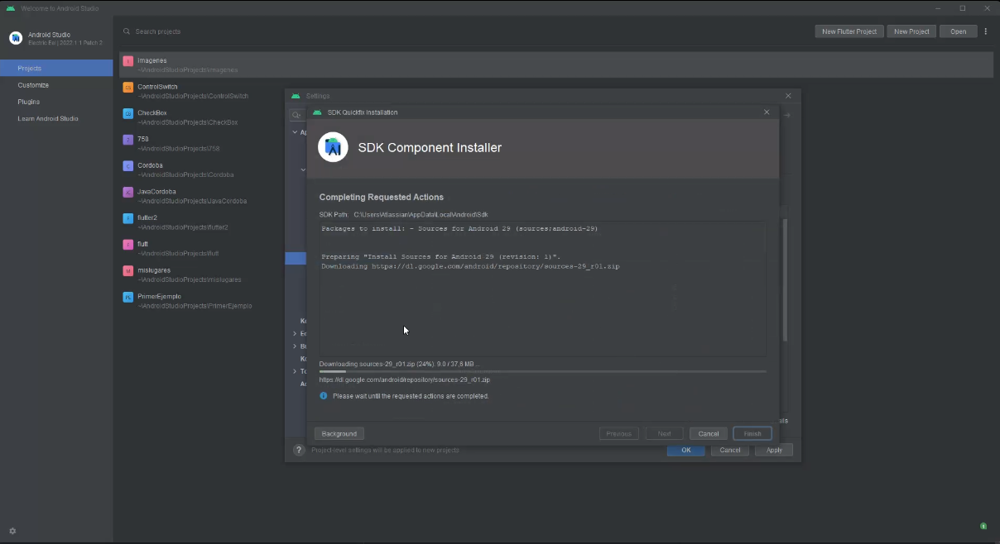
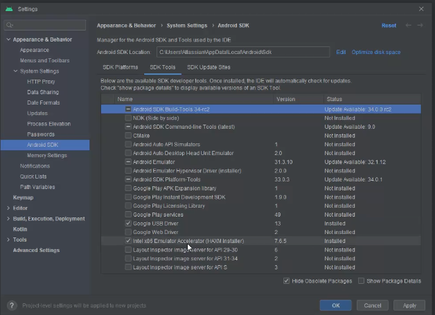
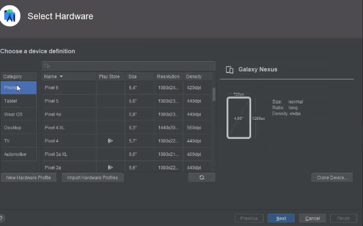
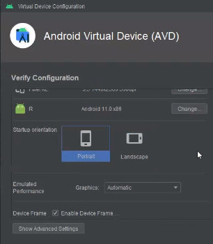
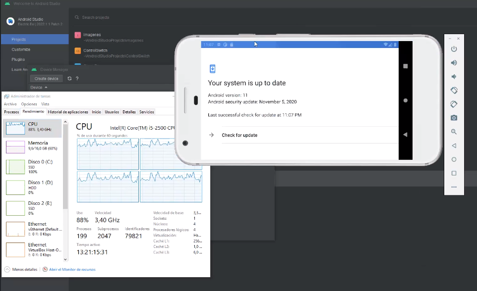

## Clase 05

Primera clase via Discord

Nos pasa un TP para que vayamos practicando.

Hacemos un rato de práctica cada uno en su compu (...)

```java

import java.util.Scanner;
  

public class Impares {  

    public static void main(String[] args) {

    Scanner scanner = new Scanner(System.in);

    System.out.println("Ingrese un numero para saber si es par o impar:");

    Integer num = scanner.nextInt();

    if(num % 2 == 0) {

        System.out.println("El número es par");

    } else {

        System.out.println("El número es impar");

    }

    }

}

```

(...) corta el ejercicio y seguimos con la clase, hace una demo para que vayamos viendo Android Studio.

### Android Studio

Muestra cómo instalar Android Studio en Win10



Algunos settings que recomienda:



Va a crear dispositivo:

Virtual Device Manager / Select Hardware



Algunos dispositivos para crear:
- Phone
- Wearable
- Tablet
- Desktop
- TV
- Automobile

Descarga la versión de R (Android 11)



Con el celu virtual creado muestra algunas cosas:



- Quedamos en entregar el TP1 el lunes