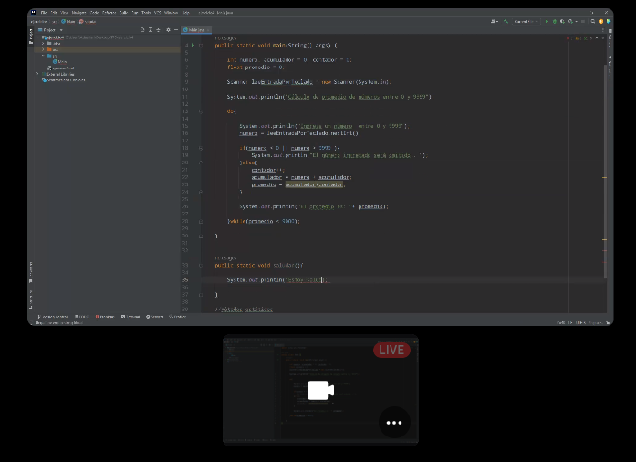
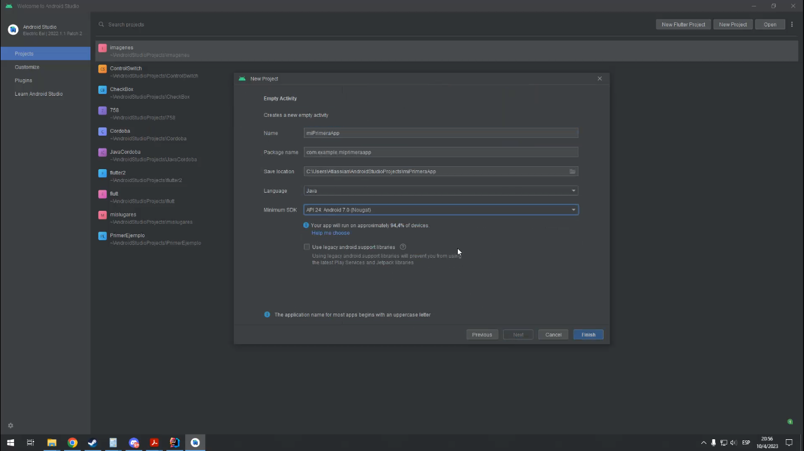
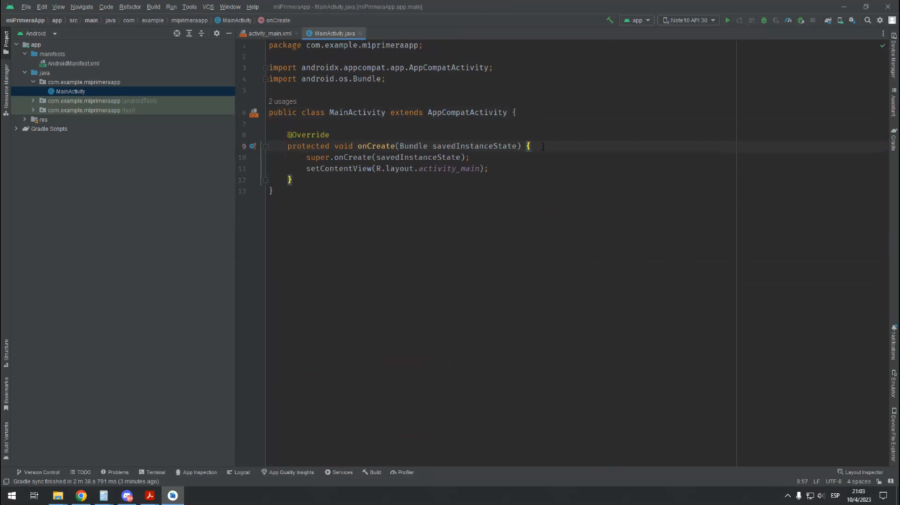
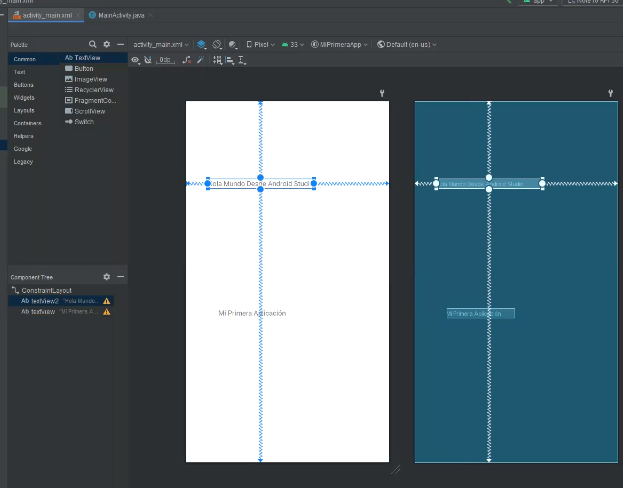
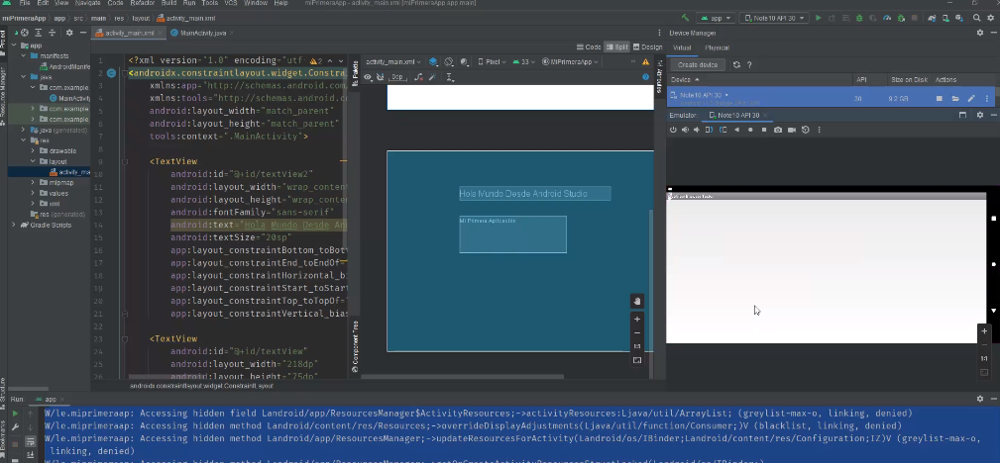

## Clase 06

Empieza mostrando un repaso por los ejercicios del TP.


(Literalmente se veía así el código 🙄)

Nos da tiempo para hacer un poco más de ejercicios.

---

### Métodos estáticos

Nos muestra cómo abstraer un método y llamarlo desde la clase main. Nos pasa un código y tenemos que extraer los métodos.

```java

import java.util.Scanner;

public class EjercicioEnClase {
    public static void main(String[] args) {

        saludar();
        System.out.println(saludarConReturn());
        System.out.println(saludarConReturnyParametros("Estoy saludando desde el parámetro saludoP"));
        calc();        

    }

    // Paso la función de Ale a un método:

    public static void calc() {
        int numero, acumulador = 0, contador = 0;
        float promedio = 0;

        Scanner leeEntradaPorTeclado = new Scanner(System.in);

        System.out.println("Cálculo de promedio de números entre 0 y 9999");

        do{

            System.out.println("Ingrese un número  entre 0 y 9999");
            numero = leeEntradaPorTeclado.nextInt();

            int numeroAlCuadrado = elevaAlCuadrado(numero);
            System.out.println(numeroAlCuadrado);

            if(numero < 0 || numero > 9999 ){
                System.out.println("El número ingresado será omitido...");
            }else{
                contador++;
                acumulador = numero + acumulador;
                promedio = acumulador/contador;
            }

            System.out.println("El promedio es: "+ promedio);

        }while(promedio < 9000);
    }

    //Métodos estáticos
    public static void saludar(){

        System.out.println("Estoy saludando desde Saludar");

    }

    public static String saludarConReturn(){

        String saludo = "Saludando con Return";

        return saludo;

    }

    public static String saludarConReturnyParametros(String saludoP){

        return saludoP;

    }

    public static int elevaAlCuadrado(int numeroaElevarP){

        int resultado = numeroaElevarP*numeroaElevarP;
        return resultado;

    }


}
```

Yo lo había hecho así a este ejercicio (4 del TP). Me anoto para después pasarlo a módulos más pequeños:

```java

// Ejercicio 4 TP1 

import java.util.Scanner;
import java.util.ArrayList;
import java.util.Collections;  

public class Promedio {  

public static void main(String[] args) {  

Scanner scanner = new Scanner(System.in);

System.out.println("### Obtener promedio, max y min ###");

int i = 0;
int n = 5; // size of my arrayList
int total = 0;
int valueMax;
int valueMin; 

ArrayList<Integer> arrNumbs = new ArrayList<Integer>(n);

while(i < n) {
System.out.println("Ingrese un número entre 0 y 9999:");
System.out.println("~~~~~~~~~~~~~~~~~~~");
int num = scanner.nextInt();

if((num < 0) || (num > 9999)) {

System.out.println("(!) error: ingrese un número entre 0 y 9999.");

} else {

// agrego num a array

arrNumbs.add(num);
total = total + num;
i++;

}
}  

// Calc & Display:

System.out.println("La lista completa de números es: " + arrNumbs);

System.out.println("El mayor número de la lista es: " + Collections.max(arrNumbs));

System.out.println("El menor número de la lista es: " + Collections.min(arrNumbs));

System.out.println("El número promedio de la lista es: " + total / n);  

}
}
```

---

Después vemos algunos conceptos de POO ahora en Java:

- Clases
- Métodos
- Encapsulamiento
- Getter y Setter

---

Seguimos viendo algo de Android Studio en el stream:



MainActivity en Android studio:



Manifest de la app (...)

Vista en Android Studio:



En Android Studio Todo el Design System de Material Design.



Para el lunes tenemos que tener una app con texto.
Quien tenga ganas y pueda, puede hacer el build 

Settings / About phone / Numero de Compilación
(hacer click varias veces para ver las opciones de desarrollador)

Menú para debug de apps / Permitir red
Escanear el QR con el Android (Pair new devices over Wifi)