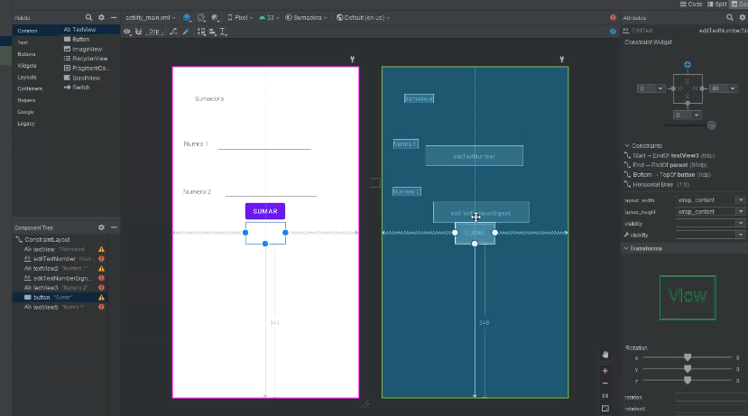
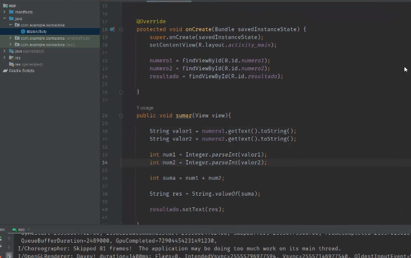
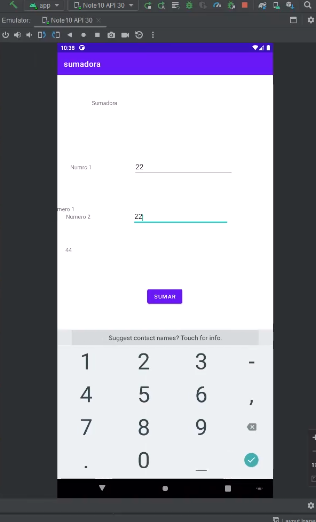
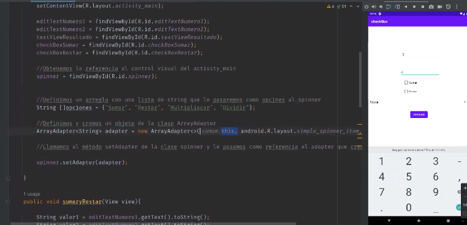

## Clase 07

Nos muestra cómo agregar funcionalidad a un botón. El ejercicio es  hacer una calculadora por partes. Primero la suma:

Crea un nuevo proyecto (actividad vacía).
Crea dos inputs de texto y un botón:

Declara las variables en en el código, castea los strings a Int y hace la suma:

Después compila y muestra la view:

---
Vemos algunos tipos de elementos:

- Radio buttons
- Checkbox
- Combo (spinner)

