## Clase 10

Menciona el TP de Java (subido a classroom - para martes 9)
Menciona el TP de API (subido a classroom - para viernes 19)

---

Comienza la clase (está relacionada a lo que vimos de API)

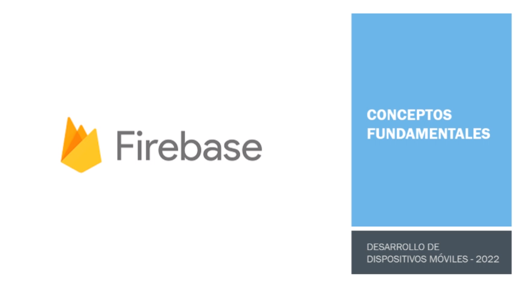

### Backend con Firebase

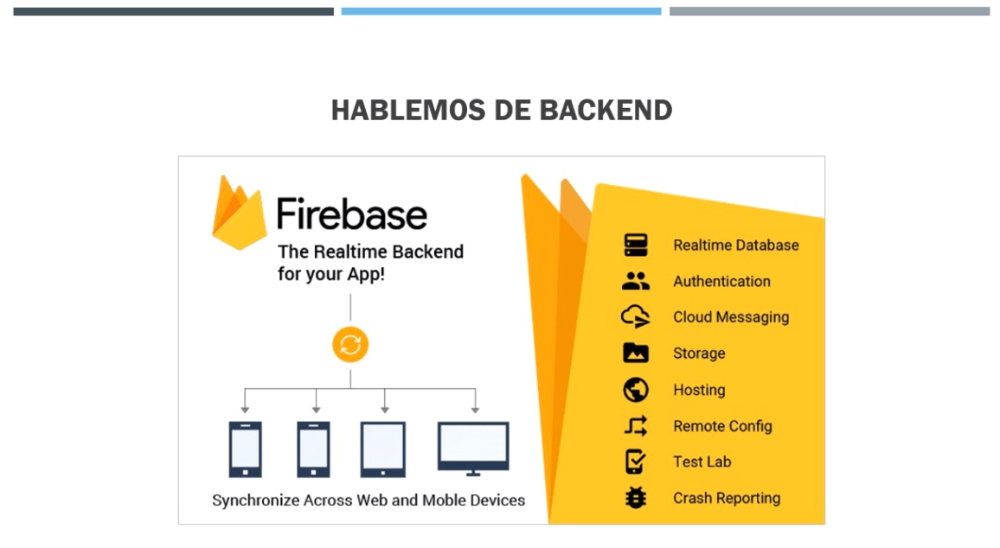

### Historia de Firebase (?? 😐)

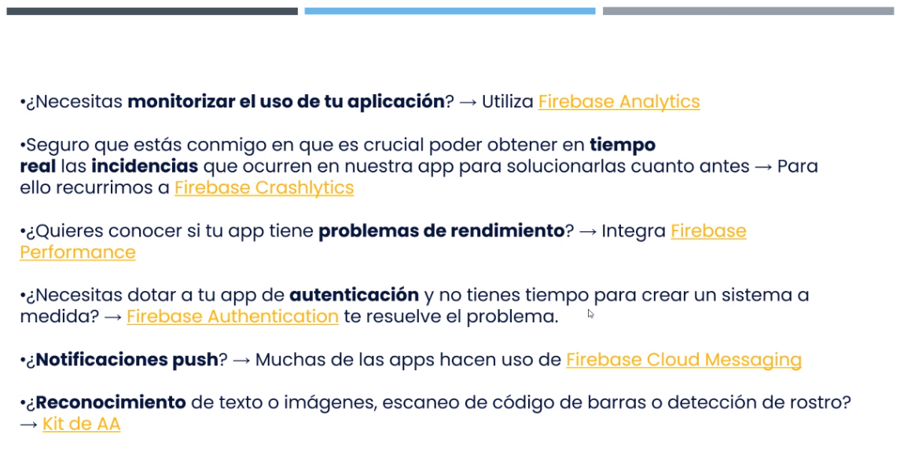

Nos da una publicidad de Google prácticamente, comentando los beneficios de Firebase.

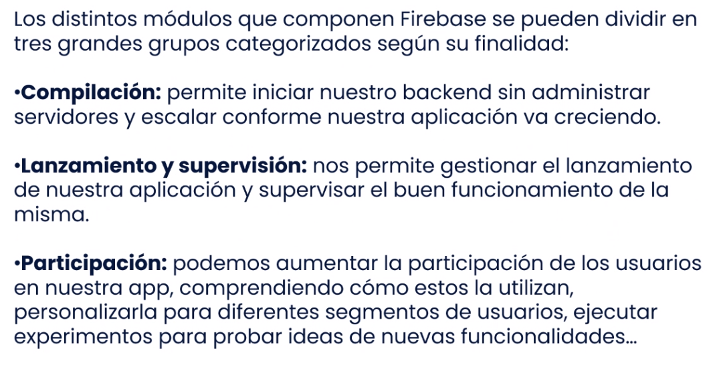

### Etapas de desarrollo con Firebase

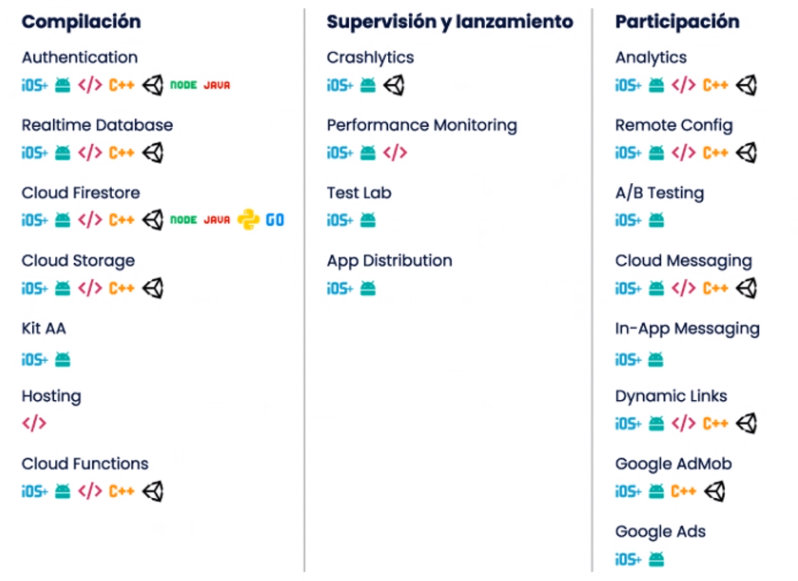

### Multiplataforma

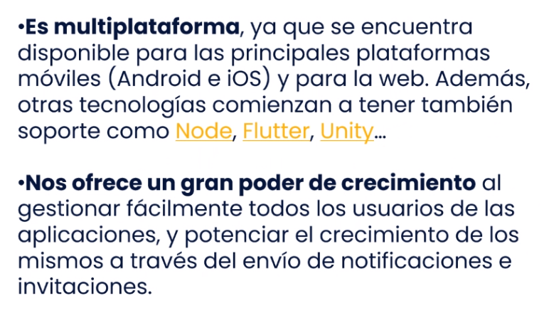

Después se pone a vendernos google ads (???)

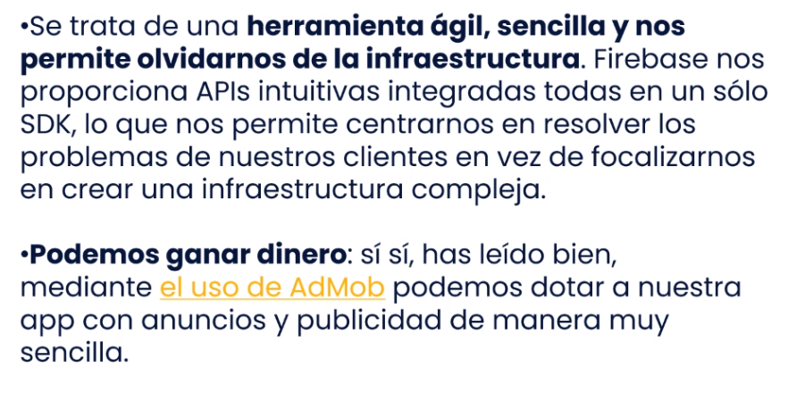

### Desventajas

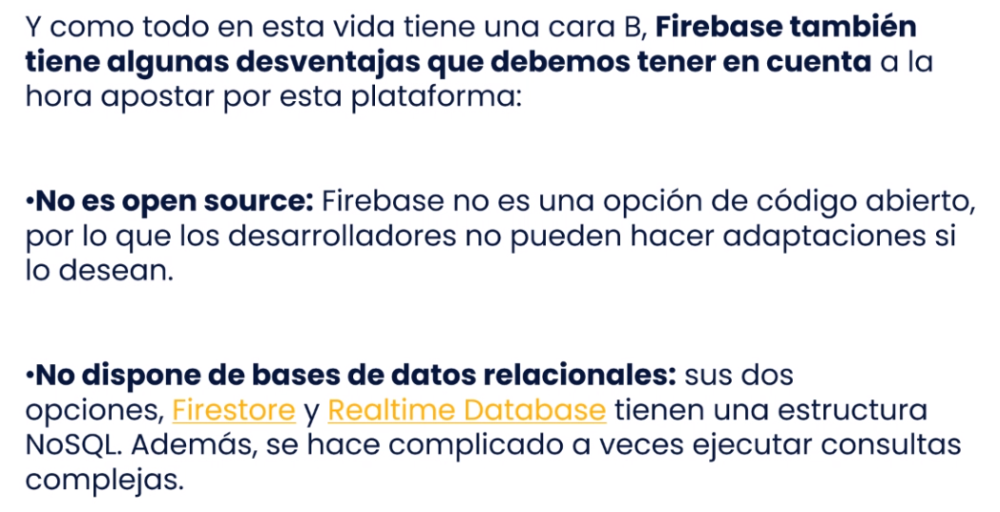

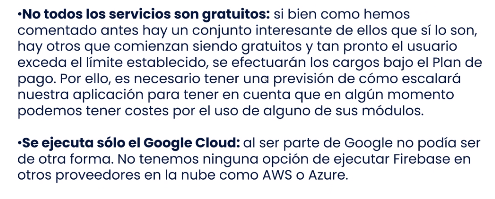

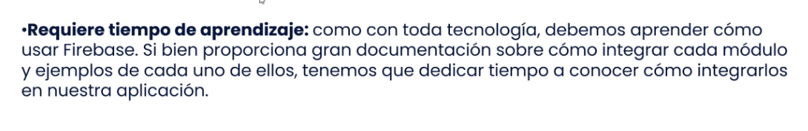

### Módulos de Firebase

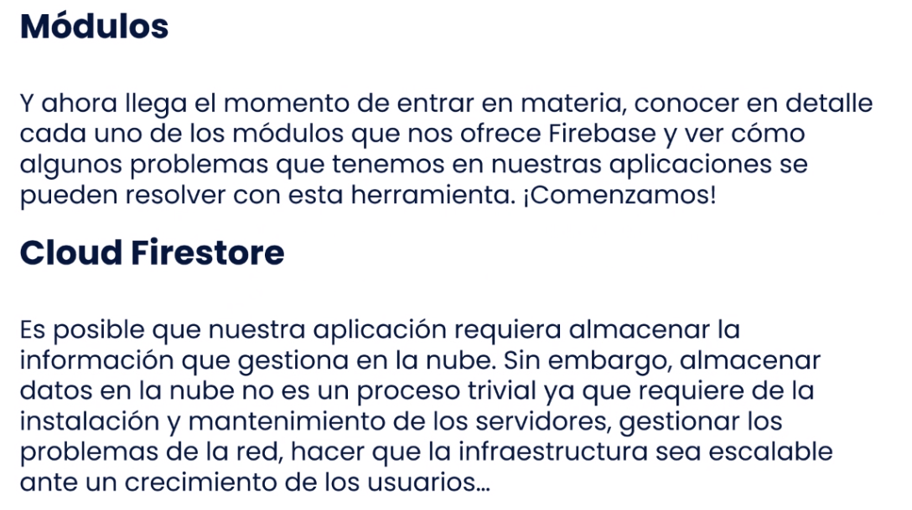

### Ejemplos (?)

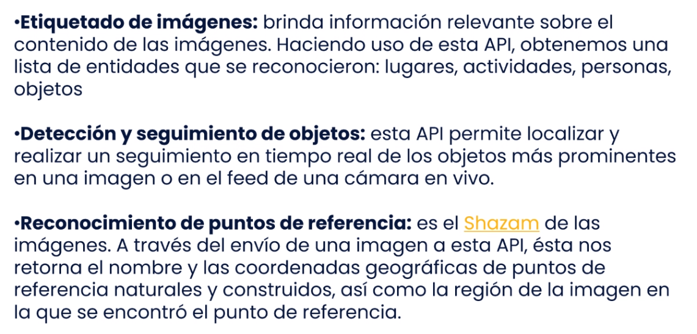

Menciona un par de cosas más sobre beneficios de usar FB y termina la clase/publinota de Google.

