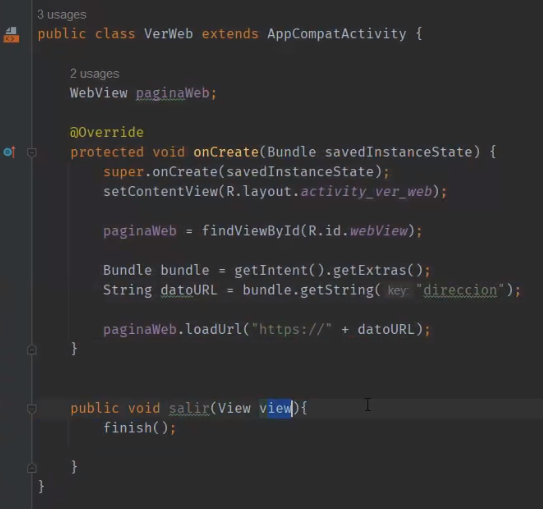

## Clase 11

Vemos en Android Studio cómo hacer un Toast:

Empezamos con un proyecto vacío


Agrega un TextView, un TextField y un Button.

Usamos la clase Toast:


```java
Toast notification = Toast.makeText(this, ingresoDatos, Toast.LENGTH_LONG);

notification.show(); // Llamamos al método show()
```

---
Vemos cómo usar imágenes:


---

Vemos otro tipo de Text data: 'TextInputLayout'


Ejemplo de clave vacía en un user / pass


---
Vemos cómo movernos a otra activity (ejemplo 'Acerca de').

Después agrega un botón de salir para finalizar el activity.

```java
public void salir(View view) {
    finish();
}
```

`finish()` cierra el activity y libera ese espacio en memoria.

---
### Webview

Muestra cómo armar un web view en la app


Llamamos al método putExtra para pasar parámetros a un bundle.

```java
public void verWeb(View view) {
    Intent verPaginaWeb = new Intent(this, VerWeb.class);
    verPaginaWeb.putExtra("direccion", url.getText().toString());
    startActivity(verPaginaWeb);
}
```

Ejemplo pregunta de parcial: el método putExtra, espera dos int o 2 strings? La rta es strings.


usamos WebView desde las herramientas



Dar permiso al activity para tener acceso a Internet desde el manifest:


