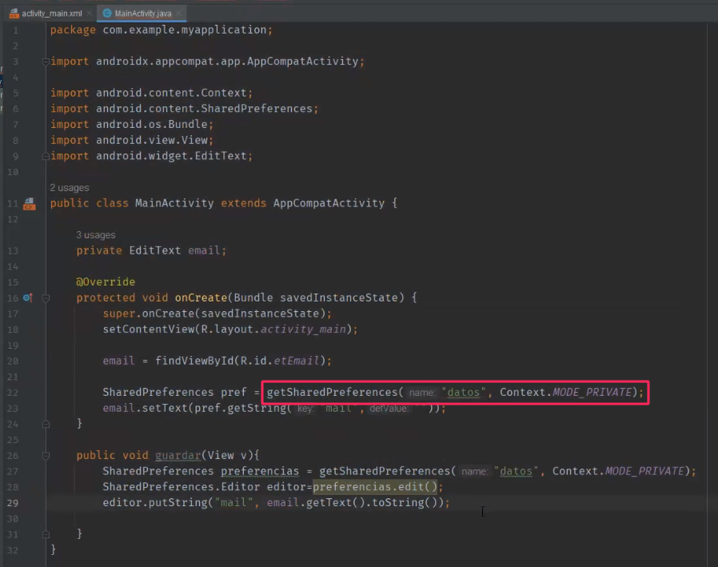
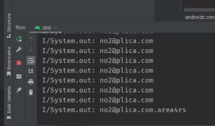

## Clase 12

Nos deja para leer sobre almacenamiento en Android.

---

Vemos shared preferences en una app que guarda el email del usuario:

Después de guardar en el shared preferences lo mostramos por consola:

