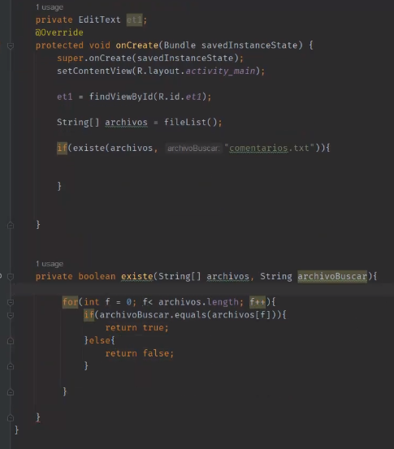
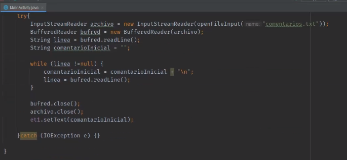
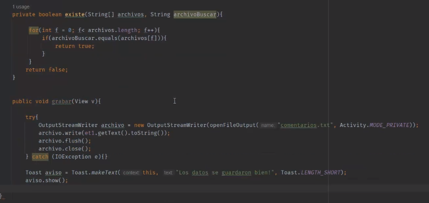
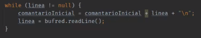
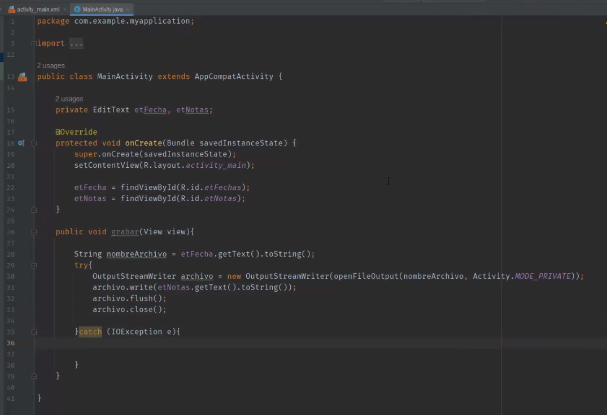
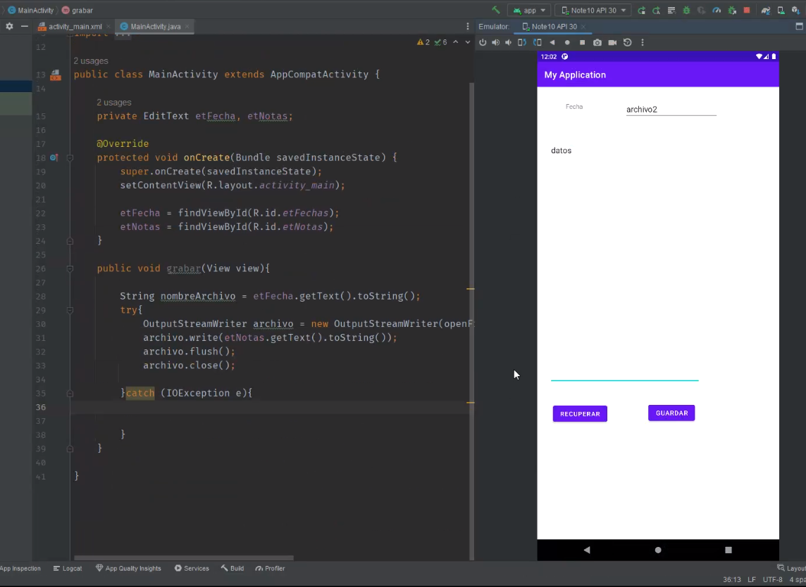

## Clase 13

Seguimos viendo shared preferences.

Pone el ejemplo de que podemos elegir el modo oscuro y guardar esa preferencia en el xml interno de android.

Para cosas más importantes, necesitamos una BD, para eso vamos a usar sqlite.

---

En vez de texto de una sola línea empezamos a usar multi line.

Menciona el método `fileList()`



Leer líneas de un archivo de comentarios:

⚠️ Hay un error en esta parte, ver más abajo.



Después usamos elementos de la activity:



Pone onClick al botón de grabar()




Esta parte nos tuvo un buen rato dando error 😵 porque no se estaba concatenando la línea al comentario inicial: 

```java
while(linea != null) {
	comentarioInicial = comentarioInicial + linea + "\n"};
	linea = bufread.readLine();
}
```

Pagina 169 del libro. Explica cómo leer y cómo escribir archivos de texto.


```java
Toast.makeText(this, "Saved succesfully", Toast.LENGTH_SHORT).show();
}
```

Agregamos permiso de usuario en el manifest para poder escribir en almacenamiento externo.





Otros archivos subidos al repo: https://github.com/al3pena/M1C23
