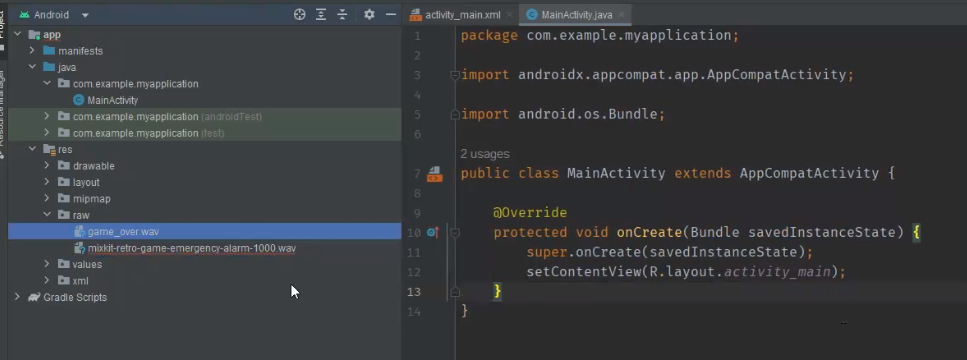

## Clase 14

Nos pasa una bibliografía


Nosotros trabajamos en el application layer. Llamamos al Activity Manager, Notifications, Views


En Android en lugar de la JVM, se conoce como DVM (Dalvik Virtual Machine)

Retoma algunos conceptos de API para mencionar que el SO Android funciona también con APIs internas


En Java interactuamos con el sistema operativo con el paquete 'os'.

Java.util.locale // para el idioma Inglés


Ejemplo de función que retorna el SO.

---
Sigue viendo temas de Dalvik (pág 15 del libro)

De qué tipo son las aplicaciones?

- Nativas (Native Apps)
- De terceros (Third Party Apps)
- Desarrollador (Developer Apps)

---
Vemos cómo cambiar el icono:


https://www.tutorialesprogramacionya.com/javaya/androidya/detalleconcepto.php?codigo=151&inicio=20

Después seguimos con el de audio:

https://www.tutorialesprogramacionya.com/javaya/androidya/detalleconcepto.php?codigo=152&inicio=20



Había un error por ingresar guiones medios en el archivo de audio.

Dos botones para que suene cada archivo:


Tipo de pregunta: la función Media Player es de Java (JDK) o de Android? **Rta: de Android**.

```java
public void emergencia(View v) {
    MediaPlayer emer = MediaPlayer.create(this, R.raw.alarma);
    emer.start();
}
```

Después vemos cómo hacer el reproductor con Intent:

https://www.tutorialesprogramacionya.com/javaya/androidya/detalleconcepto.php?codigo=156&inicio=20

---

Idea de app integradora:

Una app que nos permita calcular diversas fórmulas de la industria química. Una app para estar en la fábrica para que el supervisor de planta sepa los pesajes. Tiene que guardar los cálculos de la cantidad de materia prima que se necesita. Otros datos e información del lote. Estadísticas.

Va a tener restricciones.

Es una app de tipo cerrada (de distribución interna) requerida por una fábrica.


