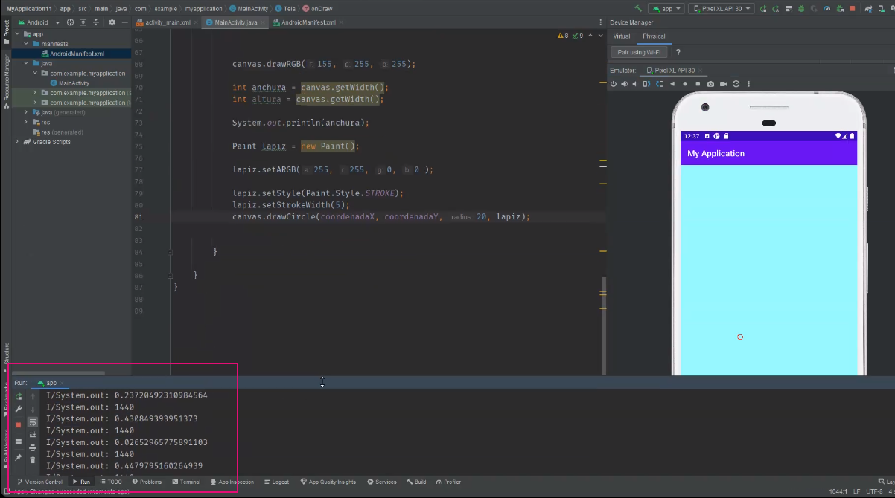

## Clase 15

Repasa data de próximas entregas.

Vemos temas con Android Studio:

- Grabar y reproducir audio (x)
- Crear figuras
- Ver donde está ubicado el dedo del user

Link y refe: https://www.tutorialesprogramacionya.com/javaya/androidya/detalleconcepto.php?codigo=176&inicio=40

Cada vez que toca la pantalla se refresca el activity. Vemos el movimiento en la terminal:

