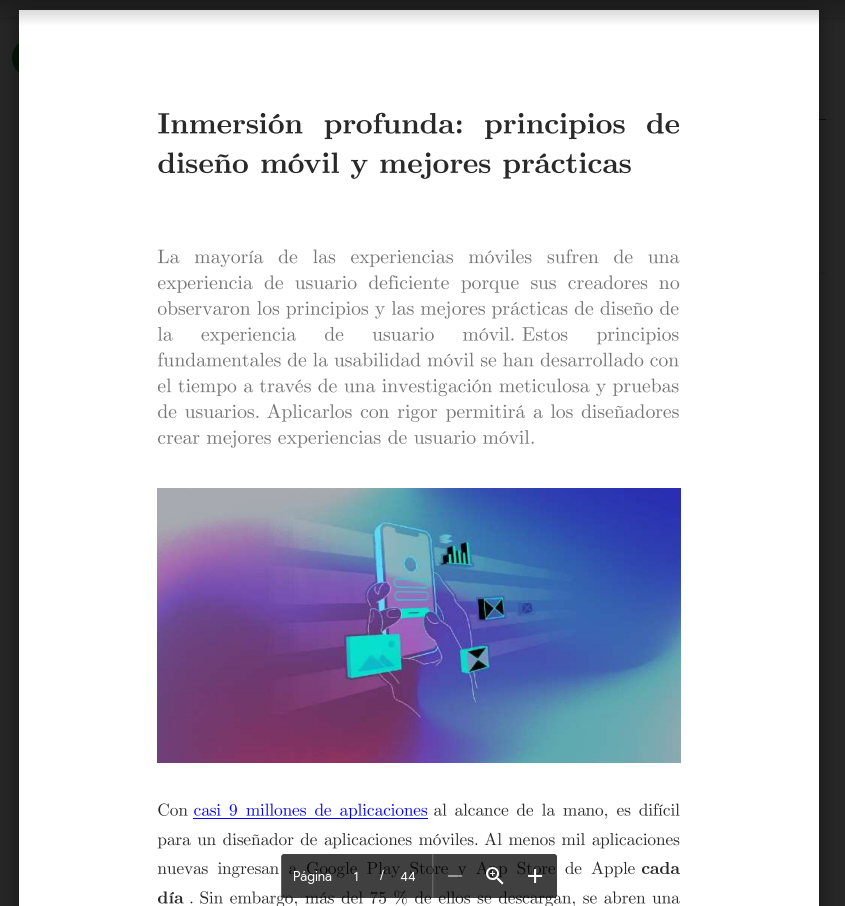
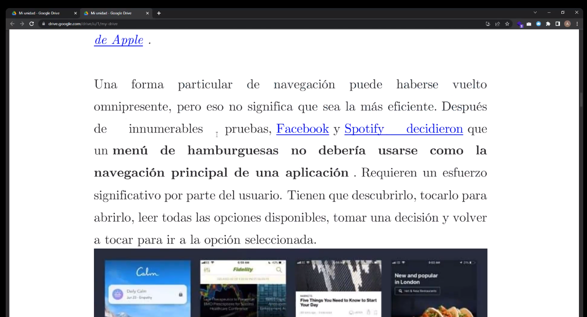
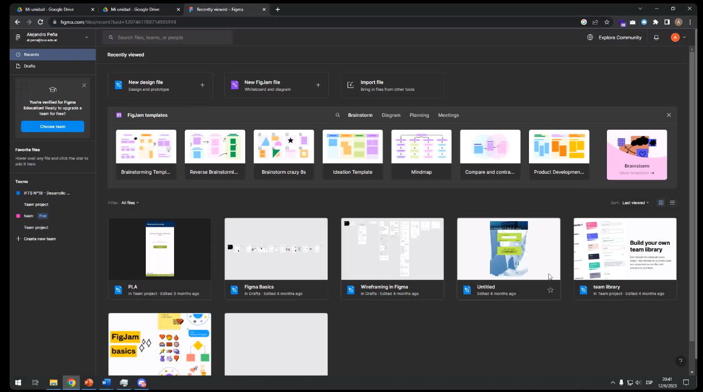
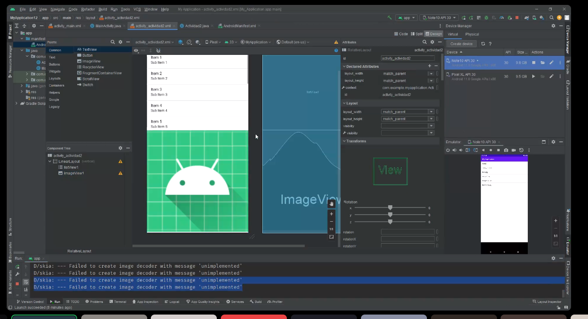

## Clase 16

Vemos una guía sobre UI/UX:

Link al pdf: https://classroom.google.com/c/NjA2MDAzMDE3ODE0/m/NjEzOTU3NTUzMTA3/details

Vemos por arriba un poco de figma:

Después empezamos a ver uso de cámara del dispositivo:

(para continuar el miércoles)