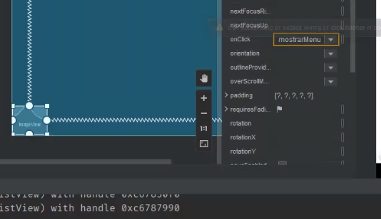
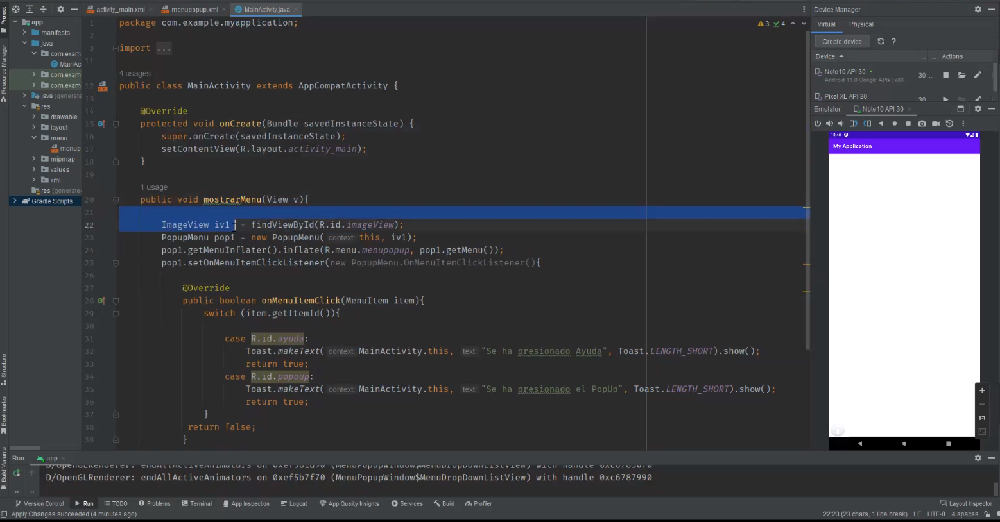
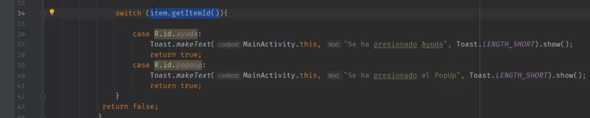
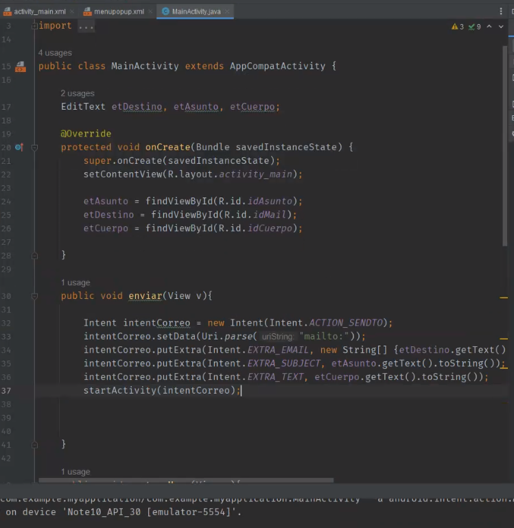
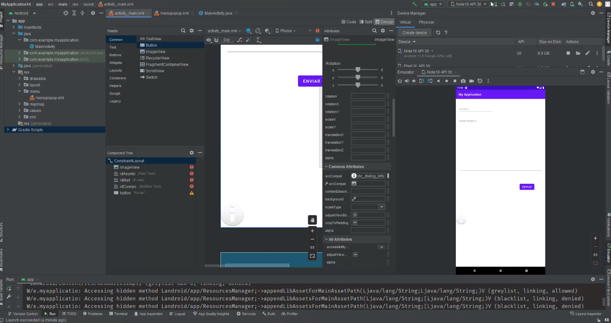
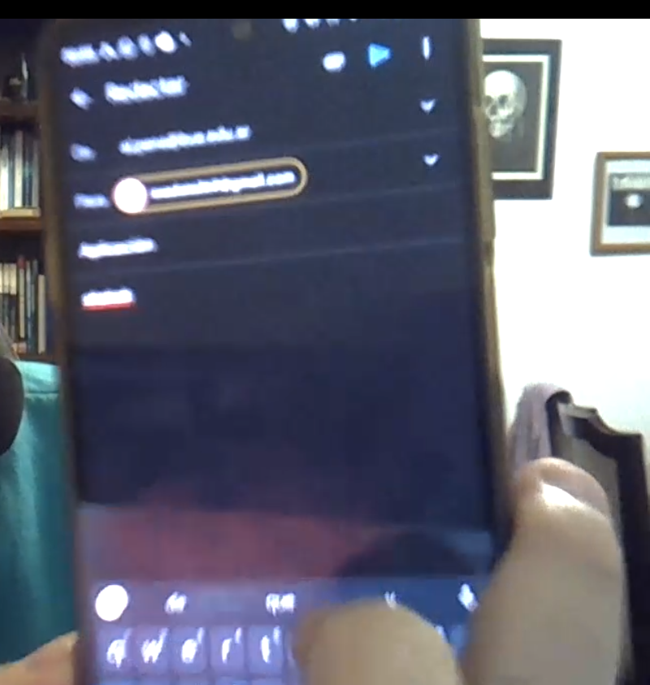

## Clase 17

Menciona info del parcial y del segundo TP.

Empezamos a ver popup

```Java

ImageView iv1 = findViewById(R.id.imageView);
PopMenu pop1 = new PopupMenu(this, iv1);
pop1.getMenuInflater().inflate(R.menu.menupop, pop1.getMenu());
pop1.setOnMenuIntemClickListener(PopupMenu.onMenuItemClickListener() {

@Override

public boolean onMenuItemClick(MenuItem item) {

    switch(item.getItemId() {
        case R.id.ayuda:
            Toast.makeText(MainActivity.this, "Se ha presionado ayuda", Toast.LENGTH_SHORT).show();
         case R.id.popup:
            Toast.makeText(MainActivity.this, "Se ha presionado popup", Toast.LENGTH_SHORT).show();
            return true;
        }
    return false
    }
}

pop1.show();

```








Enviar un correo con mailto:



El error que tira es porque espera sí o sí un cliente de correo y el celu no tiene.

Luego lo pone en un try catch para capturar el error.




en el celu con gmail configurado abre el mail:



Por último deja un mensaje fijado en el cuerpo del mail.