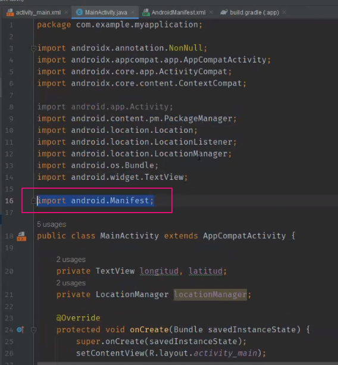

## Clase 18

Dalvik Virtual Machine

La Dalvik tiene varios componentes:

Con el target me aseguro que el código va a correr en todos los dispositivos de una versión en adelante.

Funciona como contenedores:

---

Vemos en un código permisos:

Permisos de seguridad muy alta:

Llamadas, gps, imei

Dependencias:

Importamos android.Manifest

Primero chequeamos tener permisos de gps. Después podemos llamar al locationManager:

Set location para debuggear

Simula el movimiento de un vehículo en movimiento:

Velocidad y tiempo:

