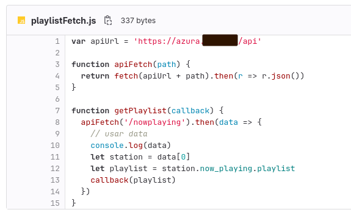

Trabajo Pŕactico sobre API

Voy bajando el contenido de la presenta para luego armar el PPT:

API elegida: Azura Cast, un programa self-host que nos permite tener nuestra estación de radio online, equipada con un servidor IceCast y una GUI web para manejar el contenido de la radio y toda su configuración.

Elijo esta porque ya la usé para algunas cosas, está bien documentada y puedo mostrar un ejemplo real implementado por mí.

---

**Consigna:**

Identificar:  

- Link de Documentación
- Mecanismos de autenticación/seguridad empleados.
- ¿Es gratuito o pago? Bajo qué modalidad se brinda el servicio (SOPA o API Rest)? ¿Está restringido sólo a actores particulares?
- Elaborar una PPT no mayor a 3 o 4 slides en donde se brinde información sobre:
- De qué trata la API
- Por qué la utilizaría en una aplicación móvil.
- Ejemplo de implementación a nivel funcional.

**Desarrollo:**

Link a documentación: https://www.azuracast.com/api/index.html

Aclaración: Esta es la documentación principal de AzuraCast, pero al ser un software self-host, cada instancia tiene su propia documentación creada con Swagger, lo que permite que los endpoints estén customizados con nuestra propia URL.

Mecanismo de autenticación: API Key

Es gratuito o pago? El uso de la API Rest de AzuraCast es gratuito, ya que la API viene integrada con el software, que es libre y abierto. Incluso la documentación es de Open API que también es Software Libre. El costo que debemos considerar en todo caso es el valor del servidor donde alojemos nuestra instancia.

No está restringido a actores particulares, aunque podemos configurar accesos a distintos tipos de usuario.

Bajo el contenido de la PPT y luego adjunto la versión final una vez que la arme.

---

~~ slide 1. ~~
API REST AzuraCast

La API de AzuraCast nos permite interactuar con nuestra instancia de este SaaS self-host. Podemos ver qué está sonando en nuestra radio, artista, canción, playlist, próxima canción y mucho más. La API está documentada con Swagger UI para visualizar y testear cualquier implementación de OpenAPI.

---

---

~~ slide 2. ~~
Por qué la utilizaría en una app?

Si tuviéramos una app mobile con nuestra radio podríamos usar la API para mostrar lo que está sonando y a qué playlist pertenece la canción. También podríamos mostrarle al usuario qué va a sonar luego.

---

---

~~ slide 3. ~~
Demo implementación

Esta es una demo de la API en uso en una PWA que hice para una radio online:

Con esta llamada a la API mostramos qué playlist está sonando.

---

Una vez que arme el PPT lo dejo subido este mismo directorio ./211-assets/ppt-api/

### Comparativa otras API

En base al análisis anterior de la API de AzuraCast, hago una tabla comparativa con otras API reconocidas.

**Info de las tablas**

- API: La empresa o aplicación que mantiene la API en cuestión.
- Des: Descripción corta de la API.
- Doc: Link a la documentación.
- Cos: Costo, si es gratuita o de pago.
- Mod: Modalidad en la que se distribuye (SOAP o REST).
- Use: Por qué la utilizaría en una app.
- Fun: Nombrar un ejemplo de implementación funcional.

---

| API | Spotify |
| --- | ------- |
| **Des** | Nos permite obtener información de artistas y canciones |
| **Doc** | [https://developer.spotify.com/documentation/web-api](https://developer.spotify.com/documentation/web-api) |
| **Cos** | Gratuito |
| **Mod** | REST |
| **Use** | Obtener datos de artistas, canciones, podcast y más |
| **Fun** | Mostrar todos los podcast de un programa |

---

| API | Duolingo (non-official) |
| --- | ------- |
| **Des** | Nos permite obtener palabras y frases en distintos idiomas de Duolingo |
| **Doc** | [https://pypi.org/project/duolingo-api/](https://pypi.org/project/duolingo-api/) |
| **Cos** | Gratuito (no es oficial, está mantenida por usuarios) |
| **Mod** | REST |
| **Use** | Obtener palabras y sonidos en distintos idiomas |
| **Fun** | Mostrar una palabra por día en el idioma que querramos (para un juego tipo Wordle) |

---