Fundamentos de Testing

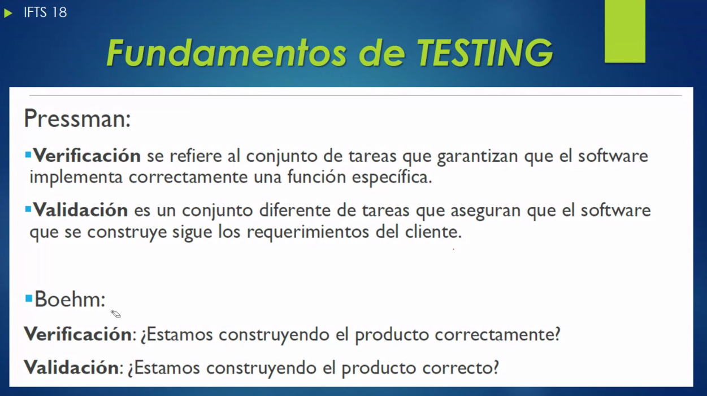

Validación y verificación

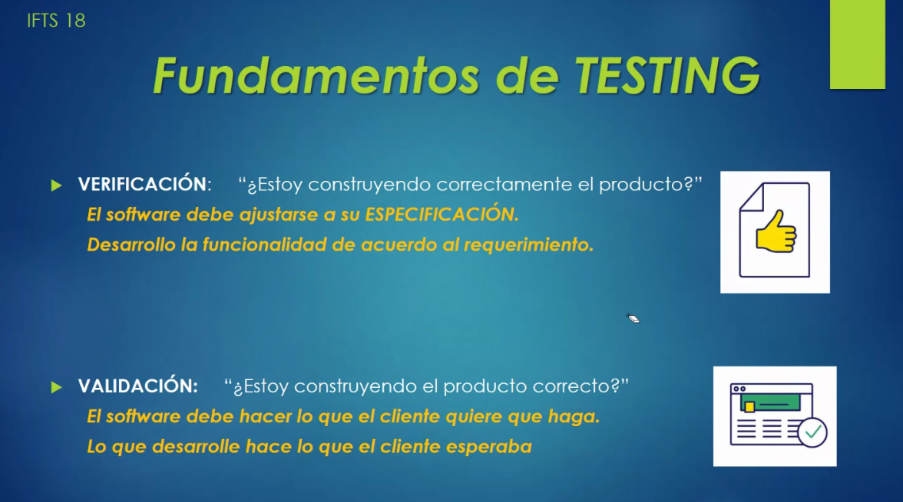

Algunos autores que cita el profe: Pressman, Boehm, Sommerville

Tipos de pruebas de software según verificación y validación:

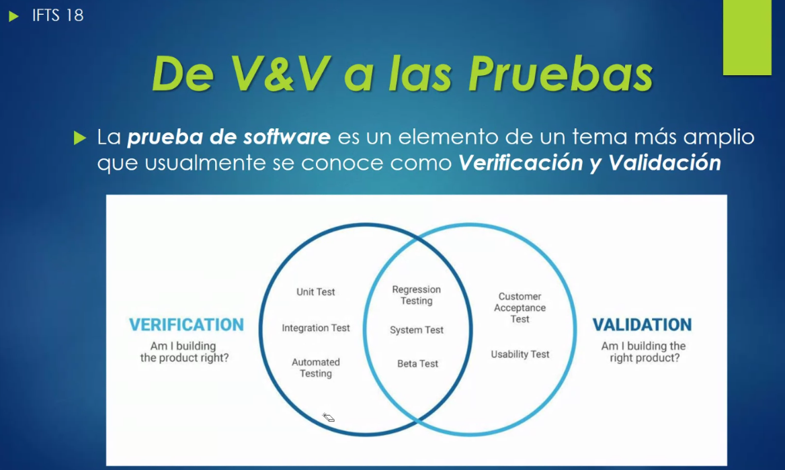

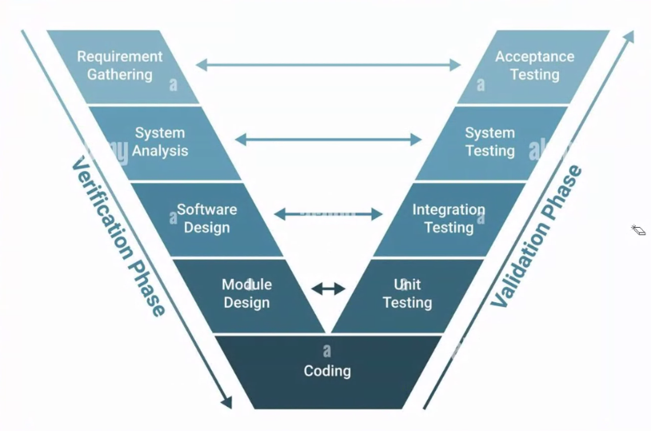

### Metodología de Pruebas

- Manuales
- Automatizadas

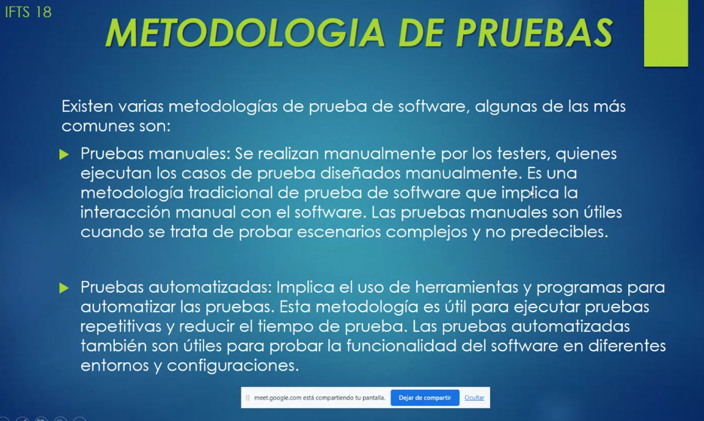

### Pruebas de caja negra y caja blanca

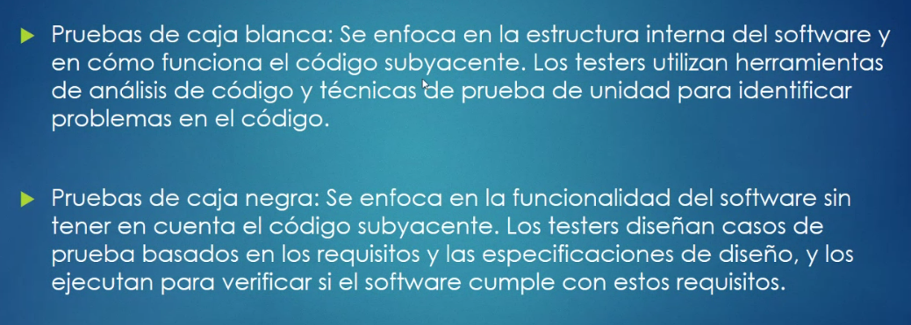

En la caja negra no conozco el código interno. Sé que tengo un input y un output pero no sé qué ocurre por dentro.

### Exploratorias y de seguridad

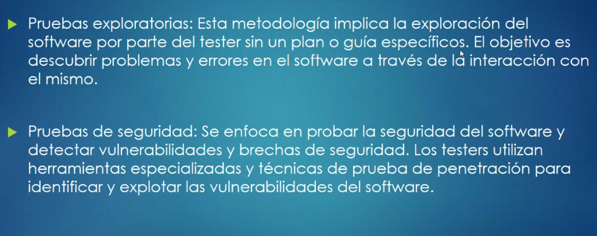

- Pruebas exploratorias: probar todo lo posible sin una guía particular.

- Pruebas de seguridad: tratar de vulnerar un sistema (pentesting)

### Práctica

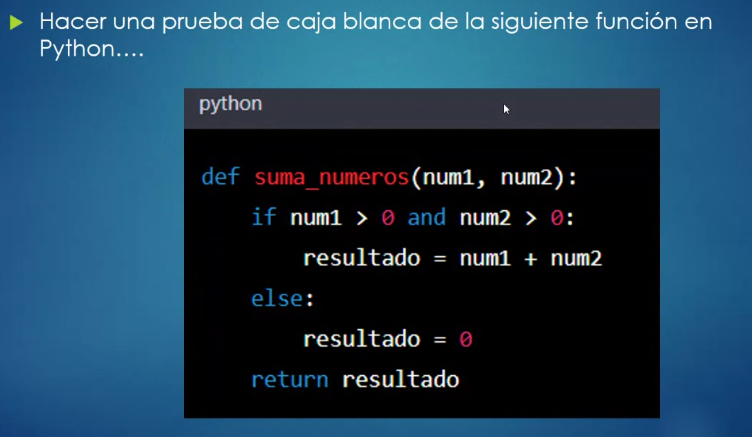

Hago pruebas con ingresando valores:

```py
num1 = input("Ingrese numero 1: ")
num2 = input("Ingrese numero 2: ")

def suma_numeros(num1, num2):
    if num1 > 0 and num2 > 0:
        resultado = num1 + num2
    else:
        resultado = 0
    return resultado

print(suma_numeros(num1,num2))
```

Output en la consola:

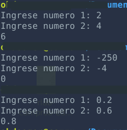

### Segunda parte después del ejercicio

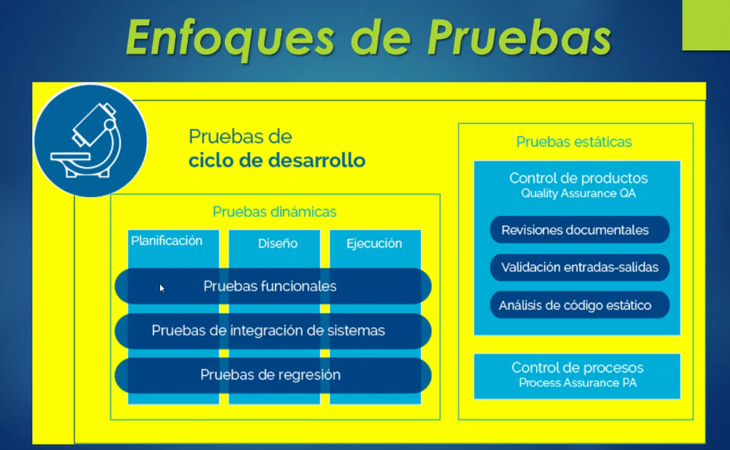

### Pruebas dinámicas y estáticas

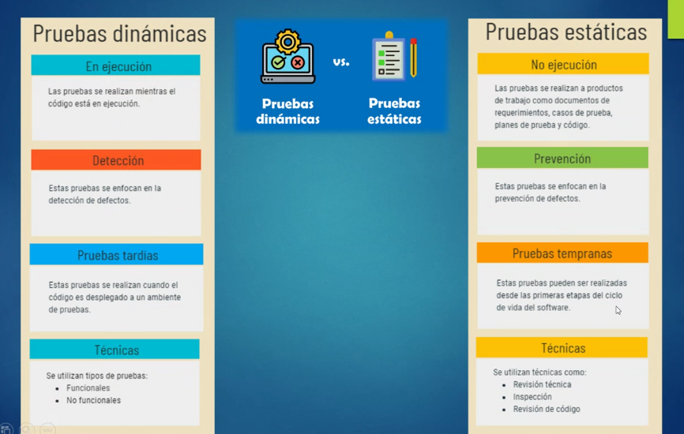

### Clasificación de pruebas

- Según el conocimiento del código
- Según la etapa de desarrollo
- Según el aspecto a evaluar

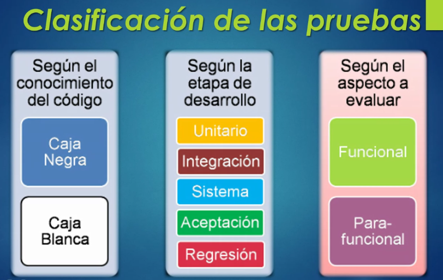