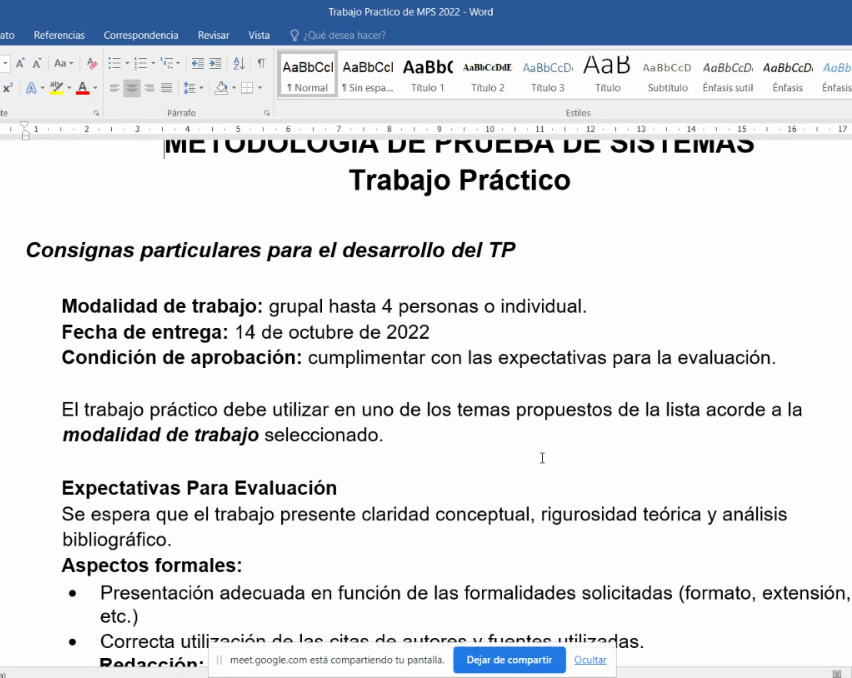
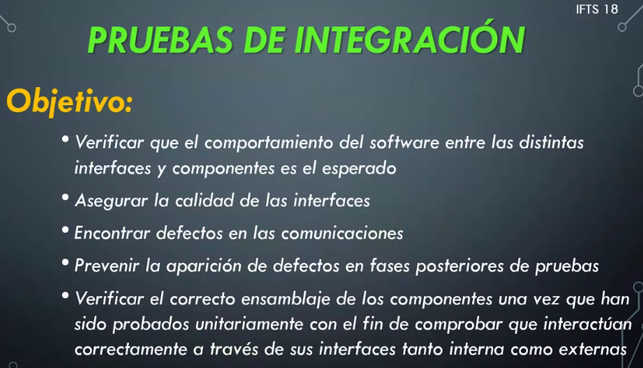

## Clase 04

Muestra un video (malísimo 😬) sobre un dev que empieza a laburar en Testing.

Luego comenta un poco del TP:

- Pruebas
- Herramientas

Nos va a dar una lista de pruebas / normas de prueba de Software. 

Hay que comentarle cómo vamos a trabajar en grupos.

Sacar conclusiones constructivas. Que nos deje alguna enseñanza valiosa con respaldo en la teoría.

- 21 de Junio entrega del TP
---
Empieza con la clase:

### Pruebas de integración

Compruebo que los componentes se integren de manera adecuada y los procesos funcionen correctamente.

(Se corta la clase por falla de conexión del profe)
