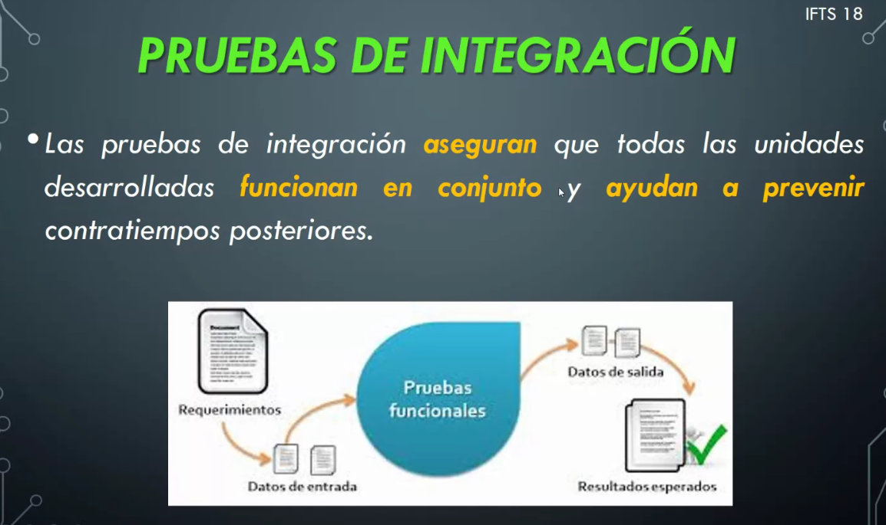
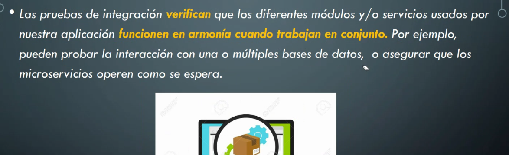
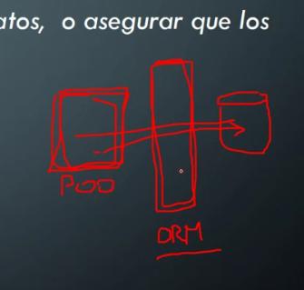
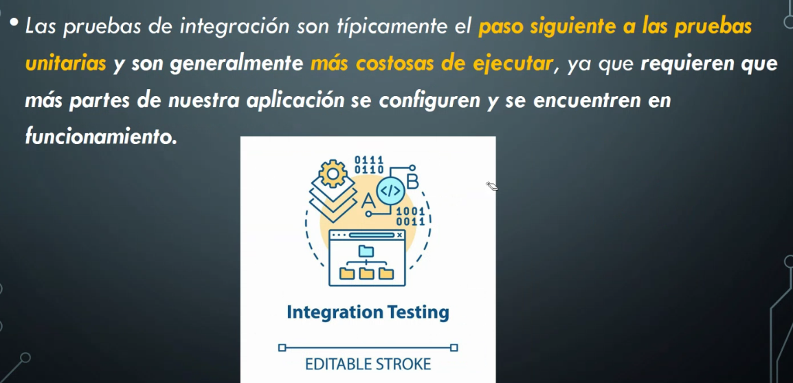
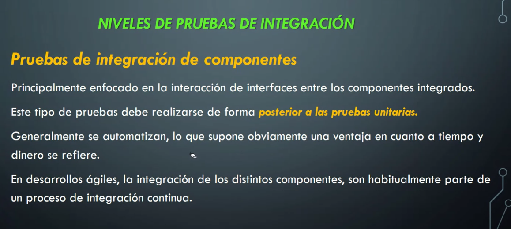
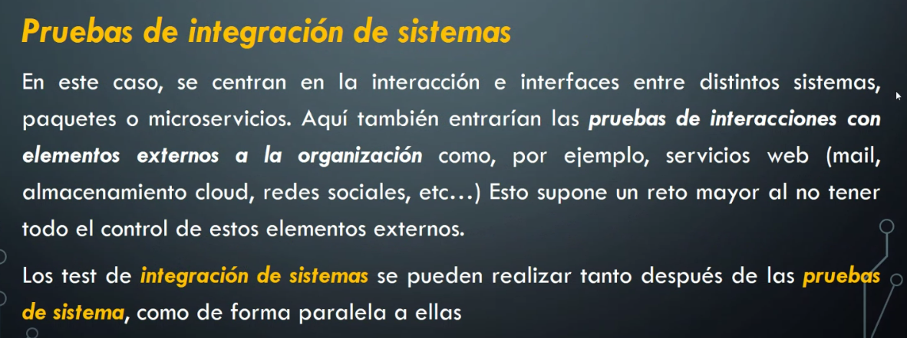
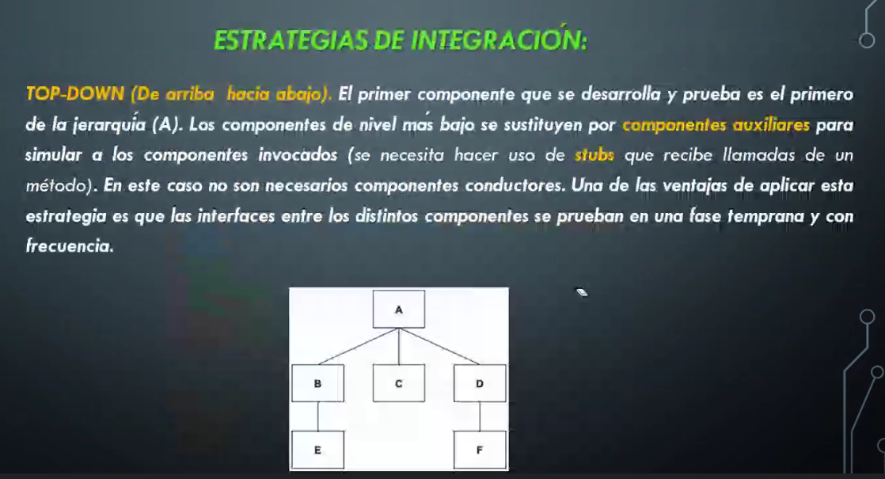
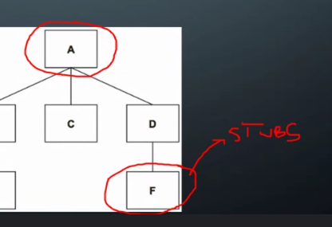
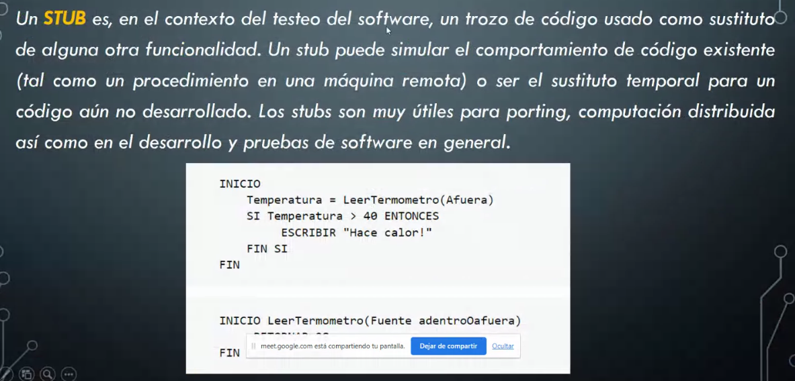

## Clase 04

Muestra un video (malísimo 😬) sobre un dev que empieza a laburar en Testing.

Luego comenta un poco del TP:

- Pruebas
- Herramientas

Nos va a dar una lista de pruebas / normas de prueba de Software. 

Hay que comentarle cómo vamos a trabajar en grupos.

Sacar conclusiones constructivas. Que nos deje alguna enseñanza valiosa con respaldo en la teoría.

- 21 de Junio entrega del TP
---
Empieza con la clase:

### Pruebas de integración

Compruebo que los componentes se integren de manera adecuada y los procesos funcionen correctamente.

(Se corta la clase por falla de conexión del profe)

Sigue..

keyword: las pruebas de integración **aseguran** el **funcionamiento en conjunto**.

Una prueba de caja blanca sería una prueba de integración.

Una clásica, comportamiento es chequear si la base de datos funciona.

Explica con un ejemplo de ORM / API / WebServer:

Interpreta el objeto del software con la query a la base de datos

Las pruebas de integración son el paso siguiente a las pruebas unitarias.

### Niveles de prueba de Integración

#### Pruebas de integración de componentes

El método de desarrollo agile implica que vaya haciendo pequeñas integraciones a un software estable.

Menciona la integración continua como proceso para seguir agregando funcionalidades.

#### Pruebas de integración de sistemas

La integración entre sistemas (API, Software, BD) de servicios externos.

### Estrategias de Integración

- Top-Down
- Bottom-Up

Empiezo a probar desde el primer componente hasta el último:

#### Qué es un Stub?

Un fragmento de código que todavía no desarrollamos, para hacer la prueba de integración usamos un Stub. 

También se puede simular un puerto, una comunicación, otra terminal que devuelve una respuesta, etc. Podemos darle muchos usos.

