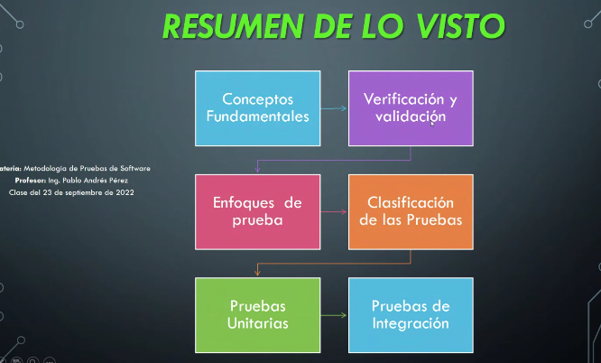
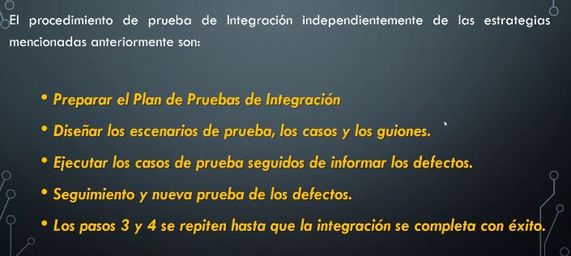
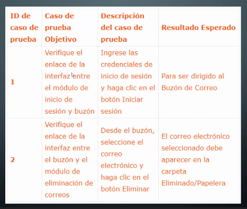
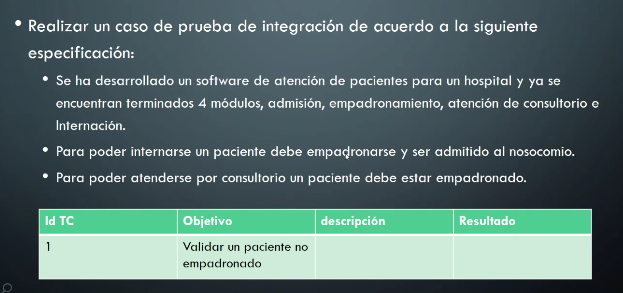

## Clase 05

Repasa info de parciales:

Primer parcial: 28 de Abril
Segundo parcial: 02 de Junio
Entrega de TP: 23 de Junio

---


---
### Resumen de lo visto



### Plan de Integración

No necesito tener definida la estrategia para armar el plan de integración.

Creo los casos de prueba. 



Ejemplo de plan de integración:


Hay que definir primero los [casos de prueba](https://es.wikipedia.org/wiki/Caso_de_prueba) (test case)

### Práctica

Realizar un caso de prueba:



```
Caso v0.1

Objetivo: Validar que un paciente pueda ser atendido en un consultorio del Hospital.

Descripción: Ingresar al módulo admisión y buscar un paciente ingresando su DNI en el buscador de pacientes. De encontrarse en la BD, confirmar que la opción de admisión se encuentra activa. Hacer clic en el botón 'Admitir' y completar el formulario de ingreso con fecha y profesional asignado, verificando que el usuario pueda ser ingresado en el Hospital para una cita médica.

Resultado: El paciente es ingresado al Hospital para una consulta. Al hacer click en admitir, el paciente ya cargado en la BD es admitido a una cita médica en el Hospital y se envía notificación al paciente.
```

Para próxima clase tener al menos 2 casos redactados.