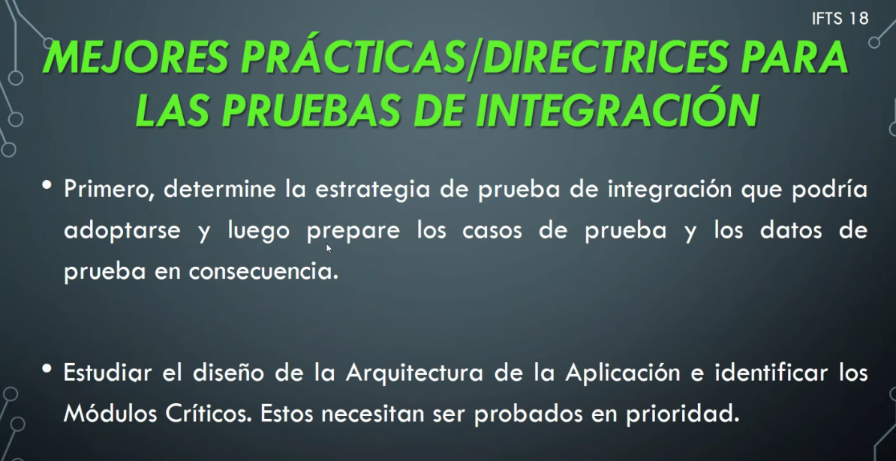
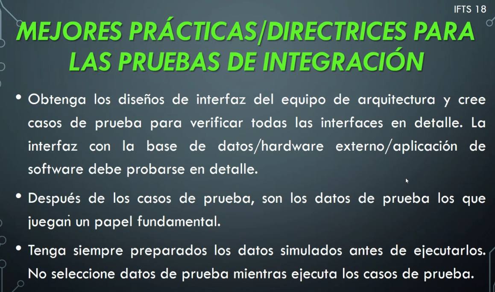
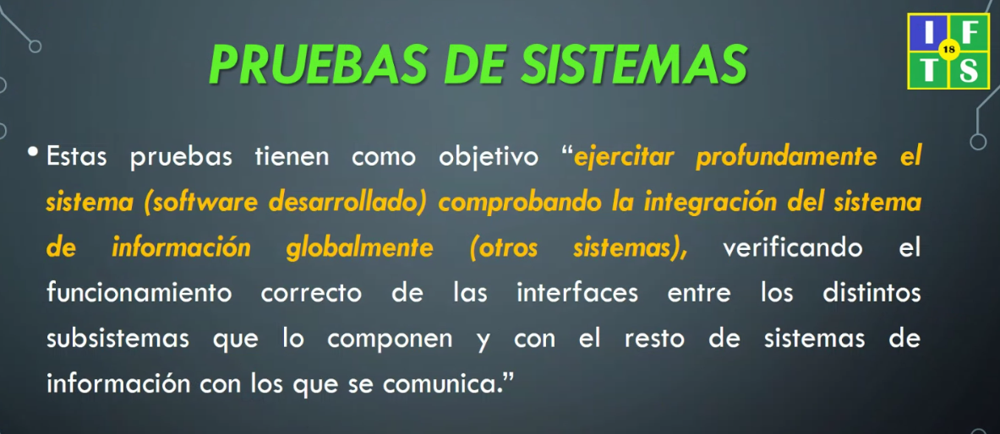
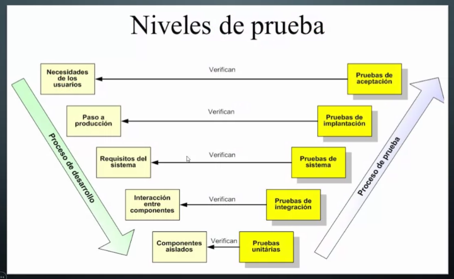
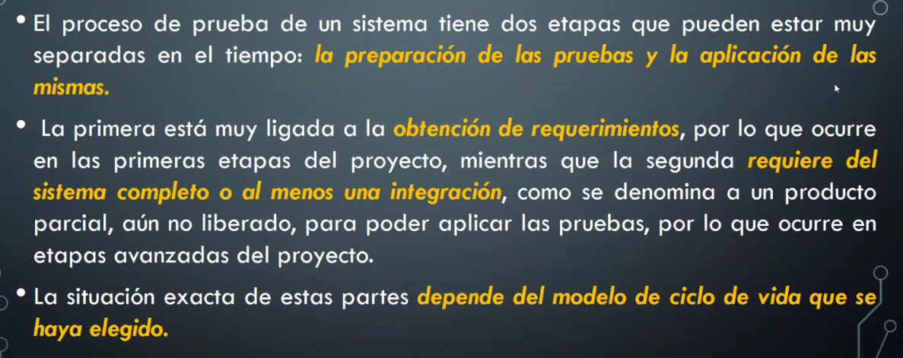
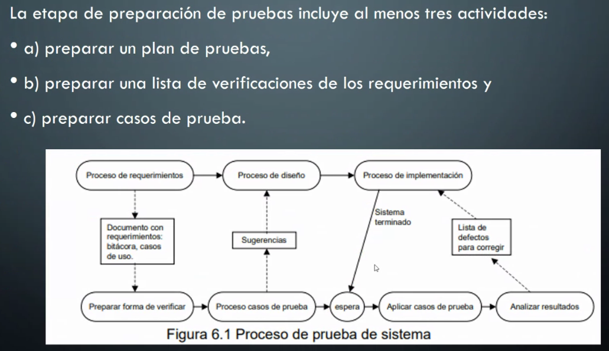
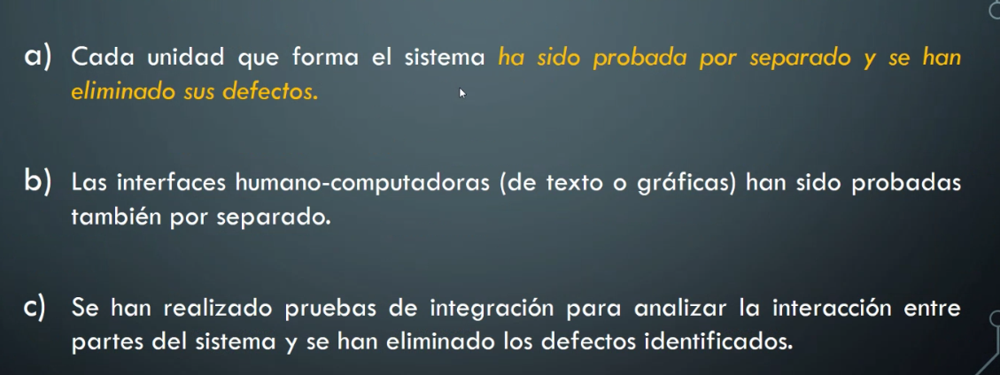
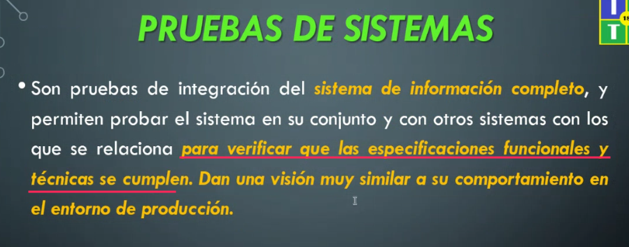
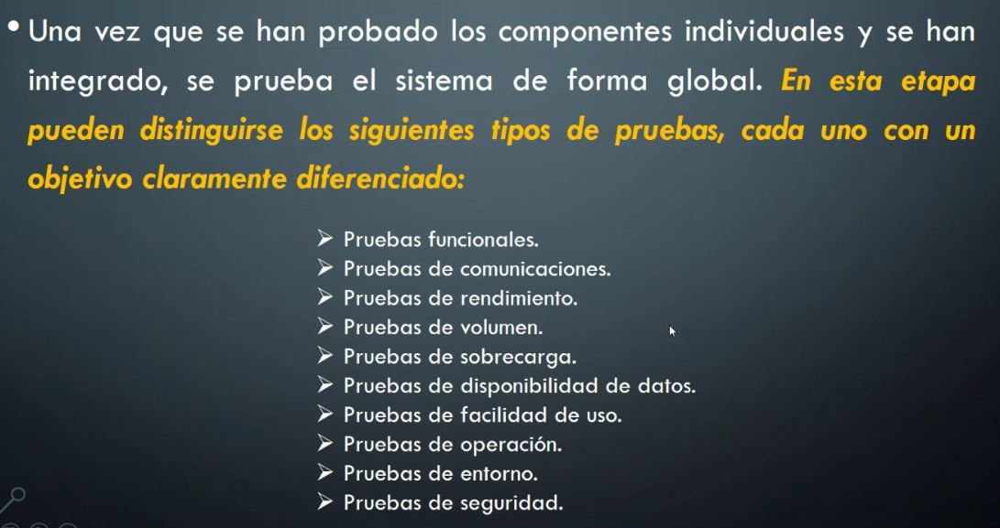
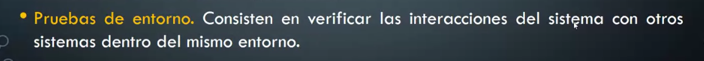

## Clase 07

Parcial entre el 24 y el 27 de mayo.
Va a ser un solo parcial + TP

---
Repaso de la clase anterior

Sigue con 'Buenas prácticas'

Ejemplo de un módulo crítico: un cliente tiene que entrar a un sistema y ver la interfaz de cliente y no la de un administrador.

En este caso no probamos todo el sistema, sino módulos dentro del software que están siendo integrados a un producto.

Ejemplo con conectarse a una API y que nos devuelva alguna información.

### Pruebas de sistemas

Las pruebas en estos sistemas es más relacionada a la integración. Probar BD, APIs, Web Servers, etc.

Hay que verificar las interfaces entre los distintos subsistemas (otros software puede ser un proveedor externo).

Pruebas dinámicas

Modelo en V:

### Vista General

### Etapas

Preparación de las pruebas (según Sommerville)

### Suposiciones importantes

Antes de llegar a esta etapa tengo que haber probado y aprobado todo lo anterior.

**Esto va al parcial:**

Todas estas pruebas integran las pruebas de sistemas:

Ej: en las pruebas funcionales debería probar un requerimiento hecho por el cliente..un usuario que se pueda loguear e ingrese como administrador de la aplicación (identificar el rol del usuario y su interfaz habilitada).

Dentro del PPT ver los detalles de cada item en la lista.

Agrego este porque está relacionado al tema que elegimos:

