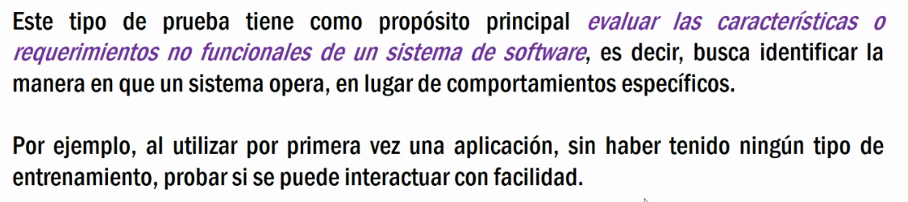

## Clase 08

Repite la info de parciales

Manda un chiste de nuevo (esta vez por lo menos está bien robado) 🙏😇


Vuelve a mencionar el modelo V, ahora con otro diagrama (pero la misma info).


Esta clase nos vamos a concentrar en las pruebas funcionales, que son las que validan funcionalidades requeridas por el cliente:


### Pruebas unitarias


Si no hubieron pruebas unitarias antes de las pruebas funcionales es más probable que todo falle 

### Pruebas de humo


Pruebas rápidas, sin documentar, son pruebas no exaustivas.

Sanity Testing vs Smoke Testing


Sanity lo traduce como 'De cordura'.

Las pruebas 'de cordura' deben tener más racionalidad (?)


### Pruebas de componentes


- Independientes
- Verifican funcionalidades

### Pruebas de componentes


Comenta que queda pendiente ver un ejemplo de Prueba de Sanidad (también llamada Prueba de Cordura (?) pero en inglés es Sanity Test).

Búsqueda rápida:

```md
A sanity test is often a quick check on something to see if it makes sense at a basic, surface level. A sanity test might be one quick test, such as a calculation check. For example, if you are testing the checkout and payment function of a mobile app, you want to make sure taxes are computed correctly.
```

---

### Pruebas No Funcionales


Ejemplo: el cliente no me pide que la app sea fácil de usar, ese es un requerimiento no funcional que lo tengo que asumir.



Algunos beneficios de las pruebas no funcionales


---
Próxima clase vemos: 


