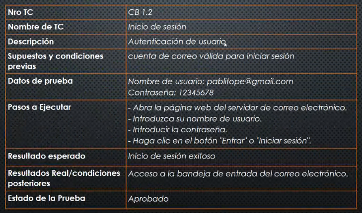
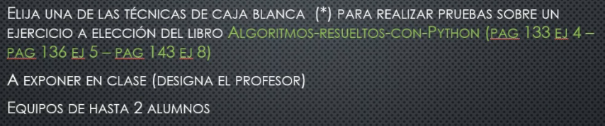
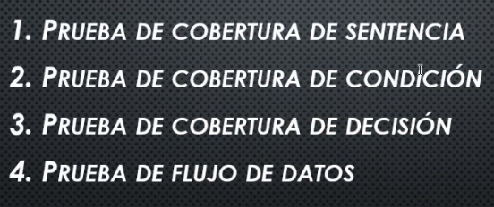

## Clase 10

Nos comenta que vamos a hacer algunas pruebas de técnicas de caja blanca para quienes no estuvieron la semana pasada.

---
Vemos todo el contenido de la clase anterior

### Modelo Test Case

Tarea para la próxima clase:

Exponer de hasta máximo 2 personas.

Recuerda los tipos de test case que podemos usar:

