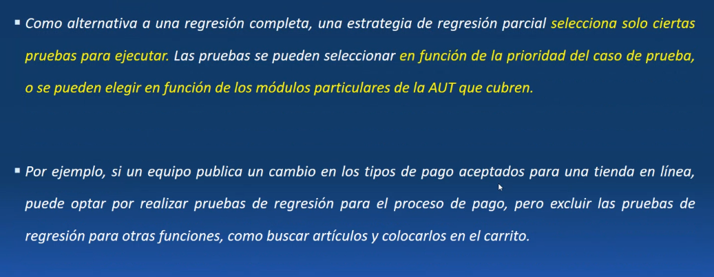
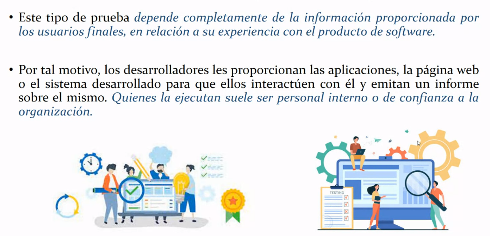
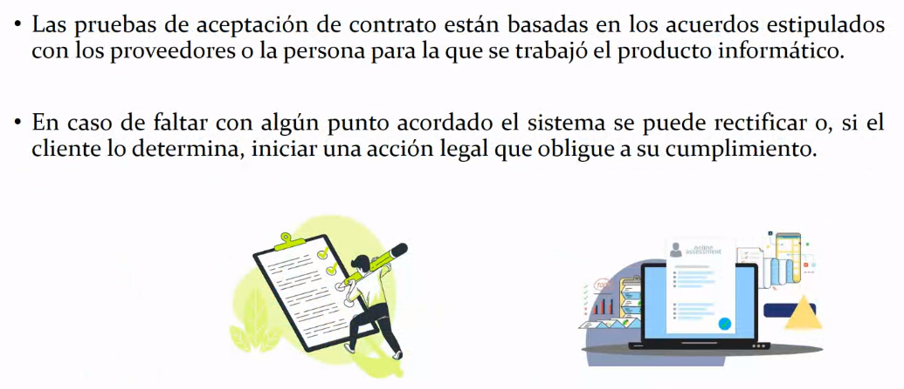

## Clase 12

Menciona el TP que suma puntos para el parcial.

Nos queda ver:

Pruebas de aceptación: a nivel usuario
Pruebas de regresión: cuando generamos un nuevo fragmento de Software tenemos que hacer pruebas de regresión

## Pruebas de regresión

Se realizan periodicamente con cada release.
Hay verificar que en el producto no vuelva a aparecer un error que ya había corregido.

Por eso volvemos a testear los test que nos arrojaron algún defecto.

Todas las pruebas que fuimos realizando las volvemos a hacer cada vez que agregamos una nueva funcionalidad.

Se recomienda que estas pruebas sean automatizadas.

Parece ser un cocepto simple, pero en la realidad es desafiante, por la falta de tiempo, personal capacitado y recursos limitados.

### Guia de pruebas de regresión

### Diferencias con otros tipos de prueba

En la práctica se usa para describir las pruebas de integración.

Cómo se realiza una prueba de regresión:

## Tipos de pruebas de regresión

### Regresión unitaria

### Rregresión completa

Probamos TODO de nuevo : )

### Regresión parcial

No hacemos TODAS las pruebas

### Cómo hacer pruebas de regresión

### Integración continua

Pruebas que se realizan cada vez que hay que integrar un fragmento de código para un deploy por ejemplo.

---

Pruebas de aceptación del usuario

Requisitos de los clientes

Ver en https://istqb.org

Las últimas pruebas son las que busca el cliente, ver que funcione su software con sus requisitos:

Mete un memardo que está bien :3

### Qué son las UAT (User Acceptance Test)

### Base para definir las UAT

### Tipos de UAT

#### UAT beta

Ej: ya está en producción, podés entrar por esta url y usar la web. A partir de ahí tengo una prueba beta

#### UAT alfa

Un paso más después de las beta (ej en un server de desarrollo). Debería ser sobre una app que está en producción.

#### UAT de contratos

Lo que está dentro del alcance del proyecto.

#### UAT operativa

(Para entidades reguladas, algo más gubernamental)

#### UAT del usuario

#### Pruebas de cumplimiento y gobernanza

De estas UAT, lo que entraría en el parcial es:

---

Termina de dar todo el contenido de lo que entra en el parcial y vuelve a hacer repaso de lo que vimos hasta ahora.

Entran a parcial:

Placas del PPT1:

- Objetivos de las pruebas
- Metodologías de pruebas
- Prueba y caso de prueba
- Error, Defecto y Fallo
- Modelo V de desarrollo (pero no lo de las placas de PPT1)

Del PPT2:

- La placa de Pressman, Sommerville y Boehm: Verificación y Validación