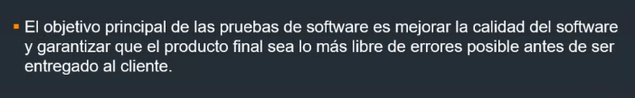
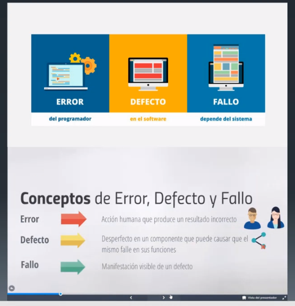
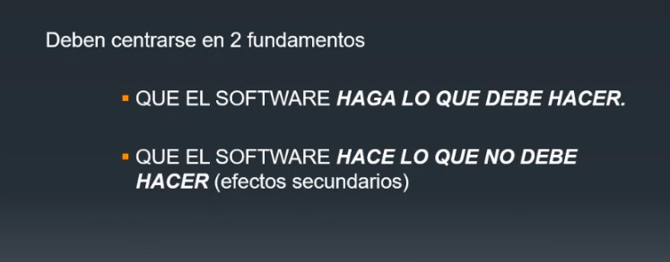

## Clase 13

Vemos avances de TP

Cada grupo va repasando sus bibliografías.

(...)

En nuestro caso que tenemos como tema Entornos de prueba menciona que lo podemos relacionar con las filminas de integración. Vemos de buscar otra bibliografía que va a estar subida después en drive.

Entra en parcial:
### Objetivos

Metodologías de prueba entran todas

Esto puede ir para verdadero falso:

Puede haber uno tipo cuáles de los estándares (ISO, IEEE)

- Qué es bug (VF)
- Casos de prueba (VF)
- Fundamentos de Testing (con autores)
- Prueba caja blanca
- Prueba caja negra
- Pruebas unitarias