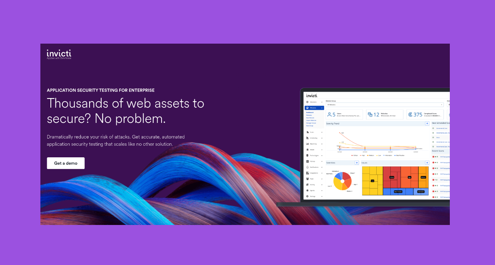
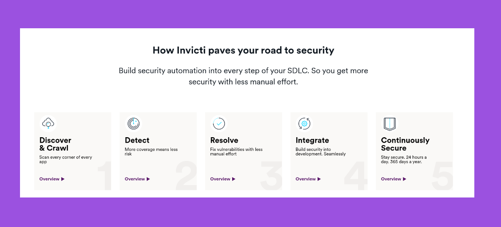
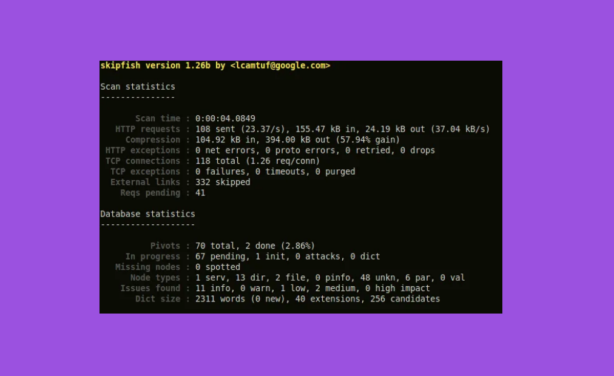

## Clase 14

Vemos presentación de una tecnología por cada alumnx que asignó aleatoreamente al comienzo de la clase y hay que armar rápido.

A mí me tocó [Invicti](https://invicti.com/). Una plataforma para pruebas de Seguridad.








Notas para hablar sobre la PPT:

```
#### Sobre DAST como concepto

La prueba de seguridad de aplicaciones dinámicas (DAST) es una metodología de prueba de seguridad de caja negra en la que una aplicación se prueba desde el exterior. Un evaluador que usa DAST examina una aplicación cuando se está ejecutando e intenta piratearla como lo haría un atacante.

#### Data de Invicti

Gain complete visibility into all your applications — even those that are lost, forgotten, or hidden.
Scan any type of web application, web service and web API — including first and third-party (open source) code — regardless of the technology, framework or language they’re built with.
Scan the corners of your web assets that other tools miss, with advanced crawling and our combined interactive + dynamic (IAST + DAST) scanning approach.

#### NTEGRATE

Build security into development.
Seamlessly.
When you catch vulnerabilities after your code has shipped, the problems ripple: Delayed releases. Scrambled troubleshooting. Tension between security and developers. Invicti helps you squash budding security issues before they grow into major disruptions by integrating security into the tools and workflows developers use daily.

#### Workflows

Build security automation into your existing workflows
Integrate Invicti with the tools your developers use every day. Automatically triage and assign proven, high-risk vulnerabilities to the right developer.

#### Price & Company

As of 19 May 2023, Acunetix by Invicti has six pricing editions ranging from $4,500 to $26,600, with a free trial available.0 Invicti is an enterprise web application security scanner that was launched in 2009 by Netsparker and has since grown into a fully-featured application security platform

#### Alternativa FOSS

Skipfish:
https://alternativeto.net/software/skipfish/about/

```

Otros temas:

- Selenium
- Jira
- Testim
- Testpad
- (...) TBD
- (...) TBD
- (...) TBD

Después menciona un poco del TP. Que se pueden cambiar los temas. Se puede elegir una herramienta en vez de los temas que elegimos al principio, pero el marco del trabajo es el mismo.