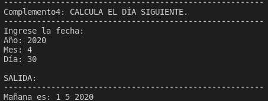

Ejercicio de ejemplo:

Algoritmo, que dada una fecha del año 2020 (representada por el día, el mes y el año en formato numérico dd/mm/aaaa), calcule el día siguiente. Asuma que el mes tiene 30 días.

```py
# -*- coding: utf-8 -*-
#Decoración: Predecir día siguiente

print("-----------------------------")
print("Complemento4: CALCULA EL DÍA SIGUIENTE.")
print("-----------------------------")

#Entradas
print("Ingrese la fecha: ")
a = int( input("Año: "))
m = int( input("Mes: "))
d = int( input("Día: "))

#Salida
print("\nSALIDA: ")

print("-----------------------------")

if d > 0 and d < 30 :
	print("Mañana es:", d+1, m, a)
else:
	if m > 0 and m < 12 :
	print("Mañana es:", 1, m+1, a)
	
	else:
	print("Mañana es:", 1, 1, a+1)

```


---

| Nro TC              | CB 1.1                                      |   
|---------------------|---------------------------------------------|
| Nombre de TC        | Cambio de mes                               |
| Descripción         | Comprobar que el cambio de mes es correcto  |
| Supuestos y cond. P | El mes tiene 30 días                        |
| Datos de prueba     | año = 2020 ~~ mes = 4 ~~ día = 30           |
| Pasos a Ejecutar    | 1. Ejecute el programa                      |
|                     | 2. Ingrese los datos de prueba              |
| Resultado esperado  | Imprimir "Mañana es 1 5 2020"               |
| Resultados Real     | Se imprimió correctamente                   |
| Estado de la prueba | Aprobado ✅                                 |

Ejecutando el programa en Python chequeamos que funciona correctamente:



### Tipo de prueba

Podemos decir que esta es una prueba unitaria funcional de caja blanca.

Buscamos probar una funcionalidad concreta que está requerida en el modelo de negocios del sistema (para obtener el día siguiente, el mes debe cambiar). Es unitaria porque comprueba una  unidad mínima de funcionamento de la pieza de software. Y es de caja blanca porque vemos el código y conocemos su estructura.

La prueba es aprobada porque al ingresar el día 30 ingresamos en la segunda condición, luego chequeamos si el mes no es mayor a 12 (lo que indicaría el cambio de año). En ese caso se incrementa +1 la variable mes y el día pasa a ser el 1ro, tal como es esperado. 

Este es el fragmento de código que aplica a nuestro test case:

```py
else:
	if m > 0 and m < 12 :
	print("Mañana es:", 1, m+1, a)
```

No comprobamos si el año varía, ni chequeamos tampoco si el cambio de un día a otro es correcto como en la primera condición del if. Sólo nos enfocamos en el cambio de mes.