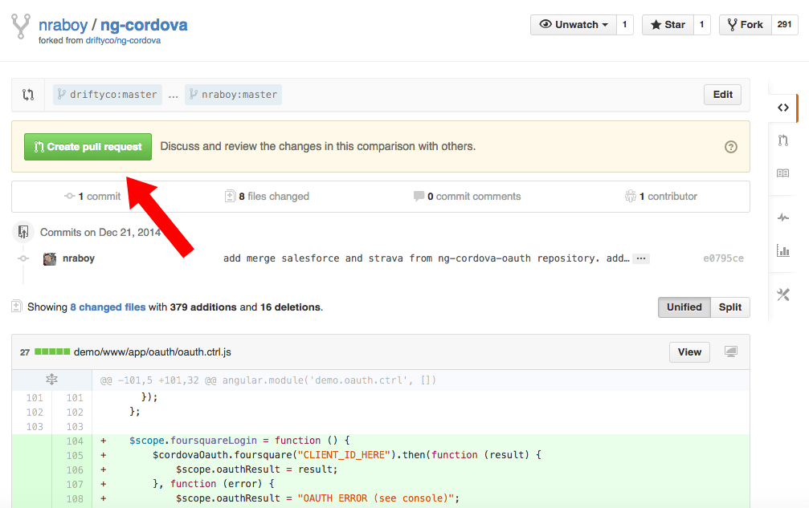

## TP final sobre QA env

Tema elegido: ambientes de pruebas

Voy anotando algunos links:

- https://en.wikipedia.org/wiki/Test_environment_management
- https://en.wikipedia.org/wiki/Deployment_environment#Testing
- https://www.flagship.io/test-environment/
- https://en.wikipedia.org/wiki/Sandbox_(software_development)
- https://www.techtarget.com/searchsecurity/definition/sandbox
- https://web.archive.org/web/20070128140333/

Temas a desarrollar:

- Ciclo de producción de Software
- Ambientes
	- Producción
	- Desarrollo
	- QA
- Cómo se crean ambientes
- Herramientas de CI
- Github Actions
- Crear un pipeline CI/CD con Github Actions

Una vez desarrollados estos temas armar:

- Introducción
- Índice
- Conclusión
- Referencias

### Ciclo de Producción

Cuando un equipo de desarrollo se propone realizar un producto de Software debe generar ciertos consensos dentro del grupo para llevar adelante un trabajo organizado. Dentro de esta tarea de definición de roles, alcance del proyecto, necesidad del cliente, stack tecnológico a utilizar y mucho más, se definen pautas para un correcto desarrollo que tienen que ver con la organización del control de versiones (generalmente Git) que darán como resultado un flujo de trabajo organizado.

Por lo general, y haciendo una reducción un tanto simple a modo de ejemplo, este ciclo de vida del producto de Software contará con una etapa de desarrollo local donde los programadores irán trabajando en sus propios entornos (su computadora) para luego "integrar" este código a un repositorio compartido. Todos los miembros del equipo deben tener acceso a este repositorio y configurarlo pertinentemente para poder agregar sus fragmentos de código al proyecto. Este acto por lo general se conoce como "Pull request" (de ahora en más PR). Esto es cuando un desarrollador solicita la aprobación de su código, que en la mayoría de los casos debe ser revisado por otro desarrollador del equipo (puede ser alguien de mayor seniority, aunque no necesariamente, ya que en el caso de un 'code review' puede ser entre pares) y este aprobará o rechazará el PR, haciendo anotaciones o comentarios si fuera necesario. Una vez aprobado el PR, el nuevo código pasará a ser parte del código de la rama que se está manipulando.

Es común hacer un traspaso entre ramas (branches) para que un código pase del ambiente de desarrollo al ambiente de producción.

### Ambientes

Por lo general se suelen utilizar "ambientes" o "entornos" para el desarrollo de Software. Por ejemplo, en el caso de aplicaciones web, estos pueden operar sobre una máquina virtual en la nube. La máquina virtual debe contar con un sistema operativo (generalmente Linux) y una serie de programas instalados que harán que nuestro código se ejecute correctamente. Por ejemplo para una aplicación web básica podemos utilizar un esquema LAMP (Linux, Apache, MySQL y PHP) lo que nos dará todas las funcionalidades necesarias para operar una web con base de datos y programación backend. Si desplegamos una aplicación LAMP en la nube corriendo sobre una máquina virtual o VPS (Virtual Private Server), podemos decir que este es nuestro entorno.

Es frecuente que estos entornos sean al menos los siguientes tres:

- Producción: el ambiente a donde ingresan los usuarios finales. En el caso de estar corriendo sobre una VPS este será el entorno más importante y que debe ser tratado con mayor precaución para no romper la aplicación y que los usuarios queden sin servicio. También debemos asignar la mayor cantidad de recursos aquí, ya que va a ser el entorno con mayor uso y tráfico. Lo mismo ocurrirá con la base de datos, que va a ser más pesada por tratarse de todos los clientes registrados en el sitio. Por lo general, como desarrolladores, no modificamos directamente el entorno de producción.
- Desarrollo: este es el ambiente por excelencia donde haremos todo el trabajo con nuestro código. Se puede experimentar, agregar y quitar funcionalidades. Es el espacio de creación principal. Es muy importante que hagamos todo esto separado del entorno de Producción, ya que si rompemos algo mientras estamos trabajando, los usuarios no van a notarlo. Este entorno puede correr en otra VPS (no necesariamente, pero es una forma de hacerlo), pero es muy importante que sea de las mismas prestaciones a nivel de Software, es decir, que tengamos instalado todo lo necesario para que el código corra de la misma manera que en Producción.
- QA / Testing: este ambiente nos permite hacer pruebas y es donde principalmente operan los Analistas de Calidad (QA Analyst, popularmente conocidos como Testers). La idea es que también tenga las mismas prestaciones que producción y desarrollo, ya que lo que probemos aquí eventualmente se ejecutará de la misma manera en Producción. Es importante que los QA puedan hacer todo tipo de pruebas sin temor de afectar el funcionamiento de los demás ambientes, ya que gran parte del trabajo de QA es romper todo lo posible. Muchas veces se llama a este ambiente "Sandbox".

Se pueden tener más ambientes o se pueden organizar de distintas maneras (staging, pre-staging, etc). Pero esto es una idea general de cómo funcionan. Es importante que los ambientes estén sincronizados con cierta frecuencia, ya que los cambios que vayamos haciendo a nuestro código va a afectar el entorno de Producción principalmente y lo que queremos es preservarlo de la manera más óptima posible para los usuarios. Si hacemos demasiados cambios en un ambiente, pronto dejará de ser coherente con Producción. Es importante, al menos de acuerdo a la metodología Scrum, hacer pequeñas entregas de código a menudo, en lugar de un gran cambio cada mucho tiempo.

Mencionamos una VPS por cada ambiente, lo cual es una forma de trabajar (si bien hay otras). Con esta misma lógica, cada ambiente tendrá su equivalente rama en el repositorio. La rama de Desarrollo, la rama de Producción y la rama de QA. Todo esto debe ser acordado por el equipo de desarrollo para trabajar de forma organizada.

Por lo general, en el esquema que venimos mencionando, los cambios realizados en la rama Desarrollo (que es la única sobre la cuál deberíamos hacer cambios de código), luego haremos un "merge" hacia la rama de Producción. En caso que tengamos configurado un esquema de integración continua, estos cambios en el repositorio se desplegarán directamente sobre los entornos al momento de hacer push.

### Ambiente de QA

El ambiente de QA, que es el que nos compete principalmente en este trabajo, tiene como objetivo permitir a los analistas de calidad hacer todo tipo de pruebas de forma segura, sin impedir el trabajo de los desarrolladores ni de los usuarios finales de la aplicación. Pueden hacerlo con todo tipo de pruebas, tanto automatizadas como manuales.

Una vez que el nuevo código realizado por los desarrolladores superó las pertinentes pruebas unitarias en el ambiente de desarrollo, recién ahí es desplegado sobre este ambiente.

En caso de haber una falla en el código, podemos desde este ambiente levantar las alertas necesarias para que el ciclo de desarrollo no siga adelante con código no aprobado por el equipo de QA. Podremos dar cuenta de esto con capturas de pantalla, fragmentos de código, logs, u otras técnicas que den aviso a los desarrolladores que algo falló. También puede ocurrir que no se tuvo en cuenta al momento de desarrollar, pero el QA encontró una forma de romper el flujo normal del proceso con un comportamiento diferente al esperado por el desarrollador. Esto es esencial para detectar problemas a tiempo, ya que si no lo encuentra el QA, lo podría encontrar el usuario y esto podría ser muy grave (y costoso económicamente) para los distintos stakeholders.

### Sandbox

¿Qué es un entorno de prueba?

Un entorno de prueba, o sandbox como se le conoce en inglés, como su nombre indica, es un ambiente con la configuración simulada del entorno de ejecución, donde el equipo de testers realizará pruebas. exhaustivas y realistas antes de implementar el software en producción.

La configuración se divide en dos ,física que se refiere al hardware y lógica.que se refiere al sistema operativo,sistema operativo cliente,servidor de base de datos,al navegador (si la aplicación es web) o a cualquier componente de software necesario para ejecutar el producto a desarrollar.

¿Por qué es necesario un ambiente de pruebas?

- Para no exponer datos confidenciales en el ambiente de producción.
- Para entregar un código de mayor calidad, respetando los parámetros mínimos de seguridad, rendimiento y disponibilidad.
- Calidad de los desarrollos y customizaciones.

#### Funcionamiento de un entorno de prueba

Un entorno de prueba funciona creando una réplica controlada del entorno de producción donde se probará el software. Esto implica configurar y establecer todos los componentes necesarios, como hardware, software, sistemas operativos, bases de datos y redes.

El equipo de pruebas utiliza este entorno para llevar a cabo pruebas exhaustivas y realistas del software en desarrollo. Esto permite identificar y solucionar problemas, evaluar el rendimiento, verificar la compatibilidad con diferentes configuraciones y asegurar que el software cumpla con los requisitos y estándares establecidos.

El entorno de prueba también ofrece un espacio aislado y seguro para realizar pruebas sin afectar el entorno de producción o los datos sensibles. Esto garantiza que los errores o fallas no tengan un impacto negativo en los usuarios o en el funcionamiento del sistema en producción.

Además, el entorno de prueba permite simular diferentes escenarios y situaciones para validar el comportamiento del software en condiciones variadas. Esto incluye pruebas de estrés, pruebas de rendimiento, pruebas de seguridad y pruebas de compatibilidad, entre otras.

En resumen, un entorno de prueba es esencial para garantizar la calidad y la estabilidad del software antes de su implementación en producción. Proporciona un espacio controlado para identificar y corregir problemas, garantizar el cumplimiento de requisitos y mejorar la experiencia del usuario final.

#### Utilidad en el desarrollo de software.

Los entornos de prueba desempeñan un papel fundamental en el desarrollo de software y ofrecen varias utilidades. A continuación, se mencionan algunas de las principales.

Identificación temprana de errores: Los entornos de prueba permiten detectar errores y problemas en el software durante las etapas iniciales del desarrollo, lo que facilita su corrección antes de que lleguen al entorno de producción. Esto ayuda a ahorrar tiempo, recursos y evita inconvenientes para los usuarios finales.

Garantía de calidad: Los entornos de prueba permiten llevar a cabo pruebas exhaustivas y variadas para evaluar la calidad del software. Esto incluye pruebas funcionales, pruebas de rendimiento, pruebas de seguridad, pruebas de compatibilidad, entre otras. Al realizar pruebas en un entorno controlado, se pueden detectar y solucionar problemas de manera efectiva, mejorando así la calidad del software final.

Aseguramiento de la estabilidad: Mediante la simulación de condiciones reales, los entornos de prueba ayudan a garantizar la estabilidad del software. Se pueden probar diferentes configuraciones de hardware y software, así como escenarios complejos, para asegurarse de que el software funcione correctamente en diferentes entornos y situaciones.

Ahorro de costos: Los entornos de prueba permiten detectar problemas y errores en las primeras etapas del desarrollo, lo que reduce la posibilidad de errores costosos en el entorno de producción. Además, las pruebas en entornos controlados ayudan a identificar y solucionar problemas de rendimiento y escalabilidad antes de que afecten a los usuarios finales, lo que puede resultar en ahorros significativos en términos de tiempo y recursos.

Mejora continua: Los entornos de prueba son espacios ideales para experimentar y probar nuevas funcionalidades o cambios en el software. Esto permite obtener retroalimentación y realizar ajustes antes de implementarlos en producción. Los resultados y aprendizajes obtenidos de las pruebas contribuyen a la mejora continua del software y su adaptación a las necesidades y expectativas de los usuarios.

En resumen, los entornos de prueba son esenciales para garantizar la calidad, estabilidad y rendimiento del software en desarrollo. Proporcionan un ambiente controlado para identificar y solucionar problemas, asegurando que el software cumpla con los requisitos y expectativas establecidos antes de su implementación en producción.

#### Software relacionado

Selenium: Es una herramienta de automatización de pruebas para aplicaciones web. Permite crear scripts de prueba en varios lenguajes de programación y ejecutar pruebas en diferentes navegadores y plataformas.

JUnit: Es un marco de pruebas unitarias para Java. Proporciona un conjunto de anotaciones y aserciones para crear y ejecutar pruebas unitarias de forma fácil y eficiente.

TestNG: Es otro marco de pruebas unitarias para Java que ofrece funcionalidades adicionales en comparación con JUnit, como la capacidad de ejecutar pruebas en paralelo, agrupar pruebas y generar informes detallados.

Jenkins: Es una herramienta de integración continua que permite automatizar la construcción, prueba y despliegue de software. Puede programar y ejecutar pruebas automáticamente en entornos de prueba configurados.

JIRA: Es una herramienta de gestión de proyectos y seguimiento de problemas que también se utiliza para administrar y realizar un seguimiento de las pruebas. Permite planificar y asignar pruebas, registrar resultados y gestionar informes de errores.

Postman: Es una herramienta para probar y documentar APIs. Permite enviar solicitudes HTTP a una API y validar las respuestas, lo que es útil para probar la integración y el funcionamiento correcto de las API en el entorno de prueba.

SoapUI: Es una herramienta de pruebas funcionales y de carga para servicios web basados en SOAP y REST. Permite crear y ejecutar pruebas automatizadas para validar el comportamiento de los servicios web.

Docker: Es una plataforma de contenedores que facilita la creación y gestión de entornos de prueba reproducibles y aislados. Permite empaquetar aplicaciones y sus dependencias en contenedores, lo que simplifica la configuración y la replicación del entorno de prueba.